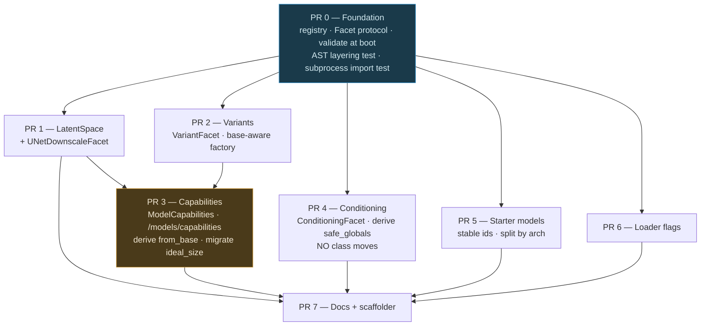

# Backend Modularization v3 — Architecture Facet Registry + Capability Taxonomy

> Refines the "Backend Modularization v2" draft. **Backend only.** Lands in this v7 fork first, each PR
> upstreamable in shape. Deliverable of this document is the spec; no code yet.

---

## 1. Context

Adding a `BaseModelType` costs ~23 new files and ~16 edited core files (Z-Image PR #8671: 70 files;
FLUX.2 Klein `b92c6ae633`: 71 files). The count is not the problem — the **failure mode** is. Most of
those core edits, if forgotten, fail at *generation time*, not at boot: an unregistered
`*ConditioningInfo` in `safe_globals` breaks deserialization mid-graph; a missing `step_callback`
branch raises `Unsupported base model` on the first preview.

The v2 draft is directionally correct and its inventory is accurate — 11 of 15 spot-checks verified
exactly, 4 partial (line numbers only), 0 wrong. This revision keeps its core moves and corrects six
things that change the design.

### What changed from the v2 draft

| # | v2 draft | Corrected | Evidence |
|---|---|---|---|
| 1 | PR 4 physically moves 15 field + 12 info + 14 output classes into arch packages; needs a leaf-module split of `fields.py` and PEP 562 `__getattr__`. Rated **Highest risk**. | **Don't move the classes.** Register `ConditioningFacet(info=…)` pointing at their current definitions and derive `safe_globals` from that. Drops to **Low risk**; §4.5's entire import-layering surgery disappears. | The moves were aesthetic — the draft's own argument against the ~80 invocation moves applies verbatim. Only `safe_globals` fails late; a missing Field/Output class is already an `ImportError` caught by `tests/test_imports.py`. |
| 2 | `max_unet_downscale` folded into `LatentSpaceFacet` | Separate facet. It is a **UNet** property (SD1→8, SDXL→4 = max internal UNet downscale), unrelated to VAE latent geometry. | `denoise_latents.py:640-650`, `t2i_adapter.py:46-53` |
| 3 | `pid/decode.py:_PER_BACKBONE` reads from `LatentSpace` | **Leave PiD alone.** Different units: Flux2 = `128` ch / `16×` (packed latents) vs the VAE's 32 ch / 8×; Flux = 16 ch / 8× (unpacked). Not derivable from one value object. | `pid/decode.py:69-91` |
| 4 | Capabilities (PR 2) before variants (PR 3); "recommend base-level rows first" | **Variants first, and variant rows are mandatory in the capabilities PR.** `MainModelDefaultSettings.from_base` already sub-dispatches on variant for 4 of 11 bases. | `configs/main.py:89` (ZImage), `:117` (Flux2), `:128` (Krea2), `:135` (Wan) |
| 5 | "Regenerate both `frontend/web` and `webv2` types"; "add a `webv2-typegen` target" | **webv2 has no OpenAPI tooling at all** — no checked-in `openapi.json`, no generated `schema.ts`, no `openapi-typescript` dependency. It hand-writes a 5-field subset of the capability contract. Nothing to regenerate. Backend-only; document the gap. | `webv2/src/features/generation/core/types.ts:37-43`; `grep webv2 Makefile` → no hits |
| 6 | Five copies of the latent-space fact | **Six.** `ideogram4_denoise.py:125-157` bypasses `diffusion_step_callback` entirely and inlines `FLUX2_LATENT_RGB_FACTORS` + a hardcoded `× 8`. | `ideogram4_denoise.py:18,129-130,154` |

Minor factual fixes to carry forward: the ERNIE `"turbo"` substring branch is `configs/main.py:96-108`
(not `:81-95`); `GENERATION_MODES` is `metadata.py:140-188`, **47** literals; the `AnyVariant`
11-member list is written **three** times (union `:334-346`, `TypeAdapter` subscript `:347-359`,
runtime arg `:360-371`); the public node API lives at `invokeai/invocation_api/__init__.py` (not under
`app/invocations/`); `_should_use_fp8` is `load_default.py:231`, ZImage case `:241-242` behind a
`hasattr(config, "base")` guard and a function-local import.

---

## 2. Verified inventory

Everything below was read in this session. Line numbers are current.

**Dispatch chains ending in a runtime `raise`**
- `app/util/step_callback.py:327-370` — 11 branches, `else: raise ValueError(f"Unsupported base model: {base_model}")`; the Wan branch (`:360-368`) sub-dispatches on `sample.shape[-3] == 48`
- `app/util/step_callback.py:386-390` — a **second** dispatch repeating that same Wan2.2-VAE test for `spatial_scale`
- `app/invocations/ideogram4_denoise.py:125-157` — a sixth, fully bespoke preview path
- `app/invocations/ideal_size.py:46-58` — 3 branches, raises for 9 of 15 generative bases
- `app/invocations/denoise_latents.py:640-650` ≡ `backend/stable_diffusion/extensions/t2i_adapter.py:46-53` — `max_unet_downscale`, duplicated down to the comment and the error string
- `app/util/t5_model_identifier.py:9-14` and `:21-26` — two structurally identical 2-branch dispatches
- `app/invocations/ip_adapter.py:139-183` — 8 comparisons against **raw strings** `"sd-1"`/`"sdxl"`, invisible to a `BaseModelType.` grep
- `backend/pid/decode.py:69-91` — `_PER_BACKBONE`, already registry-shaped, **different units** (see §1.3)

**Per-base data tables**
- `configs/main.py:66-141` — `MainModelDefaultSettings.from_base`, 11 concrete cases + `case _: return None`. Flux, SD3, CogView4, SDXLRefiner unhandled; live `TODO(psyche)` at `:140`. ERNIE (`:96-108`) substring-matches `"turbo"` against the model name **and install path** because no `ErnieImageVariantType` exists
- `app/invocations/metadata.py:140-188` — `GENERATION_MODES`, 47 literals; a capability declaration in disguise (§5)
- `backend/model_manager/starter_models.py` — 2428 lines, 185 `StarterModel(...)` definitions, 179 in `STARTER_MODELS` (`:2097-2277`), `STARTER_BUNDLES` at `:2413-2426`
- `app/invocations/fields.py:525` — `ui_model_base`, 60 call sites across ~32 invocation modules (81 raw occurrences / 34 files), plus 17 in TS

**Global unions widened by hand**
- `taxonomy.py:334-371` — `AnyVariant` + `variant_type_adapter`, list written three times
- `app/services/model_records/model_records_base.py` — `ModelRecordChanges.variant`
- `configs/main.py:67-75` — `from_base(variant=…)`, a hand-maintained union of six variant enums

**The variant-value trap.** `factory.py:486` sets `fields["base"]`; six lines later `:492` validates the
bare variant string against `variant_type_adapter` **without passing it**. Variant values must therefore
be globally unique. The workaround is documented in the code (`taxonomy.py:177-181`): `Krea2VariantType.Turbo = "krea2_turbo"` to
avoid colliding with `ZImageVariantType.Turbo`.

**Modelling error, named but not fixed here.** `BaseModelType.External` is a hosting mode, not an
architecture; `Any`/`Unknown` are sentinels. The `base == External or format == ExternalApi` predicate is
triplicated at `routers/model_manager.py:224`, `model_install_default.py:1035`,
`invocation_context.py:593`.

**Do not touch:** `fields.py:596-630` (`migrate_model_ui_type`) is a frozen backwards-compat mapping of
*deprecated* `UIType` values, not a live per-base table.

**Docs.** `docs/src/content/docs/contributing/new-model-integration.mdx` (1234 lines) is the existing
checklist. It omits `step_callback.py`, `invocation_context.py`, `dependencies.py`, the `AnyVariant`
widening, sqlite migrations, and webv2 entirely.

---

## 3. Target architecture

### 3.1 Facet registry, not one growing dataclass

```
invokeai/backend/architectures/
  registry.py          # leaf: imports nothing but taxonomy. register/get/require/validate
  facets/<name>.py     # leaf: one module per concern, pure data types
  defs/<base>.py       # one per registered base; the ONLY files allowed to import arch packages
  __init__.py          # imports every defs module (explicit list, not a glob — see below)
```

```python
# registry.py
def register(base: BaseModelType, *facets: Facet) -> None: ...
def get(base: BaseModelType, facet: type[F]) -> F | None: ...
def require(base: BaseModelType, facet: type[F]) -> F: ...   # raises with a fix-it message
def generative_bases() -> frozenset[BaseModelType]: ...      # == the registered set
def validate() -> None: ...                                  # §3.4
```

```python
# defs/z_image.py
register(
    BaseModelType.ZImage,
    LatentSpaceFacet(FLUX_16),
    CapabilitiesFacet(...),
    VariantFacet(ZImageVariantType),
    ConditioningFacet(info=ZImageConditioningInfo),
    StarterModelsFacet(Z_IMAGE_STARTER_MODELS),
    LoaderFlagsFacet(supports_fp8_storage=False),
)
```

**`defs/`, not per-arch packages.** Six of the 15 generative bases have no `backend/<arch>/` package at
all — SD1, SD2, SDXL, SDXLRefiner, SD3, CogView4, QwenImage live under `backend/stable_diffusion/` or
only in `app/invocations/`. A uniform `defs/<base>.py` avoids creating empty packages, keeps the
aggregate import list mechanical, and makes the layering rule a one-line AST check.

**Explicit import list, not a glob.** `load/__init__.py:14-17` and `app/invocations/__init__.py` both
glob, and both are fine — but a glob here would make `validate()` unable to distinguish "you forgot to
write `defs/foo.py`" from "there is no such base". The explicit list in `__init__.py` is the one-line
residual edit, and a missing entry fails `validate()` at boot with a named fix.

Adding a **new concern** touches one new `facets/*.py` + the defs that opt in. Zero central edits.
Adding a **new architecture** touches one new `defs/<base>.py` + one import line.

**Registered ⇒ generative.** There is no `set(BaseModelType) - {Any, External, Unknown}` anywhere.
External capabilities already come per-record from `ExternalModelCapabilities`; External is simply not
registered. That is the whole predicate.

### 3.2 Import layering — the rule, and why it is now cheap

Since the conditioning classes no longer move (§1.1), the only cycle risk is `defs/` reaching back into
modules that themselves read the registry (`configs/main.py`, `starter_models.py`, `step_callback.py`).

> **`architectures/defs/*` may import only: `backend/<arch>/*` packages, `architectures/facets/*`,
> `model_manager/taxonomy`, `stable_diffusion/diffusion/conditioning_data`, and
> `model_manager/starter_models/types`. Nothing else.**
> **Core may import `invokeai.backend.architectures` (the aggregate); never `architectures.defs.*`.**

Consequences that fall out and must be honoured:
- `CapabilitiesFacet` carries **plain data**, never a `MainModelDefaultSettings`. `configs/main.py`
  constructs that itself from the facet.
- PR 5 splits `starter_models.py` into `starter_models/types.py` (leaf dataclasses) + per-arch lists in
  `defs/` + `starter_models/__init__.py` (aggregator re-exporting `STARTER_MODELS` / `STARTER_BUNDLES`
  so existing importers are untouched).
- The RGB-factor constants move from `step_callback.py` into `facets/latent_space.py`, so
  `step_callback.py` imports the registry and `defs/` never imports `step_callback`.

Enforced by an **AST test** over the allowlist. `tests/test_imports.py` cannot catch this — it imports
every module into one shared process, so an order-dependent cycle passes. Add a subprocess-isolated
import of `invokeai.app.api.dependencies` alone, built on the existing
`tests/dangerously_run_function_in_subprocess.py`. Prior art for the AST approach exists in this repo:
`webv2/src/architecture/dependencyPolicy.test.ts`.

### 3.3 `LatentSpace` — the concept that does the most work

The preview chain is not keyed on architecture; the code's own comments say so
(`step_callback.py:337, 346, 349, 353, 361`). The same fact exists in **six** partial, drifting copies:
`step_callback.py:327-370`, `step_callback.py:386-390`, `ideogram4_denoise.py:125-157`,
`constants.py:3-9` (`LATENT_SCALE_FACTOR = 8`, live `HACK:` comment), and — in different units —
`pid/decode.py:69-91`.

```python
@dataclass(frozen=True)
class LatentSpace:
    channels: int
    spatial_compression: int                        # 8 or 16
    rgb_factors: list[list[float]]
    rgb_bias: list[float] | None = None
    smooth_matrix: list[list[float]] | None = None

    def preview(self, sample: Tensor) -> Image: ...  # default = today's linear projection
```

Closed set: `SD15_4`, `SDXL_4`, `SD3_16`, `FLUX_16`, `FLUX2_32`, `QWEN_16`, `WAN_16`, `WAN22_48`,
`COGVIEW4_16`, `ANIMA_WAN21_16`.

- Z-Image, Krea-2, ERNIE-Image, Ideogram-4, Anima — the five most recent bases — declare **zero** new
  preview data; they reuse `FLUX_16` / `QWEN_16` / `FLUX2_32` / `ANIMA_WAN21_16`.
- Both `sample.shape[-3] == 48` tests collapse: `LatentSpaceFacet` accepts a
  `Callable[[Tensor], LatentSpace]` resolver for Wan, which is literally what the code does by hand
  today, in one place instead of two.
- `spatial_compression` replaces the trailing hardcoded `spatial_scale`, and is exactly what webv2's
  `dimensions.grid` needs (§4).
- Keeping `preview()` a method means a future architecture needing a real tiny-VAE decode is not forced
  through a factor matrix.
- **Not migrated:** `constants.LATENT_SCALE_FACTOR` (blast radius is every latent node) and
  `pid/decode.py` (different units). Both noted as follow-ups now that a correct source exists.

`max_unet_downscale` gets its own two-member `UNetDownscaleFacet` — still worth doing, since it is
currently duplicated verbatim across two files.

### 3.4 Completeness: fail fast, then CI

1. **`validate()` at boot**, called from `run_app.py` beside the existing post-load invocation check
   (`run_app.py:96-104`) and from `dependencies.py` before `safe_globals` is built. Every registered
   base must carry every required facet; the error names the missing facet **and the file to add it to**.
2. **`require()` raises with a fix-it message**, replacing every `raise ValueError(f"Unsupported base model: {base}")`.
3. **CI test** mirroring (1), so it fails in review rather than on someone's machine.

A facet being **absent** must be distinguishable from a facet declaring **not applicable**. Required
facets: `LatentSpaceFacet`, `CapabilitiesFacet`, `ConditioningFacet`. Optional: `VariantFacet`
(bases with a variant enum), `UNetDownscaleFacet` (SD1/SDXL only), `StarterModelsFacet`,
`LoaderFlagsFacet` (defaults).

### 3.5 Derive vs. assert

`factory.py:246-247` states the codebase's preference for explicit unions over dynamic construction
("IDEs/LSPs can't identify the correct types when `AnyModelConfig` is constructed dynamically"). Honour
it, with one rule:

> **Derive** where the value is consumed at runtime. **Assert-equal** where the value is a static type.

| Target | Treatment |
|---|---|
| `safe_globals` (`dependencies.py:164-178`) | Derive |
| `MainModelDefaultSettings.from_base` | Derive |
| `STARTER_MODELS` / `STARTER_BUNDLES` | Derive |
| `GET /api/v1/models/capabilities` | Derive |
| Preview / latent-space / `max_unet_downscale` | Derive |
| `GENERATION_MODES` `Literal[…]` | Hand-written, **CI-asserted** |
| `AnyModelConfig` union | Hand-written, **CI-asserted** |
| `AnyVariant` / `variant_type_adapter` | Hand-written, **CI-asserted** |
| `invocation_api/__init__.py` exports | Hand-written, **CI-asserted** |
| `ui_model_base` on invocation fields | Hand-written, **CI-asserted** (warn first, §7) |

### 3.6 Behaviour preservation (decided)

`from_base` returns `None` for Flux/SD3/CogView4/SDXLRefiner; `ideal_size.py` raises for 9 of 15 bases.
A registry covering every base would silently make both start returning values.

**Decision: preserve exactly.** `CapabilitiesFacet.constraints` carries an explicit
`NotApplicable` sentinel distinct from "unset", so those four bases keep returning `None` and
`ideal_size` keeps raising for bases with no `optimal_side`. Every registry PR is then provably a pure
refactor. A **follow-up PR** fills the gaps and closes `TODO(psyche)` as a reviewable behaviour change.

### 3.7 Starter models — ids, not object references

`dependencies=[…]` currently holds **direct Python references to module-level singletons defined earlier
in the same file** (56 sites, e.g. `:175 dependencies=[gemma2_2b_encoder]`). The dependency graph is
enforced by definition order, so splitting by architecture creates import cycles.

Give each `StarterModel` a stable string id; `dependencies` becomes `list[str]`; the aggregator resolves
ids at build time and **fails on an unresolved id**. Per-arch lists then have zero cross-imports.

Verification must compare the **resolved dependency graph**, not just the top-level set — a set-equality
check on `source` would pass while every dependency list silently emptied. The existing
`assert len(STARTER_MODELS) == len({m.source for m in STARTER_MODELS})` (`:2428`) stays.

`STARTER_BUNDLES` is typed `dict[str, …]` and keyed by `BaseModelType` **except** for two hand-rolled
string keys `"wan_t2v"` / `"wan_i2v"` — the codebase already admitting base alone cannot key a
user-facing capability. Keep the keys bit-for-bit; note it as evidence for §4.

---

## 4. Capability taxonomy

### 4.1 The concept exists — generalize it

`configs/external_api.py:32-48` already defines `ExternalModelCapabilities`: 14 fields, `extra="forbid"`,
**required** on `ExternalApiModelConfig` (`:87`), shipped through OpenAPI, and **already consumed by
webv2** (`baseGenerationPolicies.ts:490-496, 520, 1261, 1276-1277`). It just doesn't exist for local bases.

Note: `ExternalGenerationMode` / `ExternalMaskFormat` are `Literal` **type aliases**, not `Enum`s
(`external_api.py:10-12`) — keep them that way.

Define `ModelCapabilities` with the base-agnostic fields; make `ExternalModelCapabilities` a **subclass**
adding the external-only ones. Pydantic keeps the `ExternalModelCapabilities` schema name, so its `$ref`
is unchanged and a new `ModelCapabilities` schema appears alongside — purely additive. Watch
`extra="forbid"` and every existing field default when subclassing; the OpenAPI diff for
`ExternalModelCapabilities` must be empty.

### 4.2 Three axes, not one flat enum

Field names are lifted from webv2's `BaseGenerationConfig` (`baseGenerationPolicies.ts:74-99`), already
the working shape for 13 bases. Note it is **nested**, not flat — mirror the nesting.

| Axis | Fields | Replaces |
|---|---|---|
| **Modality** | `modes: [txt2img, img2img, inpaint, outpaint]`, `input_image_required_for` | `metadata.py:GENERATION_MODES`; webv2 `CANVAS_I2L_NODE_TYPES` (`compileCanvasGraph.ts:52-70`) |
| **Features** | `negative_prompt: {visible, usage: always\|cfg-gated\|never}`, `supports_reference_images`, `max_reference_images`, `supports_regional_guidance`, `regional_negative`, `control_kinds: [controlnet, t2i_adapter, control_lora, z_image_control]`, `supports_lora`, `scheduler_set`, `scheduler_applies_to_graph`, `clip_skip_max`, `supports_seamless`, `supports_cfg_rescale` | webv2 `isControlKindSupportedForBase` (`controlValidation.ts:13-24`), `isRegionalGuidanceSupportedForBase` (`addRegionalGuidance.ts:17-21`), `BASE_GENERATION.ui.*`; legacy `SUPPORTS_REF_IMAGES_BASE_MODELS`, `SUPPORTS_NEGATIVE_PROMPT_BASE_MODELS`, `BASES_WITHOUT_STANDARD_SCHEDULER`, `CLIP_SKIP_MAP` |
| **Constraints** | `default_steps`, `default_cfg_scale`, `default_scheduler`, `optimal_side`, `dimension_grid` (= `LatentSpace.spatial_compression × patch`), `guidance_label` | `MainModelDefaultSettings.from_base`; webv2 `BASE_GENERATION.dimensions/defaults`; `ideal_size.py` |

**The two frontends genuinely disagree** — one backend source resolves it:

| base | legacy `frontend/web` | webv2 |
|---|---|---|
| `wan` reference images | supported | **not** supported (`:1268` list omits it) |
| `qwen-image` reference images | unconditional | only when `variant === 'edit'` (`:1264-1265`) |
| `qwen-image`/`z-image`/`krea-2`/`anima` negative prompt | unconditional | `cfg-gated` |
| `sdxl` clip skip | `24` | no `clipSkipMax` at all → `null` |
| `ernie-image` | in `BASES_WITHOUT_STANDARD_SCHEDULER`, absent from `CLIP_SKIP_MAP` | **entirely absent** from webv2 — no `BASE_GENERATION`, no `MODEL_BASES` entry |
| `flux`/`flux2`/`z-image` scheduler | in the "no standard scheduler" blocklist | `schedulerAppliesToGraph: true` |

Resolving these is a **judgment call per row, not a merge**. The backend declaration is the new truth;
list every divergence explicitly in the PR description so a reviewer can rule on each.

### 4.3 Making it load-bearing

1. **`from_base` derives** from the constraints axis (preserving §3.6's `None`s).
2. **`GENERATION_MODES` is CI-asserted** against `modes`. The metadata slugs are **not** the enum values —
   `z_image` not `z-image`, `krea2` not `krea-2`, plus `ernie_image`, `ideogram4`, `sd3`, and SD1 uses
   bare `txt2img` with no prefix. The facet carries an explicit `metadata_slug: str | None`
   (`None` = unprefixed). **These strings are persisted in image metadata and cannot change.**
3. **`ui_model_base` is CI-asserted** — a base declaring `supports_lora` must have a registered LoRA
   loader and a `*_lora_loader` invocation.

### 4.4 API surface

`GET /api/v1/models/capabilities` → `list[{base, variant | null, capabilities, constraints}]`. A static
table the frontend fetches once and joins against model records locally. Fully additive: no change to any
existing schema, no per-record DB pollution, cacheable.

Deliberately **not** a computed field on `AnyModelConfig` — that would add a field to all 115 config
schemas and risk polluting persisted records.

**Variant rows ship from day one** (decided, §1.4): `MainModelDefaultSettings.from_base` already
sub-dispatches on variant for ZImage (`:89`), Flux2 (`:117`), Krea2 (`:128`) and Wan (`:135`), so
base-only rows cannot reproduce current behaviour. Resolver signature is
`get_capabilities(config: AnyModelConfig) -> ModelCapabilities`; base rows are defaults, variant rows
override.

### 4.5 webv2 (decided: out of scope)

webv2 has **no** OpenAPI tooling — no `openapi.json`, no generated `schema.ts`, no `openapi-typescript`
dependency, no Makefile target, no CI check. Its capability contract is hand-written at
`webv2/src/features/generation/core/types.ts:37-43` as a 5-field optional subset; the other 9 backend
fields are untyped and unconsumed.

This initiative ships the backend endpoint and **documents the gap**. No webv2 edits. Adding
`openapi-typescript` + a `webv2-typegen` target + CI is a worthwhile separate initiative — record it as
such, with the observation that nothing today would catch webv2/backend contract drift.

---

## 5. PR sequence

Each PR passes CI independently, changes no behaviour, and **fully** migrates every base for the registry
it introduces — no hybrid `elif`/registry states.



*PR 3 (amber) is the only intentional `openapi.json` change. PR 0 (blue) must land first; 1, 2, 4, 5, 6
are otherwise independent and parallelisable.*

| PR | Content | Risk |
|---|---|---|
| **0 — Foundation** | `backend/architectures/{registry,facets/,defs/,__init__}.py`. `register`/`get`/`require`/`generative_bases`/`validate`. Boot validation wired into `run_app.py` and `dependencies.py`. AST layering test + subprocess import test. All 15 bases register an empty facet set. | Low |
| **1 — LatentSpace** | `facets/latent_space.py` (value object + the RGB constants moved out of `step_callback.py`) and `facets/unet.py`. Migrates `step_callback.py:327-390` (**both** branches), `ideogram4_denoise.py:125-157`, and the `max_unet_downscale` pair. Collapses `invocation_context.py`'s `flux_step_callback`/`flux2_step_callback` into `sd_step_callback` — **keep thin aliases, custom nodes may call them**. PiD and `LATENT_SCALE_FACTOR` untouched. | Low |
| **2 — Variants** | `VariantFacet`; base-aware variant resolution in `factory.py` (base is available at `:486`). CI-assert `AnyVariant` / `variant_type_adapter` / `ModelRecordChanges.variant` against the registry, plus a global variant-value uniqueness test. Stored values unchanged. | Low |
| **3 — Capabilities** | `ModelCapabilities` + `CapabilitiesFacet`, all 15 bases **and** the variant rows §4.4 requires. `ExternalModelCapabilities` becomes a subclass. Derive `from_base` (preserving §3.6). CI-assert `GENERATION_MODES`. New `GET /api/v1/models/capabilities`. Migrate `ideal_size.py`. | **Medium** — the only `openapi.json` change (additive). Regenerate `frontend/web` types; webv2 out of scope |
| **4 — Conditioning** | `ConditioningFacet(info=…)` for all 12 arch `*ConditioningInfo`; derive `safe_globals` from it. Bring `invocation_api/__init__.py` current (9 architectures missing) and CI-assert it. **No classes move.** | Low |
| **5 — Starter models** | `starter_models/types.py` + per-arch lists in `defs/` + aggregator; stable ids, `dependencies: list[str]`, fail on unresolved id. `STARTER_BUNDLES` keys unchanged including `"wan_t2v"`/`"wan_i2v"`. | Low–medium |
| **6 — Loader flags** | `load_default.py:241-242`'s `config.base == ZImage` → `LoaderFlagsFacet`, removing the `hasattr` guard and function-local import. **Loaders themselves do not move** — `load/__init__.py:14-17` globs `model_loaders/*.py` to trigger registration; moving them changes *when* loaders register, for zero gain. | Low |
| **7 — Docs + scaffolder** | Rewrite `docs/.../new-model-integration.mdx`. Add `scripts/new_architecture.py` generating `defs/<base>.py` and applying the residual one-line edits. | Low |

**Dropped from the v2 draft, with reasons:** loader co-location (breaks the registration glob for no
gain); the ~80 invocation moves (`app/invocations/__init__.py` already globs — adding an invocation needs
**zero** core edits today; pure aesthetics against ~18 in-flight branches); and the conditioning **class
moves** (§1.1 — all of the benefit, none of the risk, comes from registration alone).

---

## 6. Success metric

Not "16 → 5 files." The metric is: **an incompletely registered architecture cannot boot the app.**

Residual per-base core edits, all one-line, all applied by `scripts/new_architecture.py`:

| File | Edit | Avoidable? |
|---|---|---|
| `taxonomy.py` | enum value (+ variant enum) | No — deliberately closed enums |
| `configs/main.py` (± `lora.py`, `vae.py`, `controlnet.py`) | config classes with probes | No |
| `configs/factory.py` | union entries | No — deliberately explicit, order load-bearing |
| `architectures/__init__.py` | 1 import line | No — explicit by design (§3.1) |
| `metadata.py` | `GENERATION_MODES` literals | No — static type, now CI-checked |
| probe cascade in `lora.py` | cross-base exclusions | **Out of scope** — see below |

Everything else — preview, latent space, conditioning, default settings, starter models, loader flags,
capabilities, variants — lives in `backend/architectures/defs/<base>.py`.

**Probe/identification stays out of scope.** `matches_sort_key` (`factory.py:586-606`) ranks only by
`ModelType` with no base dimension, which is why every LoRA probe hand-maintains `not has_<other_base>_keys`
clauses — O(bases) per probe. The honest cost: `configs/lora.py:888-962` duplicates the entire key cascade
**twice in the same class** (`_validate_looks_like_lora` and `_get_base_or_raise`). An additive tie-breaker
score that changes nothing when exactly one config matches is the right fix, as a separate initiative.

---

## 7. Compatibility and verification

**Guarantee (PRs 0, 1, 2, 4, 5, 6):** invocation type strings, Pydantic class names (= OpenAPI `$ref`s),
enum values, discriminator tags, `GENERATION_MODES` strings, DB columns and stored model records — all
bit-for-bit identical. `schema.ts` may differ only in ordering. **PR 3** adds schemas and one route;
nothing existing changes, including `ExternalModelCapabilities`'s schema.

**Reuse, don't rebuild:**
- `.github/workflows/openapi-checks.yml` — diffs the checked-in `invokeai/frontend/web/openapi.json`
- `.github/workflows/typegen-checks.yml` — regenerates `schema.ts` and diffs
- `tests/test_imports.py` — every module imports cleanly
- `tests/model_identification/` — 78 git-lfs stripped models, the probe regression corpus
- `tests/dangerously_run_function_in_subprocess.py` — basis for the isolation test
- `make test`, `make openapi`, `make frontend-typegen`

**New tests (land in PR 0, extended per PR):**

| Test | Catches |
|---|---|
| `test_registry_completeness` | Every registered base carries every required facet |
| `test_layering` (AST) | `defs/*` imports outside the allowlist; core importing `architectures.defs.*` |
| `test_import_isolation` (subprocess) | `invokeai.app.api.dependencies` imports alone in a fresh interpreter |
| `test_safe_globals_baseline` | Derived allowlist is a **superset** of the frozen 13-class baseline (`dependencies.py:164-178`) |
| `test_generation_modes_match_registry` | `GENERATION_MODES` == derived set, exact strings incl. slug irregularities |
| `test_variant_values_unique` | No two variant enums share a value (today an unwritten invariant) |
| `test_starter_models_snapshot` | Aggregated set **and resolved dependency graph** unchanged |
| `test_any_variant_matches_registry` | `AnyVariant` / `variant_type_adapter` / `ModelRecordChanges` cover registered variants |
| `test_invocation_api_conditioning_exports` | Public node API covers every registered `ConditioningFacet` |
| `test_ui_model_base_consistency` | `supports_lora` ⇒ LoRA loader + `*_lora_loader` invocation. **Warn-only initially**, promoted to hard failure once declarations are clean |

**Manual verification per PR.** Run the app and generate on **SD1, FLUX, and Z-Image** (three distinct
latent spaces, one of which shares factors with another base), confirming progress previews render at
correct dimensions — the `spatial_scale` path has no automated coverage. After PR 1 additionally generate
on **Ideogram-4** and **Wan TI2V-5B**, the two paths whose preview logic is being restructured rather than
relocated. After PR 3, `curl /api/v1/models/capabilities` and diff `from_base` output against the
pre-change `match` for all 15 bases × all variants. After PR 5, install one starter bundle end-to-end.

No full E2E per architecture (~14 models locally) — `validate()` plus the data-relocation nature of
PRs 1/4/5 covers the risk.

---

## 8. Remaining open questions

1. **`LATENT_SCALE_FACTOR`** (`constants.py:3-9`, live `HACK:` comment) — follow-up initiative once
   `LatentSpace` exists. Blast radius is every latent node. Recommend follow-up, not PR 1.
2. **`BaseModelType.External`** — a hosting mode in an architecture enum, predicate triplicated at
   `routers/model_manager.py:224`, `model_install_default.py:1035`, `invocation_context.py:593`. Worth a
   small separate PR extracting `is_external(config)`.
3. **Frontend divergence rulings (§4.2)** — six rows where legacy and webv2 disagree. Each needs a product
   decision, not a merge. Surface them in PR 3's description for explicit sign-off.
4. **webv2 typegen** — no API-schema tooling exists at all. Separate initiative; nothing today would catch
   webv2/backend contract drift.