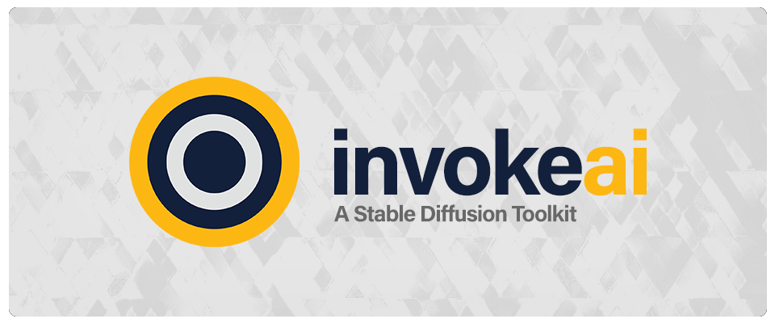

Invoke-AI is a community of software developers, researchers, and user
interface experts who have come together on a voluntary basis to build
software tools which support cutting edge AI text-to-image
applications. This community is open to anyone who wishes to
contribute to the effort and has the skill and time to do so.

# Our Values

The InvokeAI team is a diverse community which includes individuals
from various parts of the world and many walks of life. Despite our
differences, we share a number of core values which we ask prospective
contributors to understand and respect. We believe:

1. That Open Source Software is a positive force in the world. We
create software that can be used, reused, and redistributed, without
restrictions, under a straightforward Open Source license (MIT). We
believe that Open Source benefits society as a whole by increasing the
availability of high quality software to all.

2. That those who create software should receive proper attribution
for their creative work. While we support the exchange and reuse of
Open Source Software, we feel strongly that the original authors of a
piece of code should receive credit for their contribution, and we
endeavor to do so whenever possible.

3. That there is moral ambiguity surrounding AI-assisted art. We are
aware of the moral and ethical issues surrounding the release of the
Stable Diffusion model and similar products. We are aware that, due to
the composition of their training sets, current AI-generated image
models are biased against certain ethnic groups, cultural concepts of
beauty, ethnic stereotypes, and gender roles.

      1. We recognize the potential for harm to these groups that these biases
       represent and trust that future AI models will take steps towards
       reducing or eliminating the biases noted above, respect and give due
       credit to the artists whose work is sourced, and call on developers
       and users to favor these models over the older ones as they become
       available.

4. We are deeply committed to ensuring that this technology benefits
everyone, including artists. We see AI art not as a replacement for
the artist, but rather as a tool to empower them. With that
in mind, we are constantly debating how to build systems that put
artists’ needs first: tools which can be readily integrated into an
artist’s existing workflows and practices, enhancing their work and
helping them to push it further. Every decision we take as a team,
which includes several artists, aims to build towards that goal.

5. That artificial intelligence can be a force for good in the world,
but must be used responsibly. Artificial intelligence technologies
have the potential to improve society, in everything from cancer care,
to customer service, to creative writing.

     1. While we do not believe that software should arbitrarily limit what
     users can do with it, we recognize that when used irresponsibly, AI
     has the potential to do much harm. Our Discord server is actively
     moderated in order to minimize the potential of harm from
     user-contributed images. In addition, we ask users of our software to
     refrain from using it in any way that would cause mental, emotional or
     physical harm to individuals and vulnerable populations including (but
     not limited to) women; minors; ethnic minorities; religious groups;
     members of LGBTQIA communities; and people with disabilities or
     impairments.

     2. Note that some of the image generation AI models which the Invoke-AI
     toolkit supports carry licensing agreements which impose restrictions
     on how the model is used. We ask that our users read and agree to
     these terms if they wish to make use of these models. These agreements
     are distinct from the MIT license which applies to the InvokeAI
     software and source code.

6. That mutual respect is key to a healthy software development
community. Members of the InvokeAI community are expected to treat
each other with respect, beneficence, and empathy. Each of us has a
different background and a unique set of skills. We strive to help
each other grow and gain new skills, and we apportion expectations in
a way that balances the members' time, skillset, and interest
area. Disputes are resolved by open and honest communication.

## Signature

This document has been collectively crafted and approved by the current InvokeAI team members, as of 28 Nov 2022: **lstein** (Lincoln Stein), **blessedcoolant**, **hipsterusername** (Kent Keirsey), **Kyle0654** (Kyle Schouviller), **damian0815**, **mauwii** (Matthias Wild), **Netsvetaev** (Artur Netsvetaev), **psychedelicious**, **tildebyte**, **keturn**, and **ebr** (Eugene Brodsky). Although individuals within the group may hold differing views on particular details and/or their implications, we are all in agreement about its fundamental statements, as well as their significance and importance to this project moving forward.
