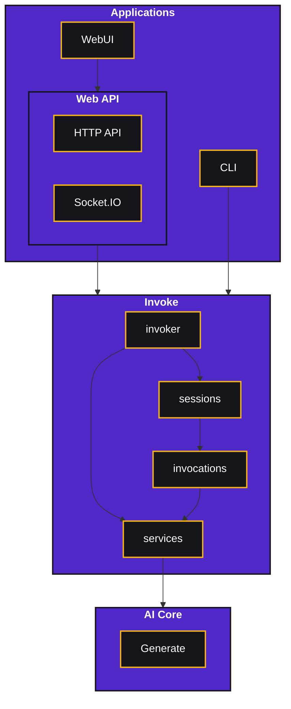

# Invoke.AI Architecture

## Applications

Applications are built on top of the invoke framework. They should construct `invoker` and then interact through it. They should avoid interacting directly with core code in order to support a variety of configurations.

### Web UI

The Web UI is built on top of an HTTP API built with [FastAPI](https://fastapi.tiangolo.com/) and [Socket.IO](https://socket.io/). The frontend code is found in `/frontend` and the backend code is found in `/ldm/invoke/app/api_app.py` and `/ldm/invoke/app/api/`. The code is further organized as such:

| Component | Description |
| --- | --- |
| api_app.py | Sets up the API app, annotates the OpenAPI spec with additional data, and runs the API |
| dependencies | Creates all invoker services and the invoker, and provides them to the API |
| events | An eventing system that could in the future be adapted to support horizontal scale-out |
| sockets | The Socket.IO interface - handles listening to and emitting session events (events are defined in the events service module) |
| routers | API definitions for different areas of API functionality |

### CLI

The CLI is built automatically from invocation metadata, and also supports invocation piping and auto-linking. Code is available in `/ldm/invoke/app/cli_app.py`.

## Invoke

The Invoke framework provides the interface to the underlying AI systems and is built with flexibility and extensibility in mind. There are four major concepts: invoker, sessions, invocations, and services.

### Invoker

The invoker (`/ldm/invoke/app/services/invoker.py`) is the primary interface through which applications interact with the framework. Its primary purpose is to create, manage, and invoke sessions. It also maintains two sets of services:
- **invocation services**, which are used by invocations to interact with core functionality.
- **invoker services**, which are used by the invoker to manage sessions and manage the invocation queue.

### Sessions

Invocations and links between them form a graph, which is maintained in a session. Sessions can be queued for invocation, which will execute their graph (either the next ready invocation, or all invocations). Sessions also maintain execution history for the graph (including storage of any outputs). An invocation may be added to a session at any time, and there is capability to add and entire graph at once, as well as to automatically link new invocations to previous invocations. Invocations can not be deleted or modified once added.

The session graph does not support looping. This is left as an application problem to prevent additional complexity in the graph.

### Invocations

Invocations represent individual units of execution, with inputs and outputs. All invocations are located in `/ldm/invoke/app/invocations`, and are all automatically discovered and made available in the applications. These are the primary way to expose new functionality in Invoke.AI, and the [implementation guide](INVOCATIONS.md) explains how to add new invocations.

### Services

Services provide invocations access AI Core functionality and other necessary functionality (e.g. image storage). These are available in `/ldm/invoke/app/services`. As a general rule, new services should provide an interface as an abstract base class, and may provide a lightweight local implementation by default in their module. The goal for all services should be to enable the usage of different implementations (e.g. using cloud storage for image storage), but should not load any module dependencies unless that implementation has been used (i.e. don't import anything that won't be used, especially if it's expensive to import).

## AI Core

The AI Core is represented by the rest of the code base (i.e. the code outside of `/ldm/invoke/app/`).
