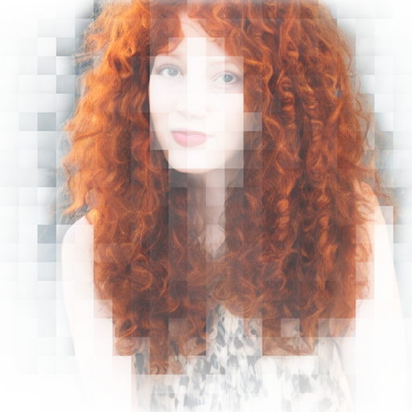
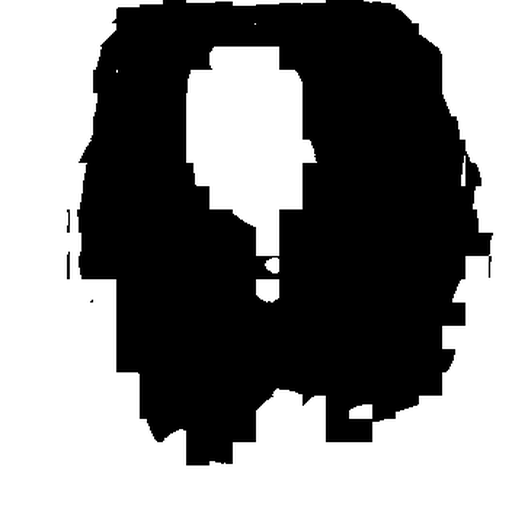

# :octicons-paintbrush-16: Inpainting

## **Creating Transparent Regions for Inpainting**

Inpainting is really cool. To do it, you start with an initial image and use a
photoeditor to make one or more regions transparent (i.e. they have a "hole" in
them). You then provide the path to this image at the dream> command line using
the `-I` switch. Stable Diffusion will only paint within the transparent region.

There's a catch. In the current implementation, you have to prepare the initial
image correctly so that the underlying colors are preserved under the
transparent area. Many imaging editing applications will by default erase the
color information under the transparent pixels and replace them with white or
black, which will lead to suboptimal inpainting. It often helps to apply
incomplete transparency, such as any value between 1 and 99%

You also must take care to export the PNG file in such a way that the color
information is preserved. There is often an option in the export dialog that
lets you specify this.

If your photoeditor is erasing the underlying color information, `dream.py` will
give you a big fat warning. If you can't find a way to coax your photoeditor to
retain color values under transparent areas, then you can combine the `-I` and
`-M` switches to provide both the original unedited image and the masked
(partially transparent) image:

```bash
invoke> "man with cat on shoulder" -I./images/man.png -M./images/man-transparent.png
```

## **Masking using Text**

You can also create a mask using a text prompt to select the part of the image
you want to alter, using the [clipseg](https://github.com/timojl/clipseg)
algorithm. This works on any image, not just ones generated by InvokeAI.

The `--text_mask` (short form `-tm`) option takes two arguments. The first
argument is a text description of the part of the image you wish to mask (paint
over). If the text description contains a space, you must surround it with
quotation marks. The optional second argument is the minimum threshold for the
mask classifier's confidence score, described in more detail below.

To see how this works in practice, here's an image of a still life painting that
I got off the web.

<figure markdown>

</figure>

You can selectively mask out the orange and replace it with a baseball in this
way:

```bash
invoke> a baseball -I /path/to/still_life.png -tm orange
```

<figure markdown>

</figure>

The clipseg classifier produces a confidence score for each region it
identifies. Generally regions that score above 0.5 are reliable, but if you are
getting too much or too little masking you can adjust the threshold down (to get
more mask), or up (to get less). In this example, by passing `-tm` a higher
value, we are insisting on a tigher mask. However, if you make it too high, the
orange may not be picked up at all!

```bash
invoke> a baseball -I /path/to/breakfast.png -tm orange 0.6
```

The `!mask` command may be useful for debugging problems with the text2mask
feature. The syntax is `!mask /path/to/image.png -tm <text> <threshold>`

It will generate three files:

- The image with the selected area highlighted.
  - it will be named XXXXX.<imagename>.<prompt>.selected.png
- The image with the un-selected area highlighted.
  - it will be named XXXXX.<imagename>.<prompt>.deselected.png
- The image with the selected area converted into a black and white image
  according to the threshold level
  - it will be named XXXXX.<imagename>.<prompt>.masked.png

The `.masked.png` file can then be directly passed to the `invoke>` prompt in
the CLI via the `-M` argument. Do not attempt this with the `selected.png` or
`deselected.png` files, as they contain some transparency throughout the image
and will not produce the desired results.

Here is an example of how `!mask` works:

```bash
invoke> !mask ./test-pictures/curly.png -tm hair 0.5
>> generating masks from ./test-pictures/curly.png
>> Initializing clipseg model for text to mask inference
Outputs:
[941.1] outputs/img-samples/000019.curly.hair.deselected.png: !mask ./test-pictures/curly.png -tm hair 0.5
[941.2] outputs/img-samples/000019.curly.hair.selected.png: !mask ./test-pictures/curly.png -tm hair 0.5
[941.3] outputs/img-samples/000019.curly.hair.masked.png: !mask ./test-pictures/curly.png -tm hair 0.5
```

<figure markdown>

<figcaption>Original image "curly.png"</figcaption>
</figure>

<figure markdown>

<figcaption>000019.curly.hair.selected.png</figcaption>
</figure>

<figure markdown>

<figcaption>000019.curly.hair.deselected.png</figcaption>
</figure>

<figure markdown>

<figcaption>000019.curly.hair.masked.png</figcaption>
</figure>

It looks like we selected the hair pretty well at the 0.5 threshold (which is
the default, so we didn't actually have to specify it), so let's have some fun:

```bash
invoke> medusa with cobras -I ./test-pictures/curly.png -M 000019.curly.hair.masked.png -C20
>> loaded input image of size 512x512 from ./test-pictures/curly.png
...
Outputs:
[946] outputs/img-samples/000024.801380492.png: "medusa with cobras" -s 50 -S 801380492 -W 512 -H 512 -C 20.0 -I ./test-pictures/curly.png -A k_lms -f 0.75
```

<figure markdown>

</figure>

You can also skip the `!mask` creation step and just select the masked

region directly:

```bash
invoke> medusa with cobras -I ./test-pictures/curly.png -tm hair -C20
```

## Using the RunwayML inpainting model

The
[RunwayML Inpainting Model v1.5](https://huggingface.co/runwayml/stable-diffusion-inpainting)
is a specialized version of
[Stable Diffusion v1.5](https://huggingface.co/spaces/runwayml/stable-diffusion-v1-5)
that contains extra channels specifically designed to enhance inpainting and
outpainting. While it can do regular `txt2img` and `img2img`, it really shines
when filling in missing regions. It has an almost uncanny ability to blend the
new regions with existing ones in a semantically coherent way.

To install the inpainting model, follow the
[instructions](../installation/050_INSTALLING_MODELS.md) for installing a new model.
You may use either the CLI (`invoke.py` script) or directly edit the
`configs/models.yaml` configuration file to do this. The main thing to watch out
for is that the the model `config` option must be set up to use
`v1-inpainting-inference.yaml` rather than the `v1-inference.yaml` file that is
used by Stable Diffusion 1.4 and 1.5.

After installation, your `models.yaml` should contain an entry that looks like
this one:

```yml
inpainting-1.5:
  weights: models/ldm/stable-diffusion-v1/sd-v1-5-inpainting.ckpt
  description: SD inpainting v1.5
  config: configs/stable-diffusion/v1-inpainting-inference.yaml
  vae: models/ldm/stable-diffusion-v1/vae-ft-mse-840000-ema-pruned.ckpt
  width: 512
  height: 512
```

As shown in the example, you may include a VAE fine-tuning weights file as well.
This is strongly recommended.

To use the custom inpainting model, launch `invoke.py` with the argument
`--model inpainting-1.5` or alternatively from within the script use the
`!switch inpainting-1.5` command to load and switch to the inpainting model.

You can now do inpainting and outpainting exactly as described above, but there
will (likely) be a noticeable improvement in coherence. Txt2img and Img2img will
work as well.

There are a few caveats to be aware of:

1. The inpainting model is larger than the standard model, and will use nearly 4
   GB of GPU VRAM. This makes it unlikely to run on a 4 GB graphics card.

2. When operating in Img2img mode, the inpainting model is much less steerable
   than the standard model. It is great for making small changes, such as
   changing the pattern of a fabric, or slightly changing a subject's expression
   or hair, but the model will resist making the dramatic alterations that the
   standard model lets you do.

3. While the `--hires` option works fine with the inpainting model, some special
   features, such as `--embiggen` are disabled.

4. The model tends to oversharpen image if you use high step or CFG values. If
   you need to do large steps, use the standard model.

5. The `--strength` (`-f`) option has no effect on the inpainting model due to
   its fundamental differences with the standard model. It will always take the
   full number of steps you specify.

## Troubleshooting

Here are some troubleshooting tips for inpainting and outpainting.

## Inpainting is not changing the masked region enough!

One of the things to understand about how inpainting works is that it is
equivalent to running img2img on just the masked (transparent) area. img2img
builds on top of the existing image data, and therefore will attempt to preserve
colors, shapes and textures to the best of its ability. Unfortunately this means
that if you want to make a dramatic change in the inpainted region, for example
replacing a red wall with a blue one, the algorithm will fight you.

You have a couple of options. The first is to increase the values of the
requested steps (`-sXXX`), strength (`-f0.XX`), and/or condition-free guidance
(`-CXX.X`). If this is not working for you, a more extreme step is to provide
the `--inpaint_replace 0.X` (`-r0.X`) option. This value ranges from 0.0 to 1.0.
The higher it is the less attention the algorithm will pay to the data
underneath the masked region. At high values this will enable you to replace
colored regions entirely, but beware that the masked region mayl not blend in
with the surrounding unmasked regions as well.

---

## Recipe for GIMP

[GIMP](https://www.gimp.org/) is a popular Linux photoediting tool.

1. Open image in GIMP.
2. Layer->Transparency->Add Alpha Channel
3. Use lasso tool to select region to mask
4. Choose Select -> Float to create a floating selection
5. Open the Layers toolbar (^L) and select "Floating Selection"
6. Set opacity to a value between 0% and 99%
7. Export as PNG
8. In the export dialogue, Make sure the "Save colour values from transparent
   pixels" checkbox is selected.

---

## Recipe for Adobe Photoshop

1. Open image in Photoshop

    <figure markdown>
    
    </figure>

2. Use any of the selection tools (Marquee, Lasso, or Wand) to select the area
   you desire to inpaint.

    <figure markdown>
    
    </figure>

3. Because we'll be applying a mask over the area we want to preserve, you
   should now select the inverse by using the ++shift+ctrl+i++ shortcut, or
   right clicking and using the "Select Inverse" option.

4. You'll now create a mask by selecting the image layer, and Masking the
   selection. Make sure that you don't delete any of the underlying image, or
   your inpainting results will be dramatically impacted.

    <figure markdown>
    
    </figure>

5. Make sure to hide any background layers that are present. You should see the
   mask applied to your image layer, and the image on your canvas should display
   the checkered background.

    <figure markdown>
    
    </figure>

6. Save the image as a transparent PNG by using `File`-->`Save a Copy` from the
   menu bar, or by using the keyboard shortcut ++alt+ctrl+s++

    <figure markdown>
    
    </figure>

7. After following the inpainting instructions above (either through the CLI or
   the Web UI), marvel at your newfound ability to selectively invoke. Lookin'
   good!

    <figure markdown>
   
    </figure>

8. In the export dialogue, Make sure the "Save colour values from transparent
   pixels" checkbox is selected.
