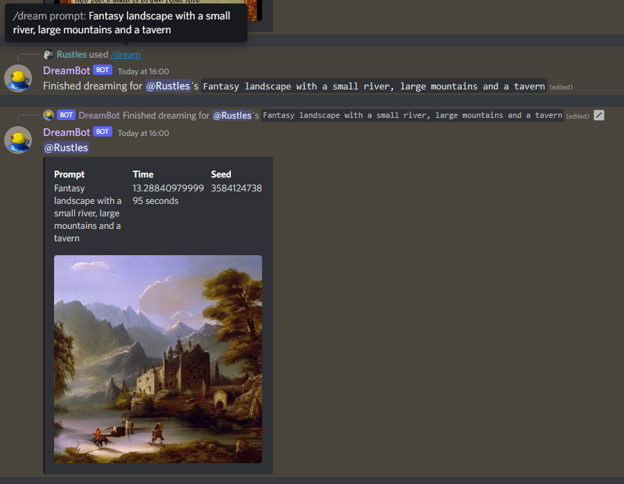
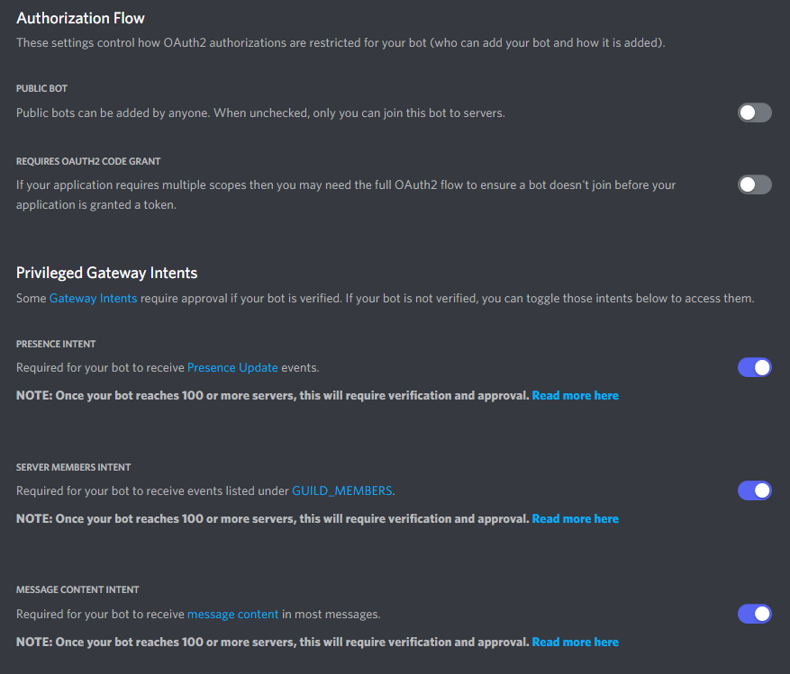
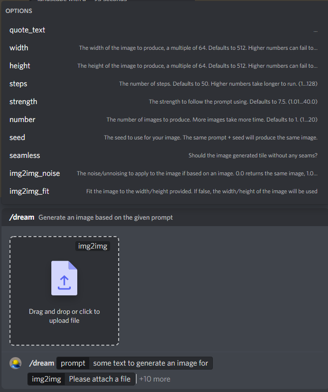

# **Discord Bot**

A Discord bot is provided in `/scripts/discord/discord_bot.py`.



To get this bot configured, you need to do the following:

- [**Discord Bot**](#discord-bot)
- [Setup Discord Bot](#setup-discord-bot)
- [Create Config](#create-config)
- [Run Bot](#run-bot)
- [Use Commands](#use-commands)

# Setup Discord Bot

* Navigate to the [Discord Developer Portal](https://discord.com/developers/applications)
* Create a **New Application**
* Fill out the name, description, etc for it
* Navigate to **OAuth2** and make a note of the **CLIENT ID** (This is a long number)
  * This will be going inside the `discord_config.json` file later
* Navigate to **Bot** and create a new bot, making a note of the **TOKEN** (`ItWill.LookLike.ThisTypeOfThing`)
  * This will be going inside the `discord_config.json` file later and **MUST** be kept private
* Configure the bot's permissions
  * 

# Create Config

Create a copy of `/scripts/discord/discord_config.json.template` called `/scripts/discord/discord_config.json`, filling in the properties as follows:

* **token**: The **Bot Token** from the Discord Developer Portal, which **must** be kept secret
* **bot**: The name of the bot, for your own sanity
* **id**: The oauth2 **client_id** for your app
* **prefix**: The prefix to use if not using slash commands (since some people prefer straight text input), defaulting to !

# Run Bot

Run your bot the same way you'd run `dream.py`, but instead using `/scripts/discord/discord_bot.py`:

**Windows .bat example**: 
```
call C:\ProgramData\Miniconda3\Scripts\activate.bat
call conda activate ldm
python scripts/discord/discord_bot.py
```

Once the bot is running successfully, it will print out the **INVITE** url for you to invite it to servers:
`Bot is ready, oauth url: https://discord.com/oauth2/authorize?client_id=1234&scope=bot+applications.commands&permissions=2147609600`

Follow the invite link to invite it to the server of your choice.

# Use Commands

Once the bot is inside your discord server, you can use it straight away with the `!dream`, but this is limited in its capabilities.
Alternatively, use the command `!sync *` which will immediately make the slash command available to your server, giving all capabilities, accessible through the `/dream` command:

