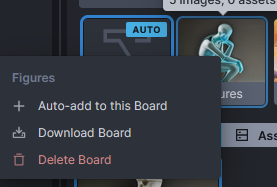

# :material-web: InvokeAI Gallery Panel

## Quick guided walkthrough of the Gallery Panel's features

The Gallery Panel is a fast way to review, find, and make use of images you've
generated and loaded. The Gallery is divided into Boards. The Uncategorized board is always 
present but you can create your own for better organization.

### Board Display and Settings

At the very top of the Gallery Panel are the boards disclosure and settings buttons.

The disclosure button shows the name of the currently selected board and allows you to show and hide the board thumbnails (shown in the image below).

The settings button opens a list of options.

- ***Image Size*** this slider lets you control the size of the image previews (images of three different sizes).
- ***Auto-Switch to New Images*** if you turn this on, whenever a new image is generated, it will automatically be loaded into the current image panel on the Text to Image tab and into the result panel on the [Image to Image](IMG2IMG.md) tab. This will happen invisibly if you are on any other tab when the image is generated.
- ***Auto-Assign Board on Click*** whenever an image is generated or saved, it always gets put in a board. The board it gets put into is marked with AUTO (image of board marked). Turning on Auto-Assign Board on Click will make whichever board you last selected be the destination when you click Invoke. That means you can click Invoke, select a different board, and then click Invoke again and the two images will be put in two different boards. (bold)It's the board selected when Invoke is clicked that's used, not the board that's selected when the image is finished generating.(bold) Turning this off, enables the Auto-Add Board drop down which lets you set one specific board to always put generated images into. This also enables and disables the Auto-add to this Board menu item described below.
- ***Always Show Image Size Badge*** this toggles whether to show image sizes for each image preview (show two images, one with sizes shown, one without)

Below these two buttons, you'll see the Search Boards text entry area. You use this to search for specific boards by the name of the board.
Next to it is the Add Board (+) button which lets you add new boards. Boards can be renamed by clicking on the name of the board under its thumbnail and typing in the new name.

### Board Thumbnail Menu

Each board has a context menu (ctrl+click / right-click).

- ***Auto-add to this Board*** if you've disabled Auto-Assign Board on Click in the board settings, you can use this option to set this board to be where new images are put.
- ***Download Board*** this will add all the images in the board into a zip file and provide a link to it in a notification (image of notification)
- ***Delete Board*** this will delete the board
> [!CAUTION]
> *** This will delete all the images in the board and the board itself. ***

### Board Contents

Every board is organized by two tabs, Images and Assets.

Images are the Invoke-generated images that are placed into the board. Assets are images that you upload into Invoke to be used as an [Image Prompt](https://support.invoke.ai/support/solutions/articles/151000159340-using-the-image-prompt-adapter-ip-adapter-) or in the [Image to Image](IMG2IMG.md) tab.

### Image Thumbnail Menu

Every image generated by Invoke has its generation information stored as text inside the image file itself. This can be read directly by selecting the image and clicking on the Info button  in any of the image result panels. 

Each image also has a context menu (ctrl+click / right-click).

Info button 

 The options are (items marked with an * will not work with images that lack generation information):
- ***Open in New Tab*** this will open the image alone in a new browser tab, separate from the Invoke interface.
- ***Download Image*** this will trigger your browser to download the image.
- ***Load Workflow **** this will load any workflow settings into the Workflow tab and automatically open it.
- ***Remix Image **** this will load all of the image's generation information, (bold)excluding its Seed, into the left hand control panel
- ***Use Prompt **** this will load only the image's text prompts into the left-hand control panel
- ***Use Seed **** this will load only the image's Seed into the left-hand control panel
- ***Use All **** this will load all of the image's generation information into the left-hand control panel
- ***Send to Image to Image*** this will put the image into the left-hand panel in the Image to Image tab ana automatically open it
- ***Send to Unified Canvas*** This will (bold)replace whatever is already present(bold) in the Unified Canvas tab with the image and automatically open the tab
- ***Change Board*** this will oipen a small window that will let you move the image to a different board. This is the same as dragging the image to that board's thumbnail.
- ***Star Image*** this will add the image to the board's list of starred images that are always kept at the top of the gallery. This is the same as clicking on the star on the top right-hand side of the image that appears when you hover over the image with the mouse
- ***Delete Image*** this will delete the image from the board
> [!CAUTION] 
> This will delete the image entirely from Invoke.

## Summary

This walkthrough only covers the Gallery interface and Boards. Actually generating images is handled by [Prompts](PROMPTS.md), the [Image to Image](IMG2IMG.md) tab, and the [Unified Canvas](UNIFIED_CANVAS.md).

## Acknowledgements

A huge shout-out to the core team working to make the Web GUI a reality,
including [psychedelicious](https://github.com/psychedelicious),
[Kyle0654](https://github.com/Kyle0654) and
[blessedcoolant](https://github.com/blessedcoolant).
[hipsterusername](https://github.com/hipsterusername) was the team's unofficial
cheerleader and added tooltips/docs.
