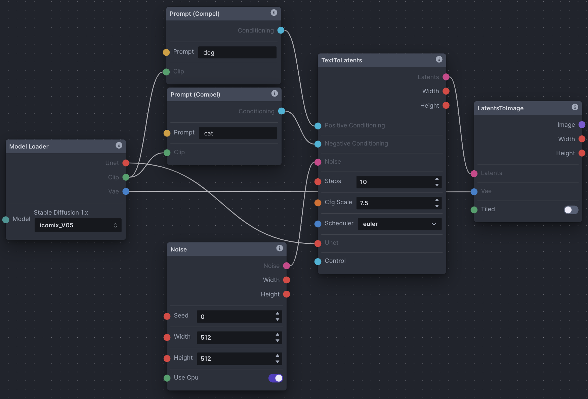

# Nodes Editor (Experimental)

🚨
*The node editor is experimental. We've made it accessible because we use it to develop the application, but we have not addressed the many known rough edges. It's very easy to shoot yourself in the foot, and we cannot offer support for it until it sees full release (ETA v3.1). Everything is subject to change without warning.* 
🚨

The nodes editor is a blank canvas allowing for the use of individual functions and image transformations to control the image generation workflow. The node processing flow is usually done from left (inputs) to right (outputs), though linearity can become abstracted the more complex the node graph becomes. Nodes inputs and outputs are connected by dragging connectors from node to node.

To better understand how nodes are used, think of how an electric power bar works. It takes in one input (electricity from a wall outlet) and passes it to multiple devices through multiple outputs. Similarly, a node could have multiple inputs and outputs functioning at the same (or different) time, but all node outputs pass information onward like a power bar passes electricity. Not all outputs are compatible with all inputs, however - Each node has different constraints on how it is expecting to input/output information. In general, node outputs are colour-coded to match compatible inputs of other nodes.

## Anatomy of a Node

Individual nodes are made up of the following:

- Inputs: Edge points on the left side of the node window where you connect outputs from other nodes.
- Outputs: Edge points on the right side of the node window where you connect to inputs on other nodes.
- Options: Various options which are either manually configured, or overridden by connecting an output from another node to the input.

## Diffusion Overview

Taking the time to understand the diffusion process will help you to understand how to set up your nodes in the nodes editor. 

There are two main spaces Stable Diffusion works in: image space and latent space.

Image space represents images in pixel form that you look at. Latent space represents compressed inputs. It’s in latent space that Stable Diffusion processes images. A VAE (Variational Auto Encoder) is responsible for compressing and encoding inputs into latent space, as well as decoding outputs back into image space.

When you generate an image using text-to-image, multiple steps occur in latent space:
1. Random noise is generated at the chosen height and width. The noise’s characteristics are dictated by the chosen (or not chosen) seed. This noise tensor is passed into latent space. We’ll call this noise A.
1. Using a model’s U-Net, a noise predictor examines noise A, and the words tokenized by CLIP from your prompt (conditioning). It generates its own noise tensor to predict what the final image might look like in latent space. We’ll call this noise B.
1. Noise B is subtracted from noise A in an attempt to create a final latent image indicative of the inputs. This step is repeated for the number of sampler steps chosen.
1. The VAE decodes the final latent image from latent space into image space.

image-to-image is a similar process, with only step 1 being different:
1. The input image is decoded from image space into latent space by the VAE. Noise is then added to the input latent image. Denoising Strength dictates how much noise is added, 0 being none, and 1 being all-encompassing. We’ll call this noise A. The process is then the same as steps 2-4 in the text-to-image explanation above. 

Furthermore, a model provides the CLIP prompt tokenizer, the VAE, and a U-Net (where noise prediction occurs given a prompt and initial noise tensor).

A noise scheduler (eg. DPM++ 2M Karras) schedules the subtraction of noise from the latent image across the sampler steps chosen (step 3 above). Less noise is usually subtracted at higher sampler steps. 

## Node Types (Base Nodes)

| Node  | Function                                                                              |
| ---------------------------------- | --------------------------------------------------------------------------------------|
| Add                                | Adds two numbers |
| CannyImageProcessor                | Canny edge detection for ControlNet |
| ClipSkip                           | Skip layers in clip text_encoder model |
| Collect                            | Collects values into a collection |
| Prompt (Compel)                    | Parse prompt using compel package to conditioning |
| ContentShuffleImageProcessor       | Applies content shuffle processing to image |
| ControlNet                         | Collects ControlNet info to pass to other nodes |
| CvInpaint                          | Simple inpaint using opencv |
| Divide                             | Divides two numbers |
| DynamicPrompt                      | Parses a prompt using adieyal/dynamic prompt's random or combinatorial generator |
| FloatLinearRange                   | Creates a range |
| HedImageProcessor                  | Applies HED edge detection to image |
| ImageBlur                          | Blurs an image |
| ImageChannel                       | Gets a channel from an image |
| ImageCollection                    | Load a collection of images and provide it as output |
| ImageConvert                       | Converts an image to a different mode |
| ImageCrop                          | Crops an image to a specified box. The box can be outside of the image. |
| ImageInverseLerp                   | Inverse linear interpolation of all pixels of an image |
| ImageLerp                          | Linear interpolation of all pixels of an image |
| ImageMultiply                      | Multiplies two images together using `PIL.ImageChops.Multiply()` |
| ImageNSFWBlurInvocation            | Detects and blurs images that may contain sexually explicit content |
| ImagePaste                         | Pastes an image into another image |
| ImageProcessor                     | Base class for invocations that reprocess images for ControlNet |
| ImageResize                        | Resizes an image to specific dimensions |
| ImageScale                         | Scales an image by a factor |
| ImageToLatents                     | Scales latents by a given factor |
| ImageWatermarkInvocation           | Adds an invisible watermark to images |
| InfillColor                        | Infills transparent areas of an image with a solid color |
| InfillPatchMatch                   | Infills transparent areas of an image using the PatchMatch algorithm |
| InfillTile                         | Infills transparent areas of an image with tiles of the image |
| Inpaint                            | Generates an image using inpaint |
| Iterate                            | Iterates over a list of items |
| LatentsToImage                     | Generates an image from latents |
| LatentsToLatents                   | Generates latents using latents as base image |
| LeresImageProcessor                | Applies leres processing to image |
| LineartAnimeImageProcessor         | Applies line art anime processing to image |
| LineartImageProcessor              | Applies line art processing to image |
| LoadImage                          | Load an image and provide it as output |
| Lora Loader                        | Apply selected lora to unet and text_encoder |
| Model Loader                       | Loads a main model, outputting its submodels |
| MaskFromAlpha                      | Extracts the alpha channel of an image as a mask |
| MediapipeFaceProcessor             | Applies mediapipe face processing to image |
| MidasDepthImageProcessor           | Applies Midas depth processing to image |
| MlsdImageProcessor                 | Applied MLSD processing to image |
| Multiply                           | Multiplies two numbers |
| Noise                              | Generates latent noise |
| NormalbaeImageProcessor            | Applies NormalBAE processing to image |
| OpenposeImageProcessor             | Applies Openpose processing to image |
| ParamFloat                         | A float parameter |
| ParamInt                           | An integer parameter |
| PidiImageProcessor                 | Applies PIDI processing to an image |
| Progress Image                     | Displays the progress image in the Node Editor |
| RandomInit                         | Outputs a single random integer |
| RandomRange                        | Creates a collection of random numbers |
| Range                              | Creates a range of numbers from start to stop with step |
| RangeOfSize                        | Creates a range from start to start + size with step |
| ResizeLatents                      | Resizes latents to explicit width/height (in pixels). Provided dimensions are floor-divided by 8. |
| RestoreFace                        | Restores faces in the image |
| ScaleLatents                       | Scales latents by a given factor |
| SegmentAnythingProcessor           | Applies segment anything processing to image |
| ShowImage                          | Displays a provided image, and passes it forward in the pipeline |
| StepParamEasing                    | Experimental per-step parameter for easing for denoising steps |
| Subtract                           | Subtracts two numbers |
| TextToLatents                      | Generates latents from conditionings |
| TileResampleProcessor              | Bass class for invocations that preprocess images for ControlNet |
| Upscale                            | Upscales an image |
| VAE Loader                         | Loads a VAE model, outputting a VaeLoaderOutput |
| ZoeDepthImageProcessor             | Applies Zoe depth processing to image |

## Node Grouping Concepts

There are several node grouping concepts that can be examined with a narrow focus. These (and other) groupings can be pieced together to make up functional graph setups, and are important to understanding how groups of nodes work together as part of a whole. Note that the screenshots below aren't examples of complete functioning node graphs (see Examples).

### Noise

As described, an initial noise tensor is necessary for the latent diffusion process. As a result, all non-image *ToLatents nodes require a noise node input.  

### Conditioning

As described, conditioning is necessary for the latent diffusion process, whether empty or not. As a result, all non-image *ToLatents nodes require positive and negative conditioning inputs. Conditioning is reliant on a CLIP tokenizer provided by the Model Loader node.

### Image Space & VAE

The ImageToLatents node doesn't require a noise node input, but requires a VAE input to convert the image from image space into latent space. In reverse, the LatentsToImage node requires a VAE input to convert from latent space back into image space.

### Defined & Random Seeds

It is common to want to use both the same seed (for continuity) and random seeds (for variance). To define a seed, simply enter it into the 'Seed' field on a noise node. Conversely, the RandomInt node generates a random integer between 'Low' and 'High', and can be used as input to the 'Seed' edge point on a noise node to randomize your seed.

### Control

Control means to guide the diffusion process to adhere to a defined input or structure. Control can be provided as input to non-image *ToLatents nodes from ControlNet nodes. ControlNet nodes usually require an image processor which converts an input image for use with ControlNet.

### LoRA

The Lora Loader node lets you load a LoRA (say that ten times fast) and pass it as output to both the Prompt (Compel) and non-image *ToLatents nodes. A model's CLIP tokenizer is passed through the LoRA into Prompt (Compel), where it affects conditioning. A model's U-Net is also passed through the LoRA into a non-image *ToLatents node, where it affects noise prediction.

### Scaling

Use the ImageScale, ScaleLatents, and Upscale nodes to upscale images and/or latent images. The chosen method differs across contexts. However, be aware that latents are already noisy and compressed at their original resolution; scaling an image could produce more detailed results.

### Iteration + Multiple Images as Input

Iteration is a common concept in any processing, and means to repeat a process with given input. In nodes, you're able to use the Iterate node to iterate through collections usually gathered by the Collect node. The Iterate node has many potential uses, from processing a collection of images one after another, to varying seeds across multiple image generations and more. This screenshot demonstrates how to collect several images and pass them out one at a time.

### Multiple Image Generation + Random Seeds

Multiple image generation in the node editor is done using the RandomRange node. In this case, the 'Size' field represents the number of images to generate. As RandomRange produces a collection of integers, we need to add the Iterate node to iterate through the collection. 

To control seeds across generations takes some care. The first row in the screenshot will generate multiple images with different seeds, but using the same RandomRange parameters across invocations will result in the same group of random seeds being used across the images, producing repeatable results. In the second row, adding the RandomInt node as input to RandomRange's 'Seed' edge point will ensure that seeds are varied across all images across invocations, producing varied results.

## Examples

With our knowledge of node grouping and the diffusion process, let’s break down some basic graphs in the nodes editor. Note that a node's options can be overridden by inputs from other nodes. These examples aren't strict rules to follow and only demonstrate some basic configurations.

### Basic text-to-image Node Graph

- Model Loader: A necessity to generating images (as we’ve read above). We choose our model from the dropdown. It outputs a U-Net, CLIP tokenizer, and VAE.
- Prompt (Compel): Another necessity. Two prompt nodes are created. One will output positive conditioning (what you want, ‘dog’), one will output negative (what you don’t want, ‘cat’). They both input the CLIP tokenizer that the Model Loader node outputs.
- Noise: Consider this noise A from step one of the text-to-image explanation above. Choose a seed number, width, and height.
- TextToLatents: This node takes many inputs for converting and processing text & noise from image space into latent space, hence the name TextTo**Latents**. In this setup, it inputs positive and negative conditioning from the prompt nodes for processing (step 2 above). It inputs noise from the noise node for processing (steps 2 & 3 above). Lastly, it inputs a U-Net from the Model Loader node for processing (step 2 above). It outputs latents for use in the next LatentsToImage node. Choose number of sampler steps, CFG scale, and scheduler.
- LatentsToImage: This node takes in processed latents from the TextToLatents node, and the model’s VAE from the Model Loader node which is responsible for decoding latents back into the image space, hence the name LatentsTo**Image**. This node is the last stop, and once the image is decoded, it is saved to the gallery.

### Basic image-to-image Node Graph

- Model Loader: Choose a model from the dropdown.
- Prompt (Compel): Two prompt nodes. One positive (dog), one negative (dog). Same CLIP inputs from the Model Loader node as before.
- ImageToLatents: Upload a source image directly in the node window, via drag'n'drop from the gallery, or passed in as input. The ImageToLatents node inputs the VAE from the Model Loader node to decode the chosen image from image space into latent space, hence the name ImageTo**Latents**. It outputs latents for use in the next LatentsToLatents node. It also outputs the source image's width and height for use in the next Noise node if the final image is to be the same dimensions as the source image.
- Noise: A noise tensor is created with the width and height of the source image, and connected to the next LatentsToLatents node. Notice the width and height fields are overridden by the input from the ImageToLatents width and height outputs.
- LatentsToLatents: The inputs and options are nearly identical to TextToLatents, except that LatentsToLatents also takes latents as an input. Considering our source image is already converted to latents in the last ImageToLatents node, and text + noise are no longer the only inputs to process, we use the LatentsToLatents node. 
- LatentsToImage: Like previously, the LatentsToImage node will use the VAE from the Model Loader as input to decode the latents from LatentsToLatents into image space, and save it to the gallery.

### Basic ControlNet Node Graph

- Model Loader
- Prompt (Compel)
- Noise: Width and height of the CannyImageProcessor ControlNet image is passed in to set the dimensions of the noise passed to TextToLatents.
- CannyImageProcessor: The CannyImageProcessor node is used to process the source image being used as a ControlNet. Each ControlNet processor node applies control in different ways, and has some different options to configure. Width and height are passed to noise, as mentioned. The processed ControlNet image is output to the ControlNet node.
- ControlNet: Select the type of control model. In this case, canny is chosen as the CannyImageProcessor was used to generate the ControlNet image. Configure the control node options, and pass the control output to TextToLatents.
- TextToLatents: Similar to the basic text-to-image example, except ControlNet is passed to the control input edge point.
- LatentsToImage
