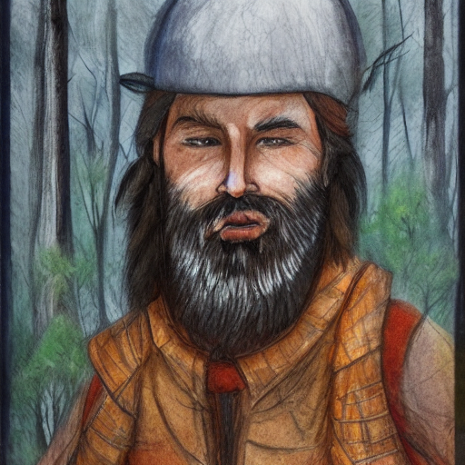

# :octicons-command-palette-24: Prompting-Features

## **Prompt Syntax Features**

The InvokeAI prompting language has the following features:

### Attention weighting

Append a word or phrase with `-` or `+`, or a weight between `0` and `2`
(`1`=default), to decrease or increase "attention" (= a mix of per-token CFG
weighting multiplier and, for `-`, a weighted blend with the prompt without the
term).

The following syntax is recognised:

- single words without parentheses: `a tall thin man picking apricots+`
- single or multiple words with parentheses:
  `a tall thin man picking (apricots)+` `a tall thin man picking (apricots)-`
  `a tall thin man (picking apricots)+` `a tall thin man (picking apricots)-`
- more effect with more symbols `a tall thin man (picking apricots)++`
- nesting `a tall thin man (picking apricots+)++` (`apricots` effectively gets
  `+++`)
- all of the above with explicit numbers `a tall thin man picking (apricots)1.1`
  `a tall thin man (picking (apricots)1.3)1.1`. (`+` is equivalent to 1.1, `++`
  is pow(1.1,2), `+++` is pow(1.1,3), etc; `-` means 0.9, `--` means pow(0.9,2),
  etc.)

You can use this to increase or decrease the amount of something. Starting from
this prompt of `a man picking apricots from a tree`, let's see what happens if
we increase and decrease how much attention we want Stable Diffusion to pay to
the word `apricots`:

<figure markdown>


</figure>

Using `-` to reduce apricot-ness:

| `a man picking apricots- from a tree`                                                                                          | `a man picking apricots-- from a tree`                                                                                                        | `a man picking apricots--- from a tree`                                                                                                    |
| ------------------------------------------------------------------------------------------------------------------------------ | --------------------------------------------------------------------------------------------------------------------------------------------- | ------------------------------------------------------------------------------------------------------------------------------------------ |
|  |  |  |

Using `+` to increase apricot-ness:

| `a man picking apricots+ from a tree`                                                                                                      | `a man picking apricots++ from a tree`                                                                                                              | `a man picking apricots+++ from a tree`                                                                                                                     | `a man picking apricots++++ from a tree`                                                                                                                                           | `a man picking apricots+++++ from a tree`                                                                                                                                                                           |
| ------------------------------------------------------------------------------------------------------------------------------------------ | --------------------------------------------------------------------------------------------------------------------------------------------------- | ----------------------------------------------------------------------------------------------------------------------------------------------------------- | ---------------------------------------------------------------------------------------------------------------------------------------------------------------------------------- | ------------------------------------------------------------------------------------------------------------------------------------------------------------------------------------------------------------------- |
|  |  |  |  |  |

You can also change the balance between different parts of a prompt. For
example, below is a `mountain man`:

<figure markdown>



</figure>

And here he is with more mountain:

| `mountain+ man`                                | `mountain++ man`                               | `mountain+++ man`                              |
| ---------------------------------------------- | ---------------------------------------------- | ---------------------------------------------- |
|  |  |  |

Or, alternatively, with more man:

| `mountain man+`                                | `mountain man++`                               | `mountain man+++`                              | `mountain man++++`                             |
| ---------------------------------------------- | ---------------------------------------------- | ---------------------------------------------- | ---------------------------------------------- |
|  |  |  |  |

### Prompt Blending

- `("a tall thin man picking apricots", "a tall thin man picking pears").blend(1,1)`
- The existing prompt blending using `:<weight>` will continue to be supported -
  `("a tall thin man picking apricots", "a tall thin man picking pears").blend(1,1)`
  is equivalent to
  `a tall thin man picking apricots:1 a tall thin man picking pears:1` in the
  old syntax.
- Attention weights can be nested inside blends.
- Non-normalized blends are supported by passing `no_normalize` as an additional
  argument to the blend weights, eg
  `("a tall thin man picking apricots", "a tall thin man picking pears").blend(1,-1,no_normalize)`.
  very fun to explore local maxima in the feature space, but also easy to
  produce garbage output.

See the section below on "Prompt Blending" for more information about how this
works.

### Prompt Conjunction  
Join multiple clauses together to create a conjoined prompt. Each clause will be passed to CLIP separately. 

For example, the prompt: 

```bash
"A mystical valley surround by towering granite cliffs, watercolor, warm"
```

Can be used with .and():
```bash
("A mystical valley", "surround by towering granite cliffs", "watercolor", "warm").and()
```

Each will give you different results - try them out and see what you prefer!


### Cross-Attention Control ('prompt2prompt')

Sometimes an image you generate is almost right, and you just want to change one
detail without affecting the rest. You could use a photo editor and inpainting
to overpaint the area, but that's a pain. Here's where `prompt2prompt` comes in
handy.

Generate an image with a given prompt, record the seed of the image, and then
use the `prompt2prompt` syntax to substitute words in the original prompt for
words in a new prompt. This works for `img2img` as well.

For example, consider the prompt `a cat.swap(dog) playing with a ball in the forest`. Normally, because of the word words interact with each other when doing a stable diffusion image generation, these two prompts would generate different compositions:
  - `a cat playing with a ball in the forest`
  - `a dog playing with a ball in the forest`

| `a cat playing with a ball in the forest` | `a dog playing with a ball in the forest` |
| --- | --- |
| img | img |


      - For multiple word swaps, use parentheses: `a (fluffy cat).swap(barking dog) playing with a ball in the forest`.
      - To swap a comma, use quotes: `a ("fluffy, grey cat").swap("big, barking dog") playing with a ball in the forest`.
- Supports options `t_start` and `t_end` (each 0-1) loosely corresponding to (bloc97's)[(https://github.com/bloc97/CrossAttentionControl)] `prompt_edit_tokens_start/_end` but with the math swapped to make it easier to
  intuitively understand. `t_start` and `t_end` are used to control on which steps cross-attention control should run. With the default values `t_start=0` and `t_end=1`, cross-attention control is active on every step of image generation. Other values can be used to turn cross-attention control off for part of the image generation process.
    - For example, if doing a diffusion with 10 steps for the prompt is `a cat.swap(dog, t_start=0.3, t_end=1.0) playing with a ball in the forest`, the first 3 steps will be run as `a cat playing with a ball in the forest`, while the last 7 steps will run as `a dog playing with a ball in the forest`, but the pixels that represent `dog` will be locked to the pixels that would have represented `cat` if the `cat` prompt had been used instead.
    - Conversely, for `a cat.swap(dog, t_start=0, t_end=0.7) playing with a ball in the forest`, the first 7 steps will run as `a dog playing with a ball in the forest` with the pixels that represent `dog` locked to the same pixels that would have represented `cat` if the `cat` prompt was being used instead. The final 3 steps will just run `a cat playing with a ball in the forest`.
    > For img2img, the step sequence does not start at 0 but instead at `(1.0-strength)` - so if the img2img `strength` is `0.7`, `t_start` and `t_end` must both be greater than `0.3` (`1.0-0.7`) to have any effect.

Prompt2prompt `.swap()` is not compatible with xformers, which will be temporarily disabled when doing a `.swap()` - so you should expect to use more VRAM and run slower that with xformers enabled.

The `prompt2prompt` code is based off
[bloc97's colab](https://github.com/bloc97/CrossAttentionControl).

### Escaping parentheses () and speech marks ""

If the model you are using has parentheses () or speech marks "" as part of its
syntax, you will need to "escape" these using a backslash, so that`(my_keyword)`
becomes `\(my_keyword\)`. Otherwise, the prompt parser will attempt to interpret
the parentheses as part of the prompt syntax and it will get confused.

---

## **Prompt Blending**

You may blend together prompts to explore the AI's
latent semantic space and generate interesting (and often surprising!)
variations. The syntax is:

```bash
("prompt #1", "prompt #2").blend(0.25, 0.75)
```

This will tell the sampler to blend 25% of the concept of prompt #1 with 75%
of the concept of prompt #2. It is recommended to keep the sum of the weights to around 1.0, but interesting things might happen if you go outside of this range.

Because you are exploring the "mind" of the AI, the AI's way of mixing two
concepts may not match yours, leading to surprising effects. To illustrate, here
are three images generated using various combinations of blend weights. As
usual, unless you fix the seed, the prompts will give you different results each
time you run them.

Let's examine how this affects image generation results:


```bash
"blue sphere, red cube, hybrid"
```

This example doesn't use blending at all and represents the default way of mixing
concepts.

<figure markdown>


</figure>

It's interesting to see how the AI expressed the concept of "cube" within the sphere. If you look closely, there is depth there, so the enclosing frame is actually a cube.

<figure markdown>

```bash
("blue sphere", "red cube").blend(0.25, 0.75)
```


</figure>

Now that's interesting. We get an image with a resemblance of a red cube, with a hint of blue shadows which represents a melding of concepts within the AI's "latent space" of semantic representations. 

<figure markdown>

```bash
("blue sphere", "red cube").blend(0.75, 0.25)
```


</figure>

Definitely more blue-spherey. 

<figure markdown>

```bash
("blue sphere", "red cube").blend(0.5, 0.5)
```
</figure>

<figure markdown>

</figure>


Whoa...! I see blue and red, and if I squint, spheres and cubes.


## Dynamic Prompts

Dynamic Prompts are a powerful feature designed to produce a variety of prompts based on user-defined options. Using a special syntax, you can construct a prompt with multiple possibilities, and the system will automatically generate a series of permutations based on your settings. This is extremely beneficial for ideation, exploring various scenarios, or testing different concepts swiftly and efficiently.

### Structure of a Dynamic Prompt

A Dynamic Prompt comprises of regular text, supplemented with alternatives enclosed within curly braces {} and separated by a vertical bar |. For example: {option1|option2|option3}. The system will then select one of the options to include in the final prompt. This flexible system allows for options to be placed throughout the text as needed.

Furthermore, Dynamic Prompts can designate multiple selections from a single group of options. This feature is triggered by prefixing the options with a numerical value followed by $$. For example, in {2$$option1|option2|option3}, the system will select two distinct options from the set.
### Creating Dynamic Prompts

To create a Dynamic Prompt, follow these steps:

    Draft your sentence or phrase, identifying words or phrases with multiple possible options.
    Encapsulate the different options within curly braces {}.
    Within the braces, separate each option using a vertical bar |.
    If you want to include multiple options from a single group, prefix with the desired number and $$.

For instance: A {house|apartment|lodge|cottage} in {summer|winter|autumn|spring} designed in {2$$style1|style2|style3}.
### How Dynamic Prompts Work

Once a Dynamic Prompt is configured, the system generates an array of combinations using the options provided. Each group of options in curly braces is treated independently, with the system selecting one option from each group. For a prefixed set (e.g., 2$$), the system will select two distinct options.

For example, the following prompts could be generated from the above Dynamic Prompt:

    A house in summer designed in style1, style2
    A lodge in autumn designed in style3, style1
    A cottage in winter designed in style2, style3
    And many more!

When the `Combinatorial` setting is on, Invoke will disable the "Images" selection, and generate every combination up until the setting for Max Prompts is reached.
When the `Combinatorial` setting is off, Invoke will randomly generate combinations up until the setting for Images has been reached.


### Tips and Tricks for Using Dynamic Prompts

Below are some useful strategies for creating Dynamic Prompts:

    Utilize Dynamic Prompts to generate a wide spectrum of prompts, perfect for brainstorming and exploring diverse ideas.
    Ensure that the options within a group are contextually relevant to the part of the sentence where they are used. For instance, group building types together, and seasons together.
    Apply the 2$$ prefix when you want to incorporate more than one option from a single group. This becomes quite handy when mixing and matching different elements.
    Experiment with different quantities for the prefix. For example, 3$$ will select three distinct options.
    Be aware of coherence in your prompts. Although the system can generate all possible combinations, not all may semantically make sense. Therefore, carefully choose the options for each group.
    Always review and fine-tune the generated prompts as needed. While Dynamic Prompts can help you generate a multitude of combinations, the final polishing and refining remain in your hands.
