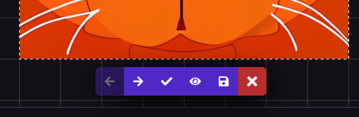
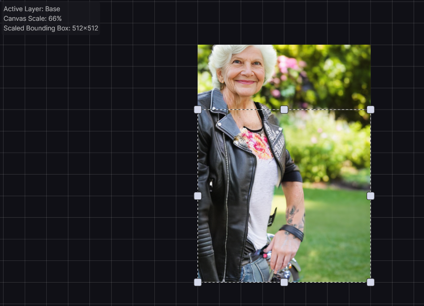

The Unified Canvas is a tool designed to streamline and simplify the process of
composing an image using Stable Diffusion. It offers artists all of the
available Stable Diffusion generation modes (Text To Image, Image To Image,
Inpainting, and Outpainting) as a single unified workflow. The flexibility of
the tool allows you to tweak and edit image generations, extend images beyond
their initial size, and to create new content in a freeform way both inside and
outside of existing images.

This document explains the basics of using the Unified Canvas, introducing you
to its features and tools one by one. It also describes some of the more
advanced tools available to power users of the Canvas.

## Basics

The Unified Canvas consists of two layers: the **Base Layer** and the **Mask
Layer**. You can swap from one layer to the other by selecting the layer you
want in the drop-down menu on the top left corner of the Unified Canvas, or by
pressing the (Q) hotkey.

### Base Layer

The **Base Layer** is the image content currently managed by the Canvas, and can
be exported at any time to the gallery by using the **Save to Gallery** option.
When the Base Layer is selected, the Brush (B) and Eraser (E) tools will
directly manipulate the base layer. Any images uploaded to the Canvas, or sent
to the Unified Canvas from the gallery, will clear out all existing content and
set the Base layer to the new image.

### Staging Area

When you generate images, they will display in the Canvas's **Staging Area**,
alongside the Staging Area toolbar buttons. While the Staging Area is active,
you cannot interact with the Canvas itself.

<figure markdown>

</figure>

Accepting generations will commit the new generation to the **Base Layer**. You
can review all generated images using the Prev/Next arrows, save any individual
generations to your gallery (without committing to the Base layer) or discard
generations. While you can Undo a discard in an individual Canvas session, any
generations that are not saved will be lost when the Canvas resets.

### Mask Layer

The **Mask Layer** consists of any masked sections that have been created to
inform Inpainting generations. You can paint a new mask, or edit an existing
mask, using the Brush tool and the Eraser with the Mask layer set as your Active
layer. Any masked areas will only affect generation inside of the current
bounding box.

### Bounding Box

When generating a new image, Invoke will process and apply new images within the
area denoted by the **Bounding Box**. The Width & Height settings of the
Bounding Box, as well as its location within the Unified Canvas and pixels or
empty space that it encloses, determine how new invocations are generated - see
[Inpainting & Outpainting](#inpainting-and-outpainting) below. The Bounding Box
can be moved and resized using the Move (V) tool. It can also be resized using
the Bounding Box options in the Options Panel. By using these controls you can
generate larger or smaller images, control which sections of the image are being
processed, as well as control Bounding Box tools like the Bounding Box
fill/erase.

###  Inpainting & Outpainting

"Inpainting" means asking the AI to refine part of an image while leaving the
rest alone. For example, updating a portrait of your grandmother to have her
wear a biker's jacket.

|                         masked original                         |                                       inpaint result                                       |
| :-------------------------------------------------------------: | :----------------------------------------------------------------------------------------: |
|  |  |

"Outpainting" means asking the AI to expand the original image beyond its
original borders, making a bigger image that's still based on the original. For
example, extending the above image of your Grandmother in a biker's jacket to
include her wearing jeans (and while we're at it, a motorcycle!)

<figure markdown>

</figure>

When you are using the Unified Canvas, Invoke decides automatically whether to
do Inpainting, Outpainting, ImageToImage, or TextToImage by looking inside the
area enclosed by the Bounding Box. It chooses the appropriate type of generation
based on whether the Bounding Box contains empty (transparent) areas on the Base
layer, or whether it contains colored areas from previous generations (or from
painted brushstrokes) on the Base layer, and/or whether the Mask layer contains
any brushstrokes. See [Generation Methods](#generation-methods) below for more
information.

## Getting Started

To get started with the Unified Canvas, you will want to generate a new base
layer using Txt2Img or importing an initial image. We'll refer to either of
these methods as the "initial image" in the below guide.

From there, you can consider the following techniques to augment your image:

- **New Images**: Move the bounding box to an empty area of the Canvas, type in
  your prompt, and Invoke, to generate a new image using the Text to Image
  function.
- **Image Correction**: Use the color picker and brush tool to paint corrections
  on the image, switch to the Mask layer, and brush a mask over your painted
  area to use **Inpainting**. You can also use the **ImageToImage** generation
  method to invoke new interpretations of the image.
- **Image Expansion**: Move the bounding box to include a portion of your
  initial image, and a portion of transparent/empty pixels, then Invoke using a
  prompt that describes what you'd like to see in that area. This will Outpaint
  the image. You'll typically find more coherent results if you keep about
  50-60% of the original image in the bounding box. Make sure that the Image To
  Image Strength slider is set to a high value - you may need to set it higher
  than you are used to.
- **New Content on Existing Images**: If you want to add new details or objects
  into your image, use the brush tool to paint a sketch of what you'd like to
  see on the image, switch to the Mask layer, and brush a mask over your painted
  area to use **Inpainting**. If the masked area is small, consider using a
  smaller bounding box to take advantage of Invoke's automatic Scaling features,
  which can help to produce better details.
- **And more**: There are a number of creative ways to use the Canvas, and the
  above are just starting points. We're excited to see what you come up with!

##  Generation Methods

The Canvas can use all generation methods available (Txt2Img, Img2Img,
Inpainting, and Outpainting), and these will be automatically selected and used
based on the current selection area within the Bounding Box.

### Text to Image

If the Bounding Box is placed over an area of Canvas with an **empty Base
Layer**, invoking a new image will use **TextToImage**. This generates an
entirely new image based on your prompt.

### Image to Image

If the Bounding Box is placed over an area of Canvas with an **existing Base
Layer area with no transparent pixels or masks**, invoking a new image will use
**ImageToImage**. This uses the image within the bounding box and your prompt to
interpret a new image. The image will be closer to your original image at lower
Image to Image strengths.

### Inpainting

If the Bounding Box is placed over an area of Canvas with an **existing Base
Layer and any pixels selected using the Mask layer**, invoking a new image will
use **Inpainting**. Inpainting uses the existing colors/forms in the masked area
in order to generate a new image for the masked area only. The unmasked portion
of the image will remain the same. Image to Image strength applies to the
inpainted area.

If you desire something completely different from the original image in your new
generation (i.e., if you want Invoke to ignore existing colors/forms), consider
toggling the Inpaint Replace setting on, and use high values for both Inpaint
Replace and Image To Image Strength.

!!! note

    By default, the **Scale Before Processing** option &mdash; which
    inpaints more coherent details by generating at a larger resolution and then
    scaling &mdash; is only activated when the Bounding Box is relatively small.
    To get the best inpainting results you should therefore resize your Bounding
    Box to the smallest area that contains your mask and enough surrounding detail
    to help Stable Diffusion understand the context of what you want it to draw.
    You should also update your prompt so that it describes _just_ the area within
    the Bounding Box.

### Outpainting

If the Bounding Box is placed over an area of Canvas partially filled by an
existing Base Layer area and partially by transparent pixels or masks, invoking
a new image will use **Outpainting**, as well as **Inpainting** any masked
areas.

---

## Advanced Features

Features with non-obvious behavior are detailed below, in order to provide
clarity on the intent and common use cases we expect for utilizing them.

### Toolbar

#### Mask Options

- **Enable Mask** - This flag can be used to Enable or Disable the currently
  painted mask. If you have painted a mask, but you don't want it affect the
  next invocation, but you _also_ don't want to delete it, then you can set this
  option to Disable. When you want the mask back, set this back to Enable.
- **Preserve Masked Area** - When enabled, Preserve Masked Area inverts the
  effect of the Mask on the Inpainting process. Pixels in masked areas will be
  kept unchanged, and unmasked areas will be regenerated.

#### Creative Tools

- **Brush - Base/Mask Modes** - The Brush tool switches automatically between
  different modes of operation for the Base and Mask layers respectively.
    - On the Base layer, the brush will directly paint on the Canvas using the
      color selected on the Brush Options menu.
    - On the Mask layer, the brush will create a new mask. If you're finding the
      mask difficult to see over the existing content of the Unified Canvas, you
      can change the color it is drawn with using the color selector on the Mask
      Options dropdown.
- **Erase Bounding Box** - On the Base layer, erases all pixels within the
  Bounding Box.
- **Fill Bounding Box** - On the Base layer, fills all pixels within the
  Bounding Box with the currently selected color.

#### Canvas Tools

- **Move Tool** - Allows for manipulation of the Canvas view (by dragging on the
  Canvas, outside the bounding box), the Bounding Box (by dragging the edges of
  the box), or the Width/Height of the Bounding Box (by dragging one of the 9
  directional handles).
- **Reset View** - Click to re-orients the view to the center of the Bounding
  Box.
- **Merge Visible** - If your browser is having performance problems drawing the
  image in the Unified Canvas, click this to consolidate all of the information
  currently being rendered by your browser into a merged copy of the image. This
  lowers the resource requirements and should improve performance.

### Compositing / Seam Correction

When doing Inpainting or Outpainting, Invoke needs to merge the pixels generated
by Stable Diffusion into your existing image. This is achieved through compositing - the area around the the boundary between your image and the new generation is
automatically blended to produce a seamless output. In a fully automatic
process, a mask is generated to cover the boundary, and then the area of the boundary is
Inpainted.

Although the default options should work well most of the time, sometimes it can
help to alter the parameters that control the Compositing. A larger blur and
a blur setting  have been noted as producing
consistently strong results . Strength of 0.7 is best for reducing hard seams.

- **Mode** - What part of the image will have the the Compositing applied to it.
  - **Mask edge** will apply Compositing to the edge of the masked area
  - **Mask** will apply Compositing to the entire masked area
  - **Unmasked** will apply Compositing to the entire image
- **Steps** - Number of generation steps that will occur during the Coherence Pass, similar to Denoising Steps. Higher step counts will generally have better results.
- **Strength** - How much noise is added for the Coherence Pass, similar to Denoising Strength. A strength of 0 will result in an unchanged image, while a strength of 1 will result in an image with a completely new area as defined by the Mode setting.
- **Blur** - Adjusts the pixel radius of the the mask. A larger blur radius will cause the mask to extend past the visibly masked area, while too small of a blur radius will result in a mask that is smaller than the visibly masked area.
- **Blur Method** - The method of blur applied to the masked area. 

### Infill & Scaling

- **Scale Before Processing & W/H**: When generating images with a bounding box
  smaller than the optimized W/H of the model (e.g., 512x512 for SD1.5), this
  feature first generates at a larger size with the same aspect ratio, and then
  scales that image down to fill the selected area. This is particularly useful
  when inpainting very small details. Scaling is optional but is enabled by
  default.
- **Inpaint Replace**: When Inpainting, the default method is to utilize the
  existing RGB values of the Base layer to inform the generation process. If
  Inpaint Replace is enabled, noise is generated and blended with the existing
  pixels (completely replacing the original RGB values at an Inpaint Replace
  value of 1). This can help generate more variation from the pixels on the Base
  layers.
    - When using Inpaint Replace you should use a higher Image To Image Strength
      value, especially at higher Inpaint Replace values
- **Infill Method**: Invoke currently supports two methods for producing RGB
  values for use in the Outpainting process: Patchmatch and Tile. We believe
  that Patchmatch is the superior method, however we provide support for Tile in
  case Patchmatch cannot be installed or is unavailable on your computer.
- **Tile Size**: The Tile method for Outpainting sources small portions of the
  original image and randomly place these into the areas being Outpainted. This
  value sets the size of those tiles.

## Hot Keys

The Unified Canvas is a tool that excels when you use hotkeys. You can view the
full list of keyboard shortcuts, updated with all new features, by clicking the
Keyboard Shortcuts icon at the top right of the InvokeAI WebUI.
