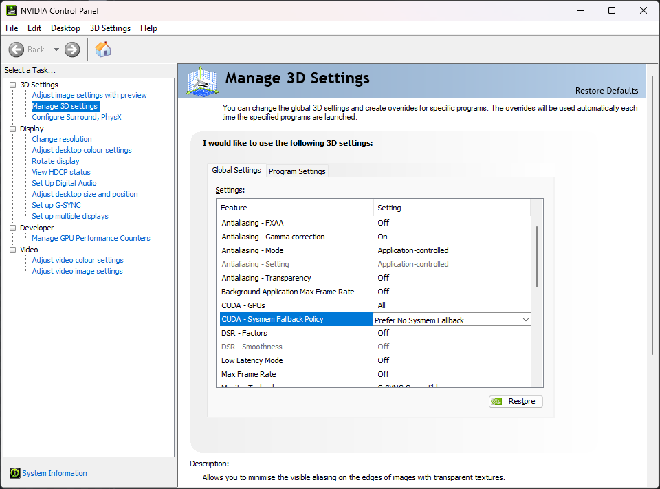

As of v5.6.0, Invoke has a low-VRAM mode. It works on systems with dedicated GPUs (Nvidia GPUs on Windows/Linux and AMD GPUs on Linux).

This allows you to generate even if your GPU doesn't have enough VRAM to hold full models. Most users should be able to run even the beefiest models - like the ~24GB unquantised FLUX dev model.

## Enabling Low-VRAM mode

To enable Low-VRAM mode, add this line to your `invokeai.yaml` configuration file, then restart Invoke:

```yaml
enable_partial_loading: true
```

**Windows users should also [disable the Nvidia sysmem fallback](#disabling-nvidia-sysmem-fallback-windows-only)**.

It is possible to fine-tune the settings for best performance or if you still get out-of-memory errors (OOMs).

!!! tip "How to find `invokeai.yaml`"

    The `invokeai.yaml` configuration file lives in your install directory. To access it, run the **Invoke Community Edition** launcher and click the install location. This will open your install directory in a file explorer window.

    You'll see `invokeai.yaml` there and can edit it with any text editor. After making changes, restart Invoke.

    If you don't see `invokeai.yaml`, launch Invoke once. It will create the file on its first startup.

## Details and fine-tuning

Low-VRAM mode involves 3 features, each of which can be configured or fine-tuned:

- Partial model loading
- Dynamic RAM and VRAM cache sizes
- Working memory

Read on to learn about these features and understand how to fine-tune them for your system and use-cases.

### Partial model loading

Invoke's partial model loading works by streaming model "layers" between RAM and VRAM as they are needed.

When an operation needs layers that are not in VRAM, but there isn't enough room to load them, inactive layers are offloaded to RAM to make room.

#### Enabling partial model loading

As described above, you can enable partial model loading by adding this line to `invokeai.yaml`:

```yaml
enable_partial_loading: true
```

### Dynamic RAM and VRAM cache sizes

Loading models from disk is slow and can be a major bottleneck for performance. Invoke uses two model caches - RAM and VRAM - to reduce loading from disk to a minimum.

By default, Invoke manages these caches' sizes dynamically for best performance.

#### Fine-tuning cache sizes

Prior to v5.6.0, the cache sizes were static, and for best performance, many users needed to manually fine-tune the `ram` and `vram` settings in `invokeai.yaml`.

As of v5.6.0, the caches are dynamically sized. The `ram` and `vram` settings are no longer used, and new settings are added to configure the cache.

**Most users will not need to fine-tune the cache sizes.**

But, if your GPU has enough VRAM to hold models fully, you might get a perf boost by manually setting the cache sizes in `invokeai.yaml`:

```yaml
# Set the RAM cache size to as large as possible, leaving a few GB free for the rest of your system and Invoke.
# For example, if your system has 32GB RAM, 28GB is a good value.
max_cache_ram_gb: 28
# Set the VRAM cache size to be as large as possible while leaving enough room for the working memory of the tasks you will be doing.
# For example, on a 24GB GPU that will be running unquantized FLUX without any auxiliary models,
# 18GB is a good value.
max_cache_vram_gb: 18
```

!!! tip "Max safe value for `max_cache_vram_gb`"

    To determine the max safe value for `max_cache_vram_gb`, subtract `device_working_mem_gb` from your GPU's VRAM. As described below, the default for `device_working_mem_gb` is 3GB.

    For example, if you have a 12GB GPU, the max safe value for `max_cache_vram_gb` is `12GB - 3GB = 9GB`.

    If you had increased `device_working_mem_gb` to 4GB, then the max safe value for `max_cache_vram_gb` is `12GB - 4GB = 8GB`.

### Working memory

Invoke cannot use _all_ of your VRAM for model caching and loading. It requires some VRAM to use as working memory for various operations.

Invoke reserves 3GB VRAM as working memory by default, which is enough for most use-cases. However, it is possible to fine-tune this setting if you still get OOMs.

#### Fine-tuning working memory

You can increase the working memory size in `invokeai.yaml` to prevent OOMs:

```yaml
# The default is 3GB - bump it up to 4GB to prevent OOMs.
device_working_mem_gb: 4
```

!!! tip "Operations may request more working memory"

    For some operations, we can determine VRAM requirements in advance and allocate additional working memory to prevent OOMs.

    VAE decoding is one such operation. This operation converts the generation process's output into an image. For large image outputs, this might use more than the default working memory size of 3GB.

    During this decoding step, Invoke calculates how much VRAM will be required to decode and requests that much VRAM from the model manager. If the amount exceeds the working memory size, the model manager will offload cached model layers from VRAM until there's enough VRAM to decode.

    Once decoding completes, the model manager "reclaims" the extra VRAM allocated as working memory for future model loading operations.

### Disabling Nvidia sysmem fallback (Windows only)

On Windows, Nvidia GPUs are able to use system RAM when their VRAM fills up via **sysmem fallback**. While it sounds like a good idea on the surface, in practice it causes massive slowdowns during generation.

It is strongly suggested to disable this feature:

- Open the **NVIDIA Control Panel** app.
- Expand **3D Settings** on the left panel.
- Click **Manage 3D Settings** in the left panel.
- Find **CUDA - Sysmem Fallback Policy** in the right panel and set it to **Prefer No Sysmem Fallback**.



!!! tip "Invoke does the same thing, but better"

    If the sysmem fallback feature sounds familiar, that's because Invoke's partial model loading strategy is conceptually very similar - use VRAM when there's room, else fall back to RAM.

    Unfortunately, the Nvidia implementation is not optimized for applications like Invoke and does more harm than good.
