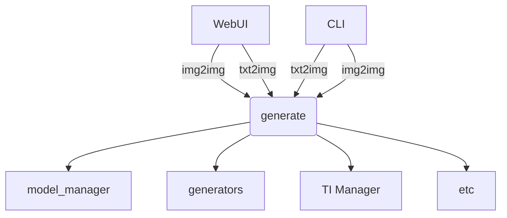
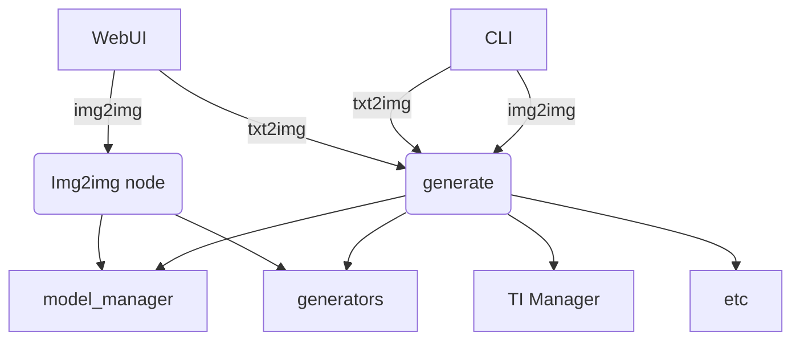
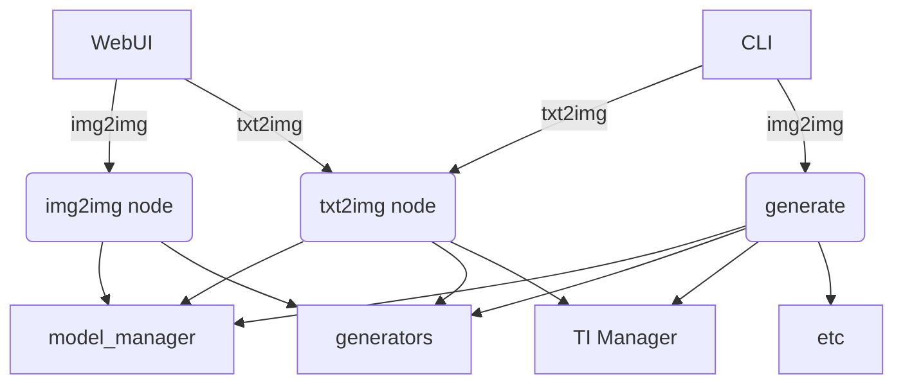
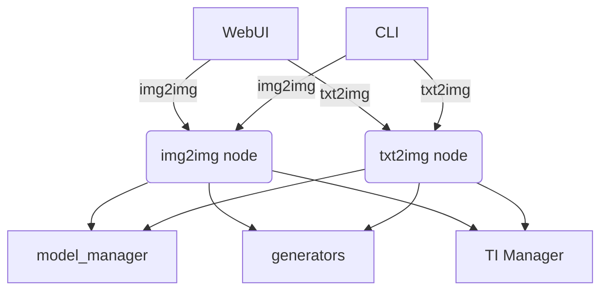

# Tranformation to nodes

## Current state

```mermaid
flowchart TD
    web[WebUI];
    cli[CLI];
    web --> |img2img| generate(generate);
    web --> |txt2img| generate(generate);
    cli --> |txt2img| generate(generate);
    cli --> |img2img| generate(generate);
    generate --> model_manager;
    generate --> generators;
    generate --> ti_manager[TI Manager];
    generate --> etc;
```

## Transitional Architecture

### first step

```mermaid
flowchart TD
    web[WebUI];
    cli[CLI];
    web --> |img2img| img2img_node(Img2img node);
    web --> |txt2img| generate(generate);
    img2img_node --> model_manager;
    img2img_node --> generators;
    cli --> |txt2img| generate;
    cli --> |img2img| generate;
    generate --> model_manager;
    generate --> generators;
    generate --> ti_manager[TI Manager];
    generate --> etc;
```

### second step

```mermaid
flowchart TD
    web[WebUI];
    cli[CLI];
    web --> |img2img| img2img_node(img2img node);
    img2img_node --> model_manager;
    img2img_node --> generators;
    web --> |txt2img| txt2img_node(txt2img node);
    cli --> |txt2img| txt2img_node;
    cli --> |img2img| generate(generate);
    generate --> model_manager;
    generate --> generators;
    generate --> ti_manager[TI Manager];
    generate --> etc;
    txt2img_node --> model_manager;
    txt2img_node --> generators;
    txt2img_node --> ti_manager[TI Manager];
```

## Final Architecture

```mermaid
flowchart TD
    web[WebUI];
    cli[CLI];
    web --> |img2img|img2img_node(img2img node);
    cli --> |img2img|img2img_node;
    web --> |txt2img|txt2img_node(txt2img node);
    cli --> |txt2img|txt2img_node;
    img2img_node --> model_manager;
    txt2img_node --> model_manager;
    img2img_node --> generators;
    txt2img_node --> generators;
    img2img_node --> ti_manager[TI Manager];
    txt2img_node --> ti_manager[TI Manager];
```
