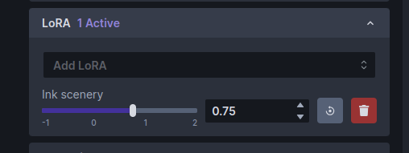

# :material-web: InvokeAI Web Server

## Quick guided walkthrough of the WebUI's features

While most of the WebUI's features are intuitive, here is a guided walkthrough
through its various components.

### Launching the WebUI

To run the InvokeAI web server, start the `invoke.sh`/`invoke.bat`
script and select option (1). Alternatively, with the InvokeAI
environment active, run `invokeai-web`:

```bash
invokeai-web
```

You can then connect to the server by pointing your web browser at
http://localhost:9090. To reach the server from a different machine on your LAN,
you may launch the web server with the `--host` argument and either the IP
address of the host you are running it on, or the wildcard `0.0.0.0`. For
example:

```bash
invoke.sh --host 0.0.0.0
```

or

```bash
invokeai-web --host 0.0.0.0
```

### The InvokeAI Web Interface

{:width="640px"}

The screenshot above shows the Text to Image tab of the WebUI. There are three
main sections:

1. A **control panel** on the left, which contains various settings
   for text to image generation. The most important part is the text
   field (currently showing `fantasy painting, horned demon`) for
   entering the positive text prompt, another text field right below it for an
   optional negative text prompt (concepts to exclude), and a _Invoke_ button 
   to begin the image rendering process.

2. The **current image** section in the middle, which shows a large
   format version of the image you are currently working on. A series
   of buttons at the top lets you modify and manipulate the image in
   various ways.

3. A **gallery** section on the right that contains a history of the images you
   have generated. These images are read and written to the directory specified
   in the `INVOKEAIROOT/invokeai.yaml` initialization file, usually a directory
   named `outputs` in `INVOKEAIROOT`.

In addition to these three elements, there are a series of icons for changing
global settings, reporting bugs, and changing the theme on the upper right.

There are also a series of icons to the left of the control panel (see
highlighted area in the screenshot below) which select among a series of tabs
for performing different types of operations.

<figure markdown>
{:width="512px"}
</figure>

From top to bottom, these are:

1. Text to Image - generate images from text
2. Image to Image - from an uploaded starting image (drawing or photograph)
   generate a new one, modified by the text prompt
3. Unified Canvas - Interactively combine multiple images, extend them
   with outpainting,and modify interior portions of the image with
   inpainting, erase portions of a starting image and have the AI fill in
   the erased region from a text prompt.
4. Node Editor - (experimental) this panel allows you to create
   pipelines of common operations and combine them into workflows.
5. Model Manager - this panel allows you to import and configure new
   models using URLs, local paths, or HuggingFace diffusers repo_ids.

## Walkthrough

The following walkthrough will exercise most (but not all) of the WebUI's
feature set.

### Text to Image

1. Launch the WebUI using launcher option [1] and connect to it with
   your browser by accessing `http://localhost:9090`. If the browser
   and server are running on different machines on your LAN, add the
   option `--host 0.0.0.0` to the `invoke.sh` launch command line and connect to
   the machine hosting the web server using its IP address or domain
   name.

2. If all goes well, the WebUI should come up and you'll see a green dot
   meaning `connected`  on the upper right.

{ align=right width=300px }

#### Basics

1.  Generate an image by typing _bluebird_ into the large prompt field
    on the upper left and then clicking on the Invoke button or pressing
	the return button.
	After a short wait, you'll see a large image of a bluebird in the
    image panel, and a new thumbnail in the gallery on the right.

    If you need more room on the screen, you can turn the gallery off
    by typing the **g** hotkey. You can turn it back on later by clicking the
    image icon that appears in the gallery's place. The list of hotkeys can
	be found by clicking on the keyboard icon above the image gallery.

2.  Generate a bunch of bluebird images by increasing the number of
    requested images by adjusting the Images counter just below the Invoke
    button. As each is generated, it will be added to the gallery. You can
    switch the active image by clicking on the gallery thumbnails.
	
	If you'd like to watch the image generation progress, click the hourglass
	icon above the main image area. As generation progresses, you'll see
	increasingly detailed versions of the ultimate image.

3.  Try playing with different settings, including changing the main
    model, the image width and height, the Scheduler, the Steps and
    the CFG scale.
	
	The _Model_ changes the main model. Thousands of custom models are
	now available, which generate a variety of image styles and
	subjects. While InvokeAI comes with a few starter models, it is
	easy to import new models into the application. See [Installing
	Models](../installation/050_INSTALLING_MODELS.md) for more details.

    Image _Width_ and _Height_ do what you'd expect. However, be aware that
    larger images consume more VRAM memory and take longer to generate.

    The _Scheduler_ controls how the AI selects the image to display. Some
    samplers are more "creative" than others and will produce a wider range of
    variations (see next section). Some samplers run faster than others.

    _Steps_ controls how many noising/denoising/sampling steps the AI will take.
    The higher this value, the more refined the image will be, but the longer
    the image will take to generate. A typical strategy is to generate images
    with a low number of steps in order to select one to work on further, and
    then regenerate it using a higher number of steps.

    The _CFG Scale_ controls how hard the AI tries to match the generated image
    to the input prompt. You can go as high or low as you like, but generally
    values greater than 20 won't improve things much, and values lower than 5
    will produce unexpected images. There are complex interactions between
    _Steps_, _CFG Scale_ and the _Scheduler_, so experiment to find out what works
    for you.
	
	The _Seed_ controls the series of values returned by InvokeAI's
    random number generator. Each unique seed value will generate a different
	image. To regenerate a previous image, simply use the original image's
	seed value. A slider to the right of the _Seed_ field will change the
	seed each time an image is generated.

{ align=right width=400px }

4.  To regenerate a previously-generated image, select the image you
    want and click the asterisk ("*") button at the top of the
    image. This loads the text prompt and other original settings into
    the control panel. If you then press _Invoke_ it will regenerate
    the image exactly. You can also selectively modify the prompt or
    other settings to tweak the image.

    Alternatively, you may click on the "sprouting plant icon" to load
    just the image's seed, and leave other settings unchanged or the
    quote icon to load just the positive and negative prompts.

5.  To regenerate a Stable Diffusion image that was generated by another SD
    package, you need to know its text prompt and its _Seed_. Copy-paste the
    prompt into the prompt box, unset the _Randomize Seed_ control in the
    control panel, and copy-paste the desired _Seed_ into its text field. When
    you Invoke, you will get something similar to the original image. It will
    not be exact unless you also set the correct values for the original
    sampler, CFG, steps and dimensions, but it will (usually) be close.
	
6.  To save an image, right click on it to bring up a menu that will
	let you download the image, save it to a named image gallery, and
	copy it to the clipboard, among other things.

#### Upscaling

{ align=right width=400px }

"Upscaling" is the process of increasing the size of an image while
    retaining the sharpness. InvokeAI uses an external library called
    "ESRGAN" to do this. To invoke upscaling, simply select an image
    and press the "expanding arrows" button above it. You can select
    between 2X and 4X upscaling, and adjust the upscaling strength,
    which has much the same meaning as in facial reconstruction. Try
    running this on one of your previously-generated images.

### Image to Image

InvokeAI lets you take an existing image and use it as the basis for a new
creation. You can use any sort of image, including a photograph, a scanned
sketch, or a digital drawing, as long as it is in PNG or JPEG format.

For this tutorial, we'll use the file named
[Lincoln-and-Parrot-512.png](../assets/Lincoln-and-Parrot-512.png).

1.  Click on the _Image to Image_ tab icon, which is the second icon
    from the top on the left-hand side of the screen. This will bring
    you to a screen similar to the one shown here:

    { width="640px" }

2.  Drag-and-drop the Lincoln-and-Parrot image into the Image panel, or click
    the blank area to get an upload dialog. The image will load into an area
    marked _Initial Image_. (The WebUI will also load the most
    recently-generated image from the gallery into a section on the left, but
    this image will be replaced in the next step.)

3.  Go to the prompt box and type _old sea captain with raven on shoulder_ and
    press Invoke. A derived image will appear to the right of the original one:

    {:width="640px"}

4.  Experiment with the different settings. The most influential one in Image to
    Image is _Denoising Strength_ located about midway down the control
    panel. By default it is set to 0.75, but can range from 0.0 to 0.99. The
    higher the value, the more of the original image the AI will replace. A
    value of 0 will leave the initial image completely unchanged, while 0.99
    will replace it completely. However, the _Scheduler_ and _CFG Scale_ also
    influence the final result. You can also generate variations in the same way
    as described in Text to Image.

5.  What if we only want to change certain part(s) of the image and
    leave the rest intact? This is called Inpainting, and you can do
    it in the [Unified Canvas](UNIFIED_CANVAS.md). The Unified Canvas
    also allows you to extend borders of the image and fill in the
    blank areas, a process called outpainting.

6.  Would you like to modify a previously-generated image using the Image to
    Image facility? Easy! While in the Image to Image panel, drag and drop any
	image in the gallery into the Initial Image area, and it will be ready for
	use. You can do the same thing with the main image display. Click on the
	_Send to_ icon to get a menu of
	commands and choose "Send to Image to Image".
	
	 

### Textual Inversion, LoRA and ControlNet

InvokeAI supports several different types of model files that
extending the capabilities of the main model by adding artistic
styles, special effects, or subjects. By mixing and matching textual
inversion, LoRA and ControlNet models, you can achieve many
interesting and beautiful effects.

We will give an example using a LoRA model named "Ink Scenery". This
LoRA, which can be downloaded from Civitai (civitai.com), is
specialized to paint landscapes that look like they were made with
dripping india ink. To install this LoRA, we first download it and 
put it into the `autoimport/lora` folder located inside the
`invokeai` root directory. After restarting the web server, the
LoRA will now become available for use.

To see this LoRA at work, we'll first generate an image without it
using the standard `stable-diffusion-v1-5` model. Choose this
model and enter the prompt "mountains, ink". Here is a typical
generated image, a mountain range rendered in ink and watercolor
wash:

{ width=512px }

Now let's install and activate the Ink Scenery LoRA. Go to
https://civitai.com/models/78605/ink-scenery-or and download the LoRA
model file to `invokeai/autoimport/lora` and restart the web
server. (Alternatively, you can use [InvokeAI's Web Model
Manager](../installation/050_INSTALLING_MODELS.md) to download and
install the LoRA directly by typing its URL into the _Import
Models_->_Location_ field).

Scroll down the control panel until you get to the LoRA accordion
section, and open it:

{ width=512px }

Click the popup menu and select "Ink scenery". (If it isn't there, then
the model wasn't installed to the right place, or perhaps you forgot
to restart the web server.) The LoRA section will change to look like this:

{ width=512px }

Note that there is now a slider control for _Ink scenery_. The slider
controls how much influence the LoRA model will have on the generated
image.

Run the "mountains, ink" prompt again and observe the change in style:

{ width=512px }

Try adjusting the weight slider for larger and smaller weights and
generate the image after each adjustment. The higher the weight, the
more influence the LoRA will have.

To remove the LoRA completely, just click on its trash can icon.

Multiple LoRAs can be added simultaneously and combined with textual
inversions and ControlNet models. Please see [Textual Inversions and
LoRAs](CONCEPTS.md) and [Using ControlNet](CONTROLNET.md) for details.

## Summary

This walkthrough just skims the surface of the many things InvokeAI
can do. Please see [Features](index.md) for more detailed reference
guides.

## Acknowledgements

A huge shout-out to the core team working to make the Web GUI a reality,
including [psychedelicious](https://github.com/psychedelicious),
[Kyle0654](https://github.com/Kyle0654) and
[blessedcoolant](https://github.com/blessedcoolant).
[hipsterusername](https://github.com/hipsterusername) was the team's unofficial
cheerleader and added tooltips/docs.
