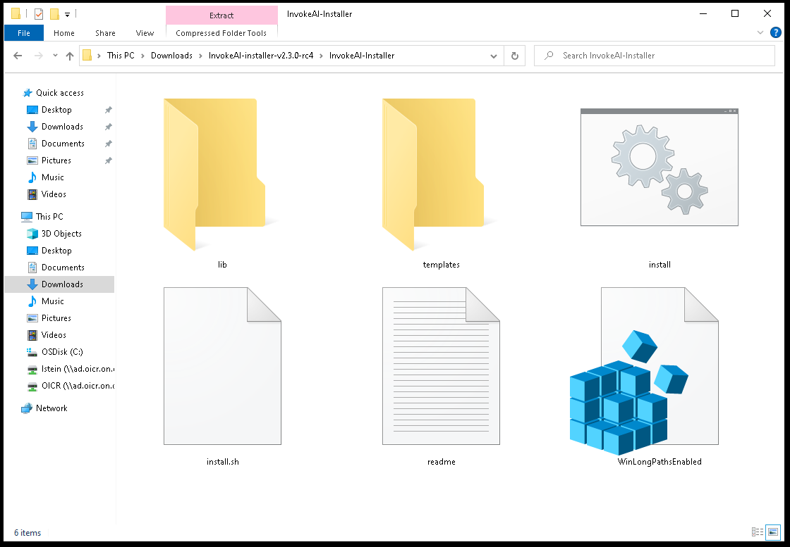
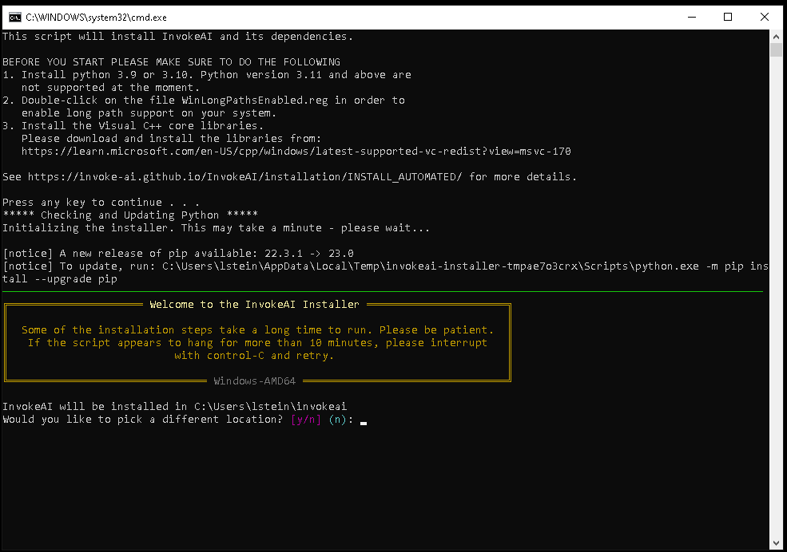

# InvokeAI Automated Installation

## Introduction

The automated installer is a Python script that automates the steps
needed to install and run InvokeAI on a stock computer running recent
versions of Linux, MacOS or Windows. It will leave you with a version
that runs a stable version of InvokeAI with the option to upgrade to
experimental versions later.

## Walk through

1.  <a name="hardware_requirements">**Hardware Requirements**: </a>Make sure that your system meets the [hardware
    requirements](../index.md#hardware-requirements) and has the
    appropriate GPU drivers installed. For a system with an NVIDIA
    card installed, you will need to install the CUDA driver, while
    AMD-based cards require the ROCm driver. In most cases, if you've
    already used the system for gaming or other graphics-intensive
    tasks, the appropriate drivers will already be installed. If
    unsure, check the [GPU Driver Guide](030_INSTALL_CUDA_AND_ROCM.md)

    !!! info "Required Space"

        Installation requires roughly 18G of free disk space to load
        the libraries and recommended model weights files.

        Regardless of your destination disk, your *system drive*
        (`C:\` on Windows, `/` on macOS/Linux) requires at least 6GB
        of free disk space to download and cache python
        dependencies.

	NOTE for Linux users: if your temporary directory is mounted
        as a `tmpfs`, ensure it has sufficient space.

2.  <a name="software_requirements">**Software Requirements**: </a>Check that your system has an up-to-date Python installed. To do
    this, open up a command-line window ("Terminal" on Linux and
    Macintosh, "Command" or "Powershell" on Windows) and type `python
    --version`. If Python is installed, it will print out the version
    number. If it is version `3.10.*` or `3.11.*` you meet
    requirements.

    !!! warning "What to do if you have an unsupported version"

        Go to [Python Downloads](https://www.python.org/downloads/)
        and download the appropriate installer package for your
        platform. We recommend [Version
        3.10.12](https://www.python.org/downloads/release/python-3109/),
        which has been extensively tested with InvokeAI.

    _Please select your platform in the section below for platform-specific
    setup requirements._

    === "Windows"
        During the Python configuration process, look out for a
        checkbox to add Python to your PATH and select it. If the
        install script complains that it can't find python, then open
        the Python installer again and choose "Modify" existing
        installation.

        Installation requires an up to date version of the Microsoft
        Visual C libraries. Please install the 2015-2022 libraries
        available here:
        https://learn.microsoft.com/en-US/cpp/windows/latest-supported-vc-redist?view=msvc-170

        Please double-click on the file `WinLongPathsEnabled.reg` and
        accept the dialog box that asks you if you wish to modify your registry.
        This activates long filename support on your system and will prevent
        mysterious errors during installation.

    === "Linux"
         To install an appropriate version of Python on Ubuntu 22.04
         and higher, run the following:

         ```
         sudo apt update
         sudo apt install -y python3 python3-pip python3-venv
         sudo update-alternatives --install /usr/local/bin/python python /usr/bin/python3.10 3
         ```

         On Ubuntu 20.04, the process is slightly different:

         ```
         sudo apt update
         sudo apt install -y software-properties-common
         sudo add-apt-repository -y ppa:deadsnakes/ppa
         sudo apt install -y python3.10 python3-pip python3.10-venv
         sudo update-alternatives --install /usr/local/bin/python python /usr/bin/python3.10 3
         ```

         Both `python` and `python3` commands are now pointing at
         Python3.10. You can still access older versions of Python by
         calling `python2`, `python3.8`, etc.

         Linux systems require a couple of additional graphics
         libraries to be installed for proper functioning of
         `python3-opencv`. Please run the following:

         `sudo apt update && sudo apt install -y libglib2.0-0 libgl1-mesa-glx`

    === "Mac"

        After installing Python, you may need to run the
        following command from the Terminal in order to install the Web
        certificates needed to download model data from https sites. If
        you see lots of CERTIFICATE ERRORS during the last part of the
        install, this is the problem, and you can fix it with this command:

            `/Applications/Python\ 3.10/Install\ Certificates.command`

        You may need to install the Xcode command line tools. These
        are a set of tools that are needed to run certain applications in a
        Terminal, including InvokeAI. This package is provided
        directly by Apple. To install, open a terminal window and run `xcode-select --install`. You will get a macOS system popup guiding you through the
        install. If you already have them installed, you will instead see some
        output in the Terminal advising you that the tools are already installed. More information can be found at [FreeCode Camp](https://www.freecodecamp.org/news/install-xcode-command-line-tools/)

3.  **Download the Installer**: The InvokeAI installer is distributed as a ZIP files. Go to the
    [latest release](https://github.com/invoke-ai/InvokeAI/releases/latest),
    and look for a file named:

    - InvokeAI-installer-v3.X.X.zip

    where "3.X.X" is the latest released version. The file is located
    at the very bottom of the release page, under **Assets**.

4.  **Unpack the installer**: Unpack the zip file into a convenient directory. This will create a new
    directory named "InvokeAI-Installer". When unpacked, the directory
    will look like this:

    <figure markdown>
    
    </figure>

5.  **Launch the installer script from the desktop**: If you are using a desktop GUI, double-click the installer file
    appropriate for your platform. It will be named `install.bat` on
    Windows systems and `install.sh` on Linux and Macintosh
    systems. Be aware that your system's file browser may suppress the
    display of the file extension.

    On Windows systems if you get an "Untrusted Publisher" warning.
    Click on "More Info" and then select "Run Anyway." You trust us, right?

6.  **[Alternative] Launch the installer script from the command line**: Alternatively, from the command line, run the shell script or .bat file:

    ```cmd
    C:\Documents\Linco> cd InvokeAI-Installer
    C:\Documents\Linco\invokeAI> .\install.bat
    ```

7.  **Select the location to install InvokeAI**: The script will ask you to choose where to install InvokeAI. Select a
    directory with at least 18G of free space for a full install. InvokeAI and
    all its support files will be installed into a new directory named
    `invokeai` located at the location you specify.

    <figure markdown>
    
    </figure>

    - The default is to install the `invokeai` directory in your home directory,
      usually `C:\Users\YourName\invokeai` on Windows systems,
      `/home/YourName/invokeai` on Linux systems, and `/Users/YourName/invokeai`
      on Macintoshes, where "YourName" is your login name.

    -If you have previously installed InvokeAI, you will be asked to
     confirm whether you want to reinstall into this directory.  You
     may choose to reinstall, in which case your version will be upgraded,
     or choose a different directory.

    - The script uses tab autocompletion to suggest directory path completions.
      Type part of the path (e.g. "C:\Users") and press ++tab++ repeatedly
      to suggest completions.

8.  **Select your GPU**: The installer will autodetect your platform and will request you to
    confirm the type of GPU your graphics card has. On Linux systems,
    you will have the choice of CUDA (NVidia cards), ROCm (AMD cards),
    or CPU (no graphics acceleration). On Windows, you'll have the
    choice of CUDA vs CPU, and on Macs you'll be offered CPU only. When
    you select CPU on M1/M2/M3 Macintoshes, you will get MPS-based
    graphics acceleration without installing additional drivers. If you
    are unsure what GPU you are using, you can ask the installer to
    guess.

9.  **Watch it go!**: Sit back and let the install script work. It will install the third-party
    libraries needed by InvokeAI and the application itself.

    Be aware that some of the library download and install steps take a long
    time. In particular, the `pytorch` package is quite large and often appears
    to get "stuck" at 99.9%. Have patience and the installation step will
    eventually resume. However, there are occasions when the library install
    does legitimately get stuck. If you have been waiting for more than ten
    minutes and nothing is happening, you can interrupt the script with ^C. You
    may restart it and it will pick up where it left off.

    <figure markdown>
    
    </figure>

10. **Post-install Configuration**: After installation completes, the
    installer will launch the configuration form, which will guide you
    through the first-time process of adjusting some of InvokeAI's
    startup settings. To move around this form use ctrl-N for
    &lt;N&gt;ext and ctrl-P for &lt;P&gt;revious, or use &lt;tab&gt;
    and shift-&lt;tab&gt; to move forward and back. Once you are in a
    multi-checkbox field use the up and down cursor keys to select the
    item you want, and &lt;space&gt; to toggle it on and off.  Within
    a directory field, pressing &lt;tab&gt; will provide autocomplete
    options.

    Generally the defaults are fine, and you can come back to this screen at
    any time to tweak your system. Here are the options you can adjust:

    - ***HuggingFace Access Token***
      InvokeAI has the ability to download embedded styles and subjects
      from the HuggingFace Concept Library on-demand. However, some of
      the concept library files are password protected. To make download
      smoother, you can set up an account at huggingface.co, obtain an
      access token, and paste it into this field. Note that you paste
      to this screen using ctrl-shift-V

    - ***Free GPU memory after each generation***
        This is useful for low-memory machines and helps minimize the
	amount of GPU VRAM used by InvokeAI.

    - ***Enable xformers support if available***
        If the xformers library was successfully installed, this will activate
	it to reduce memory consumption and increase rendering speed noticeably.
	Note that xformers has the side effect of generating slightly different
	images even when presented with the same seed and other settings.

    - ***Force CPU to be used on GPU systems***
        This will use the (slow) CPU rather than the accelerated GPU. This
	can be used to generate images on systems that don't have a compatible
	GPU.

    - ***Precision***
        This controls whether to use float32 or float16 arithmetic.
	float16 uses less memory but is also slightly less accurate.
	Ordinarily the right arithmetic is picked automatically ("auto"),
	but you may have to use float32 to get images on certain systems
	and graphics cards. The "autocast" option is deprecated and
	shouldn't be used unless you are asked to by a member of the team.

    - **Size of the RAM cache used for fast model switching***
        This allows you to keep models in memory and switch rapidly among
	them rather than having them load from disk each time. This slider
	controls how many models to keep loaded at once. A typical SD-1 or SD-2 model
	uses 2-3 GB of memory. A typical SDXL model uses 6-7 GB. Providing more
	RAM will allow more models to be co-resident.

    - ***Output directory for images***
      This is the path to a directory in which InvokeAI will store all its
      generated images.

    - ***Autoimport Folder***
      This is the directory in which you can place models you have
	  downloaded and wish to load into InvokeAI. You can place a variety
	  of models in this directory, including diffusers folders, .ckpt files,
	  .safetensors files, as well as LoRAs, ControlNet and Textual Inversion
	  files (both folder and file versions). To help organize this folder,
	  you can create several levels of subfolders and drop your models into
      whichever ones you want.
	
    - ***LICENSE***     

    At the bottom of the screen you will see a checkbox for accepting
    the CreativeML Responsible AI Licenses. You need to accept the license
    in order to download Stable Diffusion models from the next screen.

    _You can come back to the startup options form_ as many times as you like.
    From the `invoke.sh` or `invoke.bat` launcher, select option (6) to relaunch
    this script. On the command line, it is named `invokeai-configure`.

11. **Downloading Models**: After you press `[NEXT]` on the screen, you will be taken
    to another screen that prompts you to download a series of starter models. The ones
    we recommend are preselected for you, but you are encouraged to use the checkboxes to
    pick and choose.
    You will probably wish to download `autoencoder-840000` for use with models that
    were trained with an older version of the Stability VAE.

    <figure markdown>
    
    </figure>
    
    Below the preselected list of starter models is a large text field which you can use
    to specify a series of models to import. You can specify models in a variety of formats,
    each separated by a space or newline. The formats accepted are:

    - The path to a .ckpt or .safetensors file. On most systems, you can drag a file from
      the file browser to the textfield to automatically paste the path. Be sure to remove
      extraneous quotation marks and other things that come along for the ride.

    - The path to a directory containing a combination of `.ckpt` and `.safetensors` files.
      The directory will be scanned from top to bottom (including subfolders) and any
      file that can be imported will be.

    - A URL pointing to a `.ckpt` or `.safetensors` file. You can cut
      and paste directly from a web page, or simply drag the link from the web page
      or navigation bar. (You can also use ctrl-shift-V to paste into this field)
      The file will be downloaded and installed.
      
    - The HuggingFace repository ID (repo_id) for a `diffusers` model. These IDs have
       the format _author_name/model_name_, as in `andite/anything-v4.0`
      
    - The path to a local directory containing a `diffusers`
      model. These directories always have the file `model_index.json`
      at their top level.

    _Select a directory for models to import_ You may select a local
    directory for autoimporting at startup time. If you select this
    option, the directory you choose will be scanned for new
    .ckpt/.safetensors files each time InvokeAI starts up, and any new
    files will be automatically imported and made available for your
    use.

    _Convert imported models into diffusers_ When legacy checkpoint
    files are imported, you may select to use them unmodified (the
    default) or to convert them into `diffusers` models. The latter
    load much faster and have slightly better rendering performance,
    but not all checkpoint files can be converted. Note that Stable Diffusion
    Version 2.X files are **only** supported in `diffusers` format and will
    be converted regardless.
     
     _You can come back to the model install form_ as many times as you like.
     From the `invoke.sh` or `invoke.bat` launcher, select option (5) to relaunch
     this script. On the command line, it is named `invokeai-model-install`.

12. **Running InvokeAI for the first time**: The script will now exit and you'll be ready to generate some images. Look
    for the directory `invokeai` installed in the location you chose at the
    beginning of the install session. Look for a shell script named `invoke.sh`
    (Linux/Mac) or `invoke.bat` (Windows). Launch the script by double-clicking
    it or typing its name at the command-line:

    ```cmd
    C:\Documents\Linco> cd invokeai
    C:\Documents\Linco\invokeAI> invoke.bat
    ```

    - The `invoke.bat` (`invoke.sh`) script will give you the choice
      of starting (1) the command-line interface, (2) the web GUI, (3)
      textual inversion training, and (4) model merging.

    - By default, the script will launch the web interface. When you
      do this, you'll see a series of startup messages ending with
      instructions to point your browser at
      http://localhost:9090. Click on this link to open up a browser
      and start exploring InvokeAI's features.

12. **InvokeAI Options**: You can launch InvokeAI with several different command-line arguments that
    customize its behavior. For example, you can change the location of the
    image output directory or balance memory usage vs performance. See
    [Configuration](../features/CONFIGURATION.md) for a full list of the options.

    - To set defaults that will take effect every time you launch InvokeAI,
      use a text editor (e.g. Notepad) to exit the file
      `invokeai\invokeai.init`. It contains a variety of examples that you can
      follow to add and modify launch options.

    - The launcher script also offers you an option labeled "open the developer
      console". If you choose this option, you will be dropped into a
      command-line interface in which you can run python commands directly,
      access developer tools, and launch InvokeAI with customized options.


    !!! warning "Do not move or remove the `invokeai` directory"
      
        The `invokeai` directory contains the `invokeai` application, its
        configuration files, the model weight files, and outputs of image generation.
        Once InvokeAI is installed, do not move or remove this directory."


<a name="troubleshooting"></a>
## Troubleshooting

### _OSErrors on Windows while installing dependencies_

During a zip file installation or an online update, installation stops
with an error like this:

{:width="800px"}

This seems to happen particularly often with the `pydantic` and
`numpy` packages. The most reliable solution requires several manual
steps to complete installation.

Open up a Powershell window and navigate to the `invokeai` directory
created by the installer. Then give the following series of commands:

```cmd
rm .\.venv -r -force
python -mvenv .venv
.\.venv\Scripts\activate
pip install invokeai
invokeai-configure --yes --root .
```

If you see anything marked as an error during this process please stop
and seek help on the Discord [installation support
channel](https://discord.com/channels/1020123559063990373/1041391462190956654). A
few warning messages are OK.

If you are updating from a previous version, this should restore your
system to a working state. If you are installing from scratch, there
is one additional command to give:

```cmd
wget -O invoke.bat https://raw.githubusercontent.com/invoke-ai/InvokeAI/main/installer/templates/invoke.bat.in
```

This will create the `invoke.bat` script needed to launch InvokeAI and
its related programs.


### _Stable Diffusion XL Generation Fails after Trying to Load unet_

InvokeAI is working in other respects, but when trying to generate
images with Stable Diffusion XL you get a "Server Error". The text log
in the launch window contains this log line above several more lines of
error messages:

```INFO --> Loading model:D:\LONG\PATH\TO\MODEL, type sdxl:main:unet```

This failure mode occurs when there is a network glitch during
downloading the very large SDXL model.

To address this, first go to the Web Model Manager and delete the
Stable-Diffusion-XL-base-1.X model. Then navigate to HuggingFace and
manually download the .safetensors version of the model. The 1.0
version is located at
https://huggingface.co/stabilityai/stable-diffusion-xl-base-1.0/tree/main
and the file is named `sd_xl_base_1.0.safetensors`.

Save this file to disk and then reenter the Model Manager. Navigate to
Import Models->Add Model, then type (or drag-and-drop) the path to the
.safetensors file. Press "Add Model".

### _Package dependency conflicts_

If you have previously installed InvokeAI or another Stable Diffusion
package, the installer may occasionally pick up outdated libraries and
either the installer or `invoke` will fail with complaints about
library conflicts. In this case, run the `invoke.sh`/`invoke.bat`
command and enter the Developer's Console by picking option (5). This
will take you to a command-line prompt.

Then give this command:

`pip install InvokeAI --force-reinstall`

This should fix the issues.

### InvokeAI runs extremely slowly on Linux or Windows systems

The most frequent cause of this problem is when the installation
process installed the CPU-only version of the torch machine-learning
library, rather than a version that takes advantage of GPU
acceleration. To confirm this issue, look at the InvokeAI startup
messages. If you see a message saying ">> Using device CPU", then
this is what happened.

To fix this problem, first determine whether you have an NVidia or an
AMD GPU. The former uses the CUDA driver, and the latter uses ROCm
(only available on Linux). Then run the `invoke.sh`/`invoke.bat`
command and enter the Developer's Console by picking option (5). This
will take you to a command-line prompt.

Then type the following commands:

=== "NVIDIA System"
    ```bash
    pip install torch torchvision --force-reinstall --extra-index-url https://download.pytorch.org/whl/cu121
    pip install xformers
    ```

=== "AMD System"
    ```bash
    pip install torch torchvision --force-reinstall --extra-index-url https://download.pytorch.org/whl/rocm5.6
    ```

### Corrupted configuration file

Everything seems to install ok, but `invokeai` complains of a corrupted
configuration file and goes back into the configuration process (asking you to
download models, etc), but this doesn't fix the problem.

This issue is often caused by a misconfigured configuration directive in the
`invokeai\invokeai.init` initialization file that contains startup settings. The
easiest way to fix the problem is to move the file out of the way and re-run
`invokeai-configure`. Enter the developer's console (option 3 of the launcher
script) and run this command:

```cmd
invokeai-configure --root=.
```

Note the dot (.) after `--root`. It is part of the command.

_If none of these maneuvers fixes the problem_ then please report the problem to
the [InvokeAI Issues](https://github.com/invoke-ai/InvokeAI/issues) section, or
visit our [Discord Server](https://discord.gg/ZmtBAhwWhy) for interactive
assistance.

### Out of Memory Issues

The models are large, VRAM is expensive, and you may find yourself
faced with Out of Memory errors when generating images. Here are some
tips to reduce the problem:

* **4 GB of VRAM**

This should be adequate for 512x512 pixel images using Stable Diffusion 1.5
and derived models, provided that you **disable** the NSFW checker. To
disable the filter, do one of the following:

   * Select option (6) "_change InvokeAI startup options_" from the
     launcher. This will bring up the console-based startup settings
     dialogue and allow you to unselect the "NSFW Checker" option.
   * Start the startup settings dialogue directly by running
     `invokeai-configure --skip-sd-weights --skip-support-models`
     from the command line.
   * Find the `invokeai.init` initialization file in the InvokeAI root
     directory, open it in a text editor, and change `--nsfw_checker`
     to `--no-nsfw_checker`

If you are on a CUDA system, you can realize significant memory
savings by activating the `xformers` library as described above. The
downside is `xformers` introduces non-deterministic behavior, such
that images generated with exactly the same prompt and settings will
be slightly different from each other. See above for more information.

* **6 GB of VRAM**

This is a border case. Using the SD 1.5 series you should be able to
generate images up to 640x640 with the NSFW checker enabled, and up to
1024x1024 with it disabled and `xformers` activated. 

If you run into persistent memory issues there are a series of
environment variables that you can set before launching InvokeAI that
alter how the PyTorch machine learning library manages memory.  See
https://pytorch.org/docs/stable/notes/cuda.html#memory-management for
a list of these tweaks.

* **12 GB of VRAM**

This should be sufficient to generate larger images up to about
1280x1280. If you wish to push further, consider activating
`xformers`.

### Other Problems

If you run into problems during or after installation, the InvokeAI team is
available to help you. Either create an
[Issue](https://github.com/invoke-ai/InvokeAI/issues) at our GitHub site, or
make a request for help on the "bugs-and-support" channel of our
[Discord server](https://discord.gg/ZmtBAhwWhy). We are a 100% volunteer
organization, but typically somebody will be available to help you within 24
hours, and often much sooner.

## Updating to newer versions

This distribution is changing rapidly, and we add new features
regularly. Releases are announced at
http://github.com/invoke-ai/InvokeAI/releases, and at
https://pypi.org/project/InvokeAI/ To update to the latest released
version (recommended), follow these steps:

1. Start the `invoke.sh`/`invoke.bat` launch script from within the
   `invokeai` root directory.

2. Choose menu item (10) "Update InvokeAI".

3. This will launch a menu that gives you the option of:

   1. Updating to the latest official release;
   2. Updating to the bleeding-edge development version; or
   3. Manually entering the tag or branch name of a version of
      InvokeAI you wish to try out.
