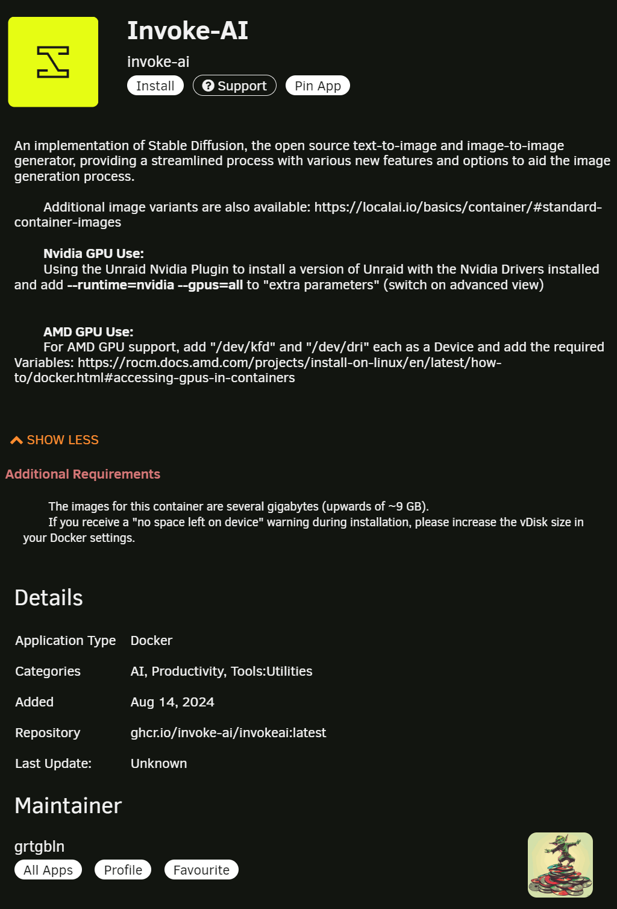
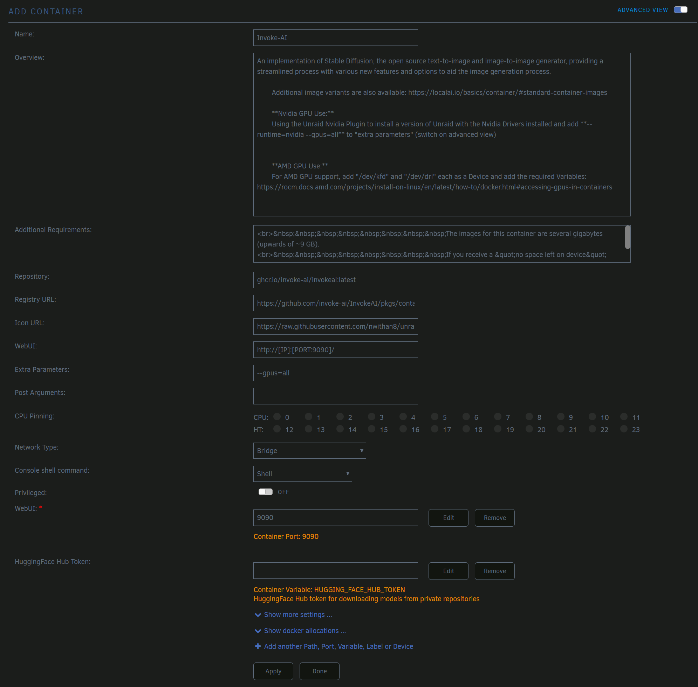
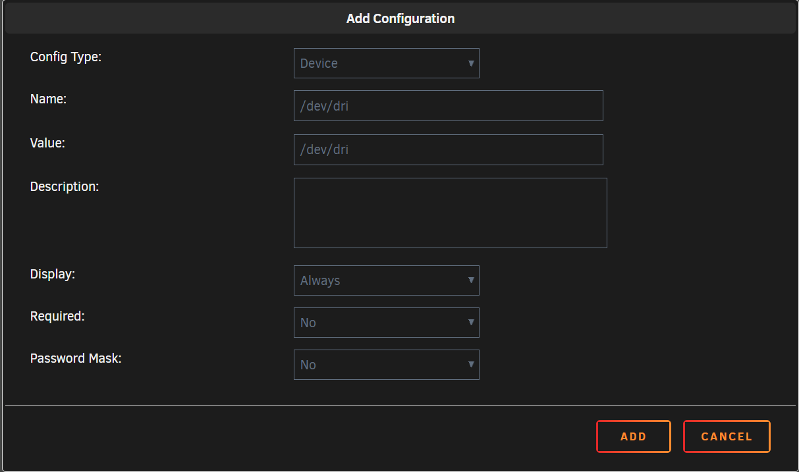

# :fontawesome-regular-server: Unraid

## TL;DR

Invoke AI is available on the Unraid Community Apps store. Simply search for "Invoke AI" and follow the on-screen instructions to install and configure.

Once the application starts up, click the Invoke AI icon, select "WebUI", install some models, and start generating.

### Prerequisites

#### Install the [Community Apps plugin](https://docs.unraid.net/unraid-os/manual/applications/#installing-the-community-applications-plugin)

### Setup

Search for "Invoke AI" in the Community Apps store (available from the "grtgbln" repository) and click "Install".

<figure markdown>

</figure>

Select the branch to use for the application. The "latest" branch is recommended for most users, as this will pull the latest stable release of Invoke AI.

Enable "Advanced View" in the top-right of the "Add Container" window to see all available settings.

<figure markdown>

</figure>

Out of the box, no settings need to be adjusted. If port 9090 is already in use by another application, you can change the "WebUI" port setting to a different port.

Provide a HuggingFace Hub Token if you plan on downloading models from private repositories on HuggingFace.

Click "Apply" to start the container.

#### Nvidia GPU Support

To use an Nvidia GPU, you will need to install the [Nvidia Driver](https://forums.unraid.net/topic/98978-plugin-nvidia-driver/) plugin, then add `--runtime=nvidia --gpus=all` to the "Extra Parameters" field in the container settings. This will pass all GPUs through to the container.

Remove any AMD GPU devices from the container settings if you are using an Nvidia GPU.

#### AMD GPU Support

To use an AMD GPU, you will need to add `/dev/kfd` and `/dev/dri` as devices in the container settings. Click "Add another Path, Port, Variable, Label or Device" at the bottom of the "Add Container" window, then select "Device" from the dropdown. Add `/dev/kfd` and `/dev/dri` as devices.

<figure markdown>

</figure>

Remove any Nvidia GPU devices from the container settings if you are using an AMD GPU.

#### Advanced Configuration

By default, persistent data such as downloaded models and configuration files are stored in the `/mnt/user/appdata/invoke_ai` directory on your system. This can be edited in the "Appdata and Model Storage Path" setting, available by clicking "Show more settings" in the "Add Container" window.

The internal path to this associated directory is `/invokeai_root`, and while it is editable in the "Data root" setting, it is not recommended to change this unless you are familiar with the internal workings of Invoke AI.
