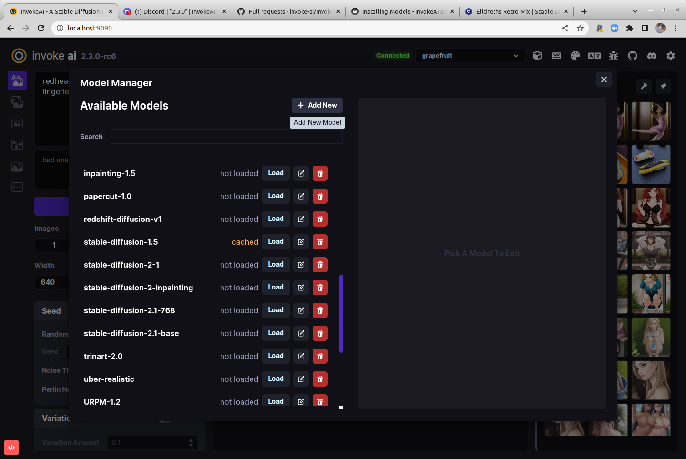
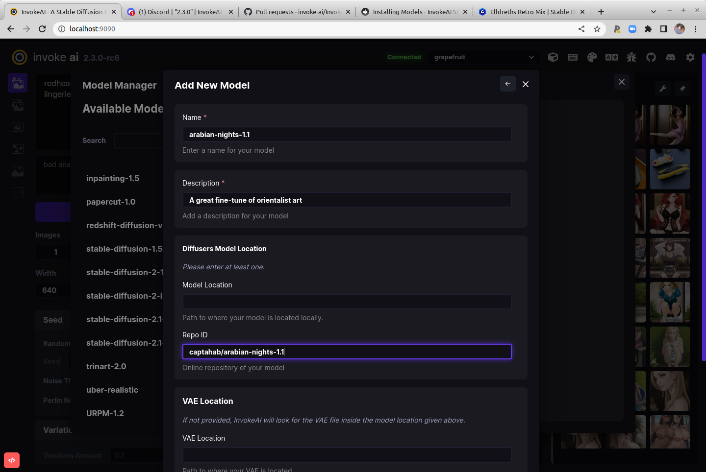
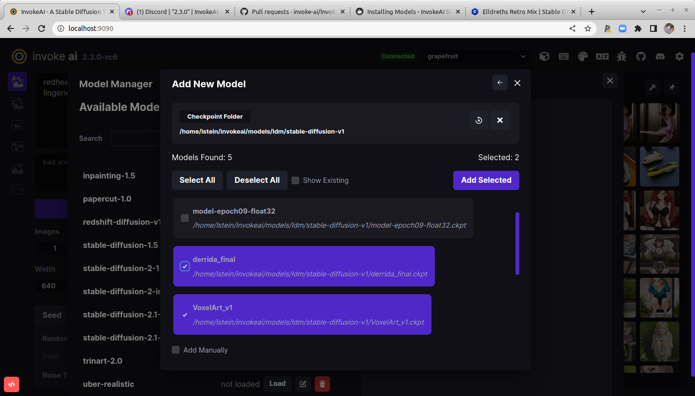

# :octicons-paintbrush-16: Installing Models

## Checkpoint and Diffusers Models

The model checkpoint files ('\*.ckpt') are the Stable Diffusion
"secret sauce". They are the product of training the AI on millions of
captioned images gathered from multiple sources.

Originally there was only a single Stable Diffusion weights file,
which many people named `model.ckpt`. Now there are hundreds
that have been fine tuned to provide particulary styles, genres, or
other features. In addition, there are several new formats that
improve on the original checkpoint format: a `.safetensors` format
which prevents malware from masquerading as a model, and `diffusers`
models, the most recent innovation.

InvokeAI supports all three formats but strongly prefers the
`diffusers` format. These are distributed as directories containing
multiple subfolders, each of which contains a different aspect of the
model. The advantage of this is that the models load from disk really
fast. Another advantage is that `diffusers` models are supported by a
large and active set of open source developers working at and with
HuggingFace organization, and improvements in both rendering quality
and performance are being made at a rapid pace. Among other features
is the ability to download and install a `diffusers` model just by
providing its HuggingFace repository ID.

While InvokeAI will continue to support legacy `.ckpt` and `.safetensors`
models for the near future, these are deprecated and support will
be withdrawn in version 3.0, after which all legacy models will be
converted into diffusers at the time they are loaded.

This manual will guide you through installing and configuring model
weight files and converting legacy `.ckpt` and `.safetensors` files
into performant `diffusers` models.

## Base Models

InvokeAI comes with support for a good set of starter models. You'll
find them listed in the master models file
`configs/INITIAL_MODELS.yaml` in the InvokeAI root directory. The
subset that are currently installed are found in
`configs/models.yaml`. As of v2.3.1, the list of starter models is:

|Model Name | HuggingFace Repo ID | Description | URL |
|---------- | ---------- | ----------- | --- |
|stable-diffusion-1.5|runwayml/stable-diffusion-v1-5|Stable Diffusion version 1.5 diffusers model (4.27 GB)|https://huggingface.co/runwayml/stable-diffusion-v1-5 |
|sd-inpainting-1.5|runwayml/stable-diffusion-inpainting|RunwayML SD 1.5 model optimized for inpainting, diffusers version (4.27 GB)|https://huggingface.co/runwayml/stable-diffusion-inpainting |
|stable-diffusion-2.1|stabilityai/stable-diffusion-2-1|Stable Diffusion version 2.1 diffusers model, trained on 768 pixel images (5.21 GB)|https://huggingface.co/stabilityai/stable-diffusion-2-1 |
|sd-inpainting-2.0|stabilityai/stable-diffusion-2-1|Stable Diffusion version 2.0 inpainting model (5.21 GB)|https://huggingface.co/stabilityai/stable-diffusion-2-1 |
|analog-diffusion-1.0|wavymulder/Analog-Diffusion|An SD-1.5 model trained on diverse analog photographs (2.13 GB)|https://huggingface.co/wavymulder/Analog-Diffusion |
|deliberate-1.0|XpucT/Deliberate|Versatile model that produces detailed images up to 768px (4.27 GB)|https://huggingface.co/XpucT/Deliberate |
|d&d-diffusion-1.0|0xJustin/Dungeons-and-Diffusion|Dungeons & Dragons characters (2.13 GB)|https://huggingface.co/0xJustin/Dungeons-and-Diffusion |
|dreamlike-photoreal-2.0|dreamlike-art/dreamlike-photoreal-2.0|A photorealistic model trained on 768 pixel images based on SD 1.5 (2.13 GB)|https://huggingface.co/dreamlike-art/dreamlike-photoreal-2.0 |
|inkpunk-1.0|Envvi/Inkpunk-Diffusion|Stylized illustrations inspired by Gorillaz, FLCL and Shinkawa; prompt with "nvinkpunk" (4.27 GB)|https://huggingface.co/Envvi/Inkpunk-Diffusion |
|openjourney-4.0|prompthero/openjourney|An SD 1.5 model fine tuned on Midjourney; prompt with "mdjrny-v4 style" (2.13 GB)|https://huggingface.co/prompthero/openjourney |
|portrait-plus-1.0|wavymulder/portraitplus|An SD-1.5 model trained on close range portraits of people; prompt with "portrait+" (2.13 GB)|https://huggingface.co/wavymulder/portraitplus |
|seek-art-mega-1.0|coreco/seek.art_MEGA|A general use SD-1.5 "anything" model that supports multiple styles (2.1 GB)|https://huggingface.co/coreco/seek.art_MEGA |
|trinart-2.0|naclbit/trinart_stable_diffusion_v2|An SD-1.5 model finetuned with ~40K assorted high resolution manga/anime-style images (2.13 GB)|https://huggingface.co/naclbit/trinart_stable_diffusion_v2 |
|waifu-diffusion-1.4|hakurei/waifu-diffusion|An SD-1.5 model trained on 680k anime/manga-style images (2.13 GB)|https://huggingface.co/hakurei/waifu-diffusion |

Note that these files are covered by an "Ethical AI" license which
forbids certain uses. When you initially download them, you are asked
to accept the license terms. In addition, some of these models carry
additional license terms that limit their use in commercial
applications or on public servers. Be sure to familiarize yourself
with the model terms by visiting the URLs in the table above.

## Community-Contributed Models

There are too many to list here and more are being contributed every
day.  [HuggingFace](https://huggingface.co/models?library=diffusers)
is a great resource for diffusers models, and is also the home of a
[fast-growing repository](https://huggingface.co/sd-concepts-library)
of embedding (".bin") models that add subjects and/or styles to your
images. The latter are automatically installed on the fly when you
include the text `<concept-name>` in your prompt. See [Concepts
Library](../features/CONCEPTS.md) for more information.

Another popular site for community-contributed models is
[CIVITAI](https://civitai.com). This extensive site currently supports
only `.safetensors` and `.ckpt` models, but they can be easily loaded
into InvokeAI and/or converted into optimized `diffusers` models. Be
aware that CIVITAI hosts many models that generate NSFW content.

!!! note

    InvokeAI 2.3.x does not support directly importing and
    running Stable Diffusion version 2 checkpoint models. If you
    try to import them, they will be automatically
    converted into `diffusers` models on the fly. This adds about 20s
    to loading time. To avoid this overhead, you are encouraged to
    use one of the conversion methods described below to convert them
    permanently.

## Installation

There are multiple ways to install and manage models:

1. The `invokeai-model-install` script which will download and install them for you.

2. The command-line tool (CLI) has commands that allows you to import, configure and modify
   models files.

3. The web interface (WebUI) has a GUI for importing and managing
   models.

### Installation via `invokeai-model-install`

From the `invoke` launcher, choose option (5) "Download and install
models."  This will launch the same script that prompted you to select
models at install time. You can use this to add models that you
skipped the first time around. It is all right to specify a model that
was previously downloaded; the script will just confirm that the files
are complete.

This script allows you to load 3d party models. Look for a large text
entry box labeled "IMPORT LOCAL AND REMOTE MODELS." In this box, you
can cut and paste one or more of any of the following:

1. A URL that points to a downloadable .ckpt or .safetensors file.
2. A file path pointing to a .ckpt or .safetensors  file.
3. A diffusers model repo_id (from HuggingFace) in the format
   "owner/repo_name".
4. A directory path pointing to a diffusers model directory.
5. A directory path pointing to a directory containing a bunch of
   .ckpt and .safetensors files. All will be imported.

You can enter multiple items into the textbox, each one on a separate
line. You can paste into the textbox using ctrl-shift-V or by dragging
and dropping a file/directory from the desktop into the box.

The script also lets you designate a directory that will be scanned
for new model files each time InvokeAI starts up. These models will be
added automatically.

Lastly, the script gives you a checkbox option to convert legacy models
into diffusers, or to run the legacy model directly. If you choose to
convert, the original .ckpt/.safetensors file will **not** be deleted,
but a new diffusers directory will be created, using twice your disk
space. However, the diffusers version will load faster, and will be
compatible with InvokeAI 3.0.

### Installation via the CLI

You can install a new model, including any of the community-supported ones, via
the command-line client's `!import_model` command.

#### Installing individual `.ckpt` and `.safetensors` models

If the model is already downloaded to your local disk, use
`!import_model /path/to/file.ckpt` to load it. For example:

```bash
invoke> !import_model C:/Users/fred/Downloads/martians.safetensors
```

!!! tip "Forward Slashes"
    On Windows systems, use forward slashes rather than backslashes
    in your file paths.
    If you do use backslashes,
    you must double them like this:
    `C:\\Users\\fred\\Downloads\\martians.safetensors`

Alternatively you can directly import the file using its URL:

```bash
invoke> !import_model https://example.org/sd_models/martians.safetensors
```

For this to work, the URL must not be password-protected. Otherwise
you will receive a 404 error.

When you import a legacy model, the CLI will try to figure out what
type of model it is and select the correct load configuration file.
However, one thing it can't do is to distinguish between Stable
Diffusion 2.x models trained on 512x512 vs 768x768 images. In this
case, the CLI will pop up a menu of choices, asking you to select
which type of model it is. Please consult the model documentation to
identify the correct answer, as loading with the wrong configuration
will lead to black images. You can correct the model type after the
fact using the `!edit_model` command.

After importing, the model will load. If this is successful, you will
be asked if you want to keep the model loaded in memory to start
generating immediately. You'll also be asked if you wish to make this
the default model on startup. You can change this later using
`!edit_model`.

#### Importing a batch of `.ckpt` and `.safetensors` models from a directory

You may also point `!import_model` to a directory containing a set of
`.ckpt` or `.safetensors` files. They will be imported _en masse_.

!!! example

    ```console
    invoke> !import_model C:/Users/fred/Downloads/civitai_models/
    ```

You will be given the option to import all models found in the
directory, or select which ones to import. If there are subfolders
within the directory, they will be searched for models to import.

#### Installing `diffusers` models

You can install a `diffusers` model from the HuggingFace site using
`!import_model` and the HuggingFace repo_id for the model:

```bash
invoke> !import_model andite/anything-v4.0
```

Alternatively, you can download the model to disk and import it from
there. The model may be distributed as a ZIP file, or as a Git
repository:

```bash
invoke> !import_model C:/Users/fred/Downloads/andite--anything-v4.0
```

!!! tip "The CLI supports file path autocompletion"
         Type a bit of the path name and hit ++tab++ in order to get a choice of
         possible completions.

!!! tip "On Windows, you can drag model files onto the command-line"
         Once you have typed in `!import_model `, you can drag the
         model  file or directory onto the command-line to insert the model path. This way, you don't need to
         type it or copy/paste. However, you will need to reverse or
         double backslashes as noted above.

Before installing, the CLI will ask you for a short name and
description for the model, whether to make this the default model that
is loaded at InvokeAI startup time, and whether to replace its
VAE. Generally the answer to the latter question is "no".

### Installation via the WebUI

To access the WebUI Model Manager, click on the button that looks like
a cube in the upper right side of the browser screen. This will bring
up a dialogue that lists the models you have already installed, and
allows you to load, delete or edit them:

<figure markdown>



</figure>

To add a new model, click on **+ Add New** and select to either a
checkpoint/safetensors model, or a diffusers model:

<figure markdown>


</figure>

In this example, we chose **Add Diffusers**. As shown in the figure
below, a new dialogue prompts you to enter the name to use for the
model, its description, and either the location of the `diffusers`
model on disk, or its Repo ID on the HuggingFace web site. If you
choose to enter a path to disk, the system will autocomplete for you
as you type:

<figure markdown>



</figure>

Press **Add Model** at the bottom of the dialogue (scrolled out of
site in the figure), and the model will be downloaded, imported, and
registered in `models.yaml`.

The **Add Checkpoint/Safetensor Model** option is similar, except that
in this case you can choose to scan an entire folder for
checkpoint/safetensors files to import. Simply type in the path of the
directory and press the "Search" icon. This will display the
`.ckpt` and `.safetensors` found inside the directory and its
subfolders, and allow you to choose which ones to import:

<figure markdown>



</figure>

## Model Management Startup Options

The `invoke` launcher and the `invokeai` script accept a series of
command-line arguments that modify InvokeAI's behavior when loading
models. These can be provided on the command line, or added to the
InvokeAI root directory's `invokeai.init` initialization file.

The arguments are:

* `--model <model name>` -- Start up with the indicated model loaded
* `--ckpt_convert` -- When a checkpoint/safetensors model is loaded, convert it into a `diffusers` model in memory. This does not permanently save the converted model to disk.
* `--autoconvert <path/to/directory>` -- Scan the indicated directory path for new checkpoint/safetensors files, convert them into `diffusers` models, and import them into InvokeAI.

Here is an example of providing an argument on the command line using
the `invoke.sh` launch script:

```bash
invoke.sh --autoconvert /home/fred/stable-diffusion-checkpoints
```

And here is what the same argument looks like in `invokeai.init`:

```bash
--outdir="/home/fred/invokeai/outputs
--no-nsfw_checker
--autoconvert /home/fred/stable-diffusion-checkpoints
```

### Specifying a configuration file for legacy checkpoints

Some checkpoint files come with instructions to use a specific .yaml
configuration file. For InvokeAI load this file correctly, please put
the config file in the same directory as the corresponding `.ckpt` or
`.safetensors` file and make sure the file has the same basename as
the model file. Here is an example:

```bash
wonderful-model-v2.ckpt
wonderful-model-v2.yaml
```

This is not needed for `diffusers` models, which come with their own
pre-packaged configuration.

### Specifying a custom VAE file for legacy checkpoints

To associate a custom VAE with a legacy file, place the VAE file in
the same directory as the corresponding `.ckpt` or
`.safetensors` file and make sure the file has the same basename as
the model file. Use the suffix `.vae.pt` for VAE checkpoint files, and
`.vae.safetensors` for VAE safetensors files. There is no requirement
that both the model and the VAE follow the same format.

Example:

```bash
wonderful-model-v2.pt
wonderful-model-v2.vae.safetensors
```

### Converting legacy models into `diffusers`

The CLI `!convert_model` will convert a `.safetensors` or `.ckpt`
models file into `diffusers` and install it.This will enable the model
to load and run faster without loss of image quality.

The usage is identical to `!import_model`. You may point the command
to either a downloaded model file on disk, or to a (non-password
protected) URL:

```bash
invoke> !convert_model C:/Users/fred/Downloads/martians.safetensors
```

After a successful conversion, the CLI will offer you the option of
deleting the original `.ckpt` or `.safetensors` file.

### Optimizing a previously-installed model

Lastly, if you have previously installed a `.ckpt` or `.safetensors`
file and wish to convert it into a `diffusers` model, you can do this
without re-downloading and converting the original file using the
`!optimize_model` command. Simply pass the short name of an existing
installed model:

```bash
invoke> !optimize_model martians-v1.0
```

The model will be converted into `diffusers` format and replace the
previously installed version. You will again be offered the
opportunity to delete the original `.ckpt` or `.safetensors` file.

Alternatively you can use the WebUI's model manager to handle diffusers
optimization. Select the legacy model you wish to convert, and then
look for a button labeled "Convert to Diffusers" in the upper right of
the window.

### Related CLI Commands

There are a whole series of additional model management commands in
the CLI that you can read about in [Command-Line
Interface](../features/CLI.md). These include:

* `!models` - List all installed models
* `!switch <model name>` - Switch to the indicated model
* `!edit_model <model name>` - Edit the indicated model to change its name, description or other properties
* `!del_model <model name>` - Delete the indicated model

### Manually editing `configs/models.yaml`

If you are comfortable with a text editor then you may simply edit `models.yaml`
directly.

You will need to download the desired `.ckpt/.safetensors` file and
place it somewhere on your machine's filesystem. Alternatively, for a
`diffusers` model, record the repo_id or download the whole model
directory. Then using a **text** editor (e.g. the Windows Notepad
application), open the file `configs/models.yaml`, and add a new
stanza that follows this model:

#### A legacy model

A legacy `.ckpt` or `.safetensors` entry will look like this:

```yaml
arabian-nights-1.0:
  description: A great fine-tune in Arabian Nights style
  weights: ./path/to/arabian-nights-1.0.ckpt
  config: ./configs/stable-diffusion/v1-inference.yaml
  format: ckpt
  width: 512
  height: 512
  default: false
```

Note that `format` is `ckpt` for both `.ckpt` and `.safetensors` files.

#### A diffusers model

A stanza for a `diffusers` model will look like this for a HuggingFace
model with a repository ID:

```yaml
arabian-nights-1.1:
  description: An even better fine-tune of the Arabian Nights
  repo_id: captahab/arabian-nights-1.1
  format: diffusers
  default: true
```

And for a downloaded directory:

```yaml
arabian-nights-1.1:
  description: An even better fine-tune of the Arabian Nights
  path: /path/to/captahab-arabian-nights-1.1
  format: diffusers
  default: true
```

There is additional syntax for indicating an external VAE to use with
this model. See `INITIAL_MODELS.yaml` and `models.yaml` for examples.

After you save the modified `models.yaml` file relaunch
`invokeai`. The new model will now be available for your use.

