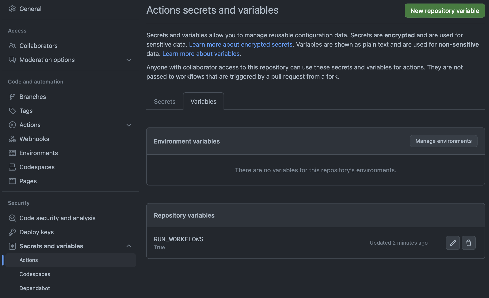

# :simple-githubactions: Github-Workflows

## Execute Workflows in your fork

If you have forked [InvokeAI](https://github.com/invok-ai/InvokeAI) and want the
Workflows to be executed, setup a repository variable with the name
`RUN_WORKFLOWS` and any value but not empty. You can do this by opening your fork on
[GitHub](https://github.com) and navigate to:

Settings --> Secrets and Variables --> Actions --> Variables

This is an attempt to save GitHub some compute, since we are sure not every Fork
has the requirement to execute the workflows.
