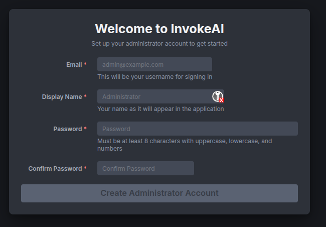
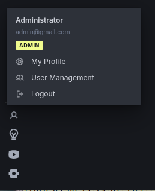
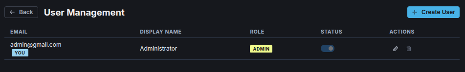
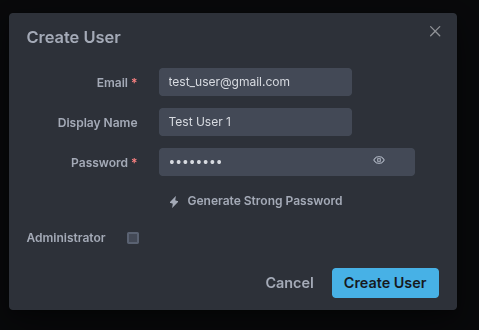
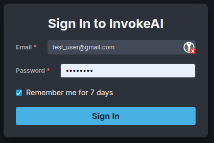

# InvokeAI Multi-User Guide

## Overview

Multi-User mode is a recent feature (introduced in version 6.12), which allows multiple individuals to share a single InvokeAI server while keeping their work separate and organized. Each user has their own username and login password, images, assets, image boards, customization settings and workflows. 

Two types of users are recognized:

* A user with **Administrator** status can add, remove and modify other users, and can install models. They also have the ability to view the full session queue and pause or kill other users' jobs.
* **Non-administrator** users can modify their own profile but not others. They also do not have the ability to install or configure models, but must ask an Administrator to do this task.

Multiple users can be granted Administrator status.

*** 

## Getting Started

To activate Multi-User mode, open the `INVOKEAI_ROOT/invokeai.yaml` configuration file in a text editor. Add this line anywhere in the file:
```yaml
multiuser: true
```

You may also wish to make InvokeAI available to other machines on your local LAN. Add an additional line to `invokeai.yaml`:

```yaml
host: 0.0.0.0
```

Restart the server. It will now be in multi-user mode. If you enabled
the `host` option, other users on your home or office LAN will be able
to reach it by browsing to the IP address of the machine the backend
is running on (`http://host-ip-address:9090`).

!!! tip "Do not expose InvokeAI to the internet"
    It is not recommended to expose the InvokeAI host to the internet
	due to security concerns.	

### Initial Setup (First Time in Multi-User Mode)

If you're the first person to access a fresh InvokeAI installation in multi-user mode, you'll see the **Administrator Setup** dialog:



Now

1. Enter your email address (this will be your login name)
2. Create a display name (this will be the name other users see)
3. Choose a strong password that meets the requirements:
    - At least 8 characters long
    - Contains uppercase letters
    - Contains lowercase letters
    - Contains numbers
4. Confirm your password
5. Click **Create Administrator Account**

You'll now be taken to a login screen and can enter the credentials
you just created.

### Adding and Modifying Users

If you are logged in as Administrator, you can add additional users. Click on the small "person silhouette" icon at the bottom left of the main Invoke screen and select "User Management:"



This will take you to the User Management screen...



...where you can click "Create User" to add a new user.



The User Management screen also allows you to:

1. Temporarily change a user's status to Inactive, preventing them from logging in to Invoke.
2. Edit a user (by clicking on the pencil icon) to change the user's display name or password.
3. Permanently delete a user.
4. Grant a user Administrator privileges.

### Command-line User Management Scripts

Administrators can also use a series of command-line scripts to add, modify, or delete users. If you use the launcher, click the ">" icon to enter the command-line interface. Otherwise, if you are a native command-line user, activate the InvokeAI environment from your terminal.

The commands are named:

* **invoke-useradd** -- add a user
* **invoke-usermod** -- modify a user
* **invoke-userdel** -- delete a user
* **invoke-userlist** -- list all users

Pass the `--help` argument to get the usage of each script. For example:

```bash
> invoke-useradd --help
usage: invoke-useradd [-h] [--root ROOT] [--email EMAIL] [--password PASSWORD] [--name NAME] [--admin]

Add a user to the InvokeAI database

options:
  -h, --help            show this help message and exit
  --root ROOT, -r ROOT  Path to the InvokeAI root directory. If omitted, the root is resolved in this order: the $INVOKEAI_ROOT environment
                        variable, the active virtual environment's parent directory, or $HOME/invokeai.
  --email EMAIL, -e EMAIL
                        User email address
  --password PASSWORD, -p PASSWORD
                        User password
  --name NAME, -n NAME  User display name (optional)
  --admin, -a           Make user an administrator

If no arguments are provided, the script will run in interactive mode.
```

***

## Logging in as a Non-Administrative User

If you are a registered user on the system, enter your email address and password to log in. The Administrator will be able to provide you with the values to use:



As an unprivileged user you can do pretty much anything that's allowed under single-user mode -- generating images, using LoRAs, creating and running workflows, creating image boards -- but you are restricted against installing new models, changing low-level server settings, or interfering with other users. More information on user roles is given below.

### Changing your Profile

To change your display name or profile, click on the person silhouette icon at the bottom left of the screen and choose "My Profile". This will take you to a screen that lets you change these values. At this time you can change your display name but not your login ID (ordinarily your contact email address). 

*** 

## Understanding User Roles

In single-user mode, you have access to all features without restrictions. In multi-user mode, InvokeAI has two user roles:

### Regular User

As a regular user, you can:

- ✅ Create and manage your own image boards
- ✅ Generate images using all AI tools (Linear, Canvas, Upscale, Workflows)
- ✅ Create, save, and load your own workflows
- ✅ View your own generation queue
- ✅ Customize your UI preferences (theme, hotkeys, etc.)
- ✅ View available models (read-only access to Model Manager)
- ✅ Access shared boards (based on permissions granted to you) (FUTURE FEATURE)
- ✅ Access workflows marked as public (FUTURE FEATURE)

You cannot:

- ❌ Add, delete, or modify models
- ❌ View or modify other users' boards, images, or workflows
- ❌ Manage user accounts
- ❌ Access system configuration
- ❌ View or cancel other users' generation tasks

!!! tip "The generation queue"
	When two or more users are accessing InvokeAI at the same time,
	their image generation jobs will be placed on the session queue on
	a first-come, first-serve basis. This means that you will have to
	wait for other users' image rendering jobs to complete before
	yours will start.
	
	When another user's job is running, you will see the image
	generation progress bar and a queue badge that reads `X/Y`, where
	"X" is the number of jobs you have queued and "Y" is the total
	number of jobs queued, including your own and others.
	
	You can also pull up the Queue tab in order to see where your job
	is in relationship to other queued tasks.

### Administrator

Administrators have all regular user capabilities, plus:

- ✅ Full model management (add, delete, configure models)
- ✅ Create and manage user accounts
- ✅ View and manage all users' generation queues
- ✅ Create and manage shared boards (FUTURE FEATURE)
- ✅ Access system configuration
- ✅ Grant or revoke admin privileges

***

## Working with Your Content in Multi-User Mode

### Image Boards

In multi-user model, Image Boards work as before. Each user can create an unlimited number of boards and organize their images and assets as they see fit. Boards are private: you cannot see a board owned by a different user.

!!! tip "Shared Boards"
    InvokeAI 6.13 will add support for creating public boards that are accessible to all users.

The Administrator can see all users Image Boards and their contents.

### Going From Multi-User to Single-User mode

If an InvokeAI instance was in multiuser mode and then restarted in single user mode (by setting `multiuser: false` in the configuration file), all users' boards will be consolidated in one place. Any images that were in  "Uncategorized" will be merged together into a single Uncategorized board. If, at a later date, the server is restarted in multi-user mode, the boards and images will be separated and restored to their owners.

### Workflows

In the current released version (6.12) workflows are always shared among users. Any workflow that you create will be visible to other users and vice-versa, and there is no protection against one user modifying another user's workflow.

!!! tip "Private and Shared Workflows"
    InvokeAI 6.13 will provide the ability to create private and shared workflows. A private workflow can only be viewed by the user who created it. At any time, however, the user can designate the workflow *shared*, in which case it can be opened on a read-only basis by all logged-in users.


### The Generation Queue

The queue shows your pending and running generation tasks.

**Queue Features:**

- View your current and completed generations
- Cancel pending tasks
- Re-run previous generations
- Monitor progress in real-time

**Queue Isolation:**

- You will see your own queue items, as well as the items generated by
  either users, but the generation parameters (e.g. prompts) for other
  users' are hidden for privacy reasons.
- Administrators can view all queues for troubleshooting
- Your generations won't interfere with other users' tasks

***

## Customizing Your Experience

### Personal Preferences

Your UI preferences are saved to your account and are restored when you log in:

- **Theme**: Choose between light and dark modes
- **Hotkeys**: Customize keyboard shortcuts
- **Canvas Settings**: Default zoom, grid visibility, etc.
- **Generation Defaults**: Default values for width, height, steps, etc.

These settings are stored per-user and won't affect other users.

***

## Troubleshooting

### Cannot Log In

**Issue:** Login fails with "Incorrect email or password"

**Solutions:**

- Verify you're entering the correct email address
- Check that Caps Lock is off
- Try typing the password slowly to avoid mistakes
- Contact your administrator if you've forgotten your password

**Issue:** Login fails with "Account is disabled"

**Solution:** Contact your administrator to reactivate your account

### Session Expired

**Issue:** You're suddenly logged out and see "Session expired"

**Explanation:** Sessions expire after 24 hours (or 7 days with "remember me")

**Solution:** Simply log in again with your credentials

### Cannot Access Features

**Issue:** Features like Model Manager show "Admin privileges required"

**Explanation:** Some features are restricted to administrators

**Solution:** 

- For model viewing: You can view but not modify models
- For user management: Contact an administrator
- For system configuration: Contact an administrator

### Missing Boards or Images

**Issue:** Boards or images you created are not visible

**Possible Causes:**

1. **Filter Applied:** Check if a filter is hiding content
2. **Wrong User:** Ensure you're logged in with the correct account
3. **Archived Board:** Check the "Show Archived" option

**Solution:** 

- Clear any active filters
- Verify you're logged in as the right user
- Check archived items

### Slow Performance

**Issue:** Generation or UI feels slower than expected

**Possible Causes:**

- Other users generating images simultaneously
- Server resource limits
- Network latency

**Solutions:**

- Check the queue to see if others are generating
- Wait for current generations to complete
- Contact administrator if persistent

### Generation Stuck in Queue

**Issue:** Your generation is queued but not starting

**Possible Causes:**

- Server is processing other users' generations
- Server resources are fully utilized
- Technical issue with the server

**Solutions:**

- Wait for your turn in the queue
- Check if your generation is paused
- Contact administrator if stuck for extended period


***

## Frequently Asked Questions

### Can other users see my images?

No, unless you add them to a shared board (FUTURE FEATURE). All your personal boards and images are private.

### Can I share my workflows with others?

Not directly. Ask your administrator to mark workflows as public if you want to share them.

### How long do sessions last?

- 24 hours by default
- 7 days if you check "Remember me" during login

### Can I use the API with multi-user mode?

Yes, but you'll need to authenticate with a JWT token. See the [API Guide](api_guide.md) for details.

### What happens if I forget my password?

Contact your administrator. They can reset your password for you.

### Can I have multiple sessions?

Yes, you can log in from multiple devices or browsers simultaneously. All sessions will use the same account and see the same content.

### Why can't I see the Model Manager "Add Models" tab?

Regular users can see the Models tab but with read-only access. Check that you're logged in and try refreshing the page.

### How do I know if I'm an administrator?

Administrators see an "Admin" badge next to their name in the top-right corner and have access to additional features like User Management.

### Can I request admin privileges?

Yes, ask your current administrator to grant you admin
privileges. Admin privileges will give you the ability to see all
other user's boards and images, as well as to add models and change
various server-wide settings.

## Getting Help

### Support Channels

- **Administrator:** Contact your system administrator for account issues
- **Documentation:** Check the [FAQ](../faq.md) for common issues
- **Community:** Join the [Discord](https://discord.gg/ZmtBAhwWhy) for help
- **Bug Reports:** File issues on [GitHub](https://github.com/invoke-ai/InvokeAI/issues)

### Reporting Issues

When reporting an issue, include:

- Your role (regular user or administrator)
- What you were trying to do
- What happened instead
- Any error messages you saw
- Your browser and operating system

## Additional Resources

- [Administrator Guide](admin_guide.md) - For administrators managing users and the system
- [API Guide](api_guide.md) - For developers using the InvokeAI API
- [Multiuser Specification](specification.md) - Technical details about the feature
- [InvokeAI Documentation](../index.md) - Main documentation hub

---

**Need more help?** Contact your administrator or visit the [InvokeAI Discord](https://discord.gg/ZmtBAhwWhy).
