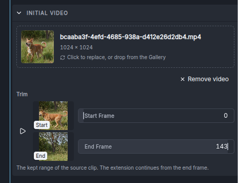
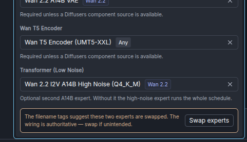

import { Image } from 'astro:assets';
import videoOverview from '../assets/video-panel-overview.png';
import videoStartEnd from '../assets/video-panel-start-end-images.png';
import videoRender from '../assets/video-panel-model-section.png';
import { LinkCard, CardGrid, Steps } from '@astrojs/starlight/components';

InvokeAI generates short MP4 clips from a text prompt, one or two images, an existing video, a soundtrack — or combinations of those — using three local model families:

* **[Wan 2.2](../wan-22)** — the Alibaba Wan-AI family: three transformer variants covering text-to-video, image-to-video, first-to-last-frame interpolation, and video extension, with a 4-step **Lightning** fast path.
* **[MiniMax H3](../minimax-h3)** — two task transformers, **FL2VA** (first/last-frame-to-video-plus-audio) and **Ref2VA** (reference-to-video-plus-audio), that between them cover every conditioning mode *and* generate a synchronized stereo soundtrack, with a **Turbo** fast path. A [hybrid](/users-guide/video-generation/minimax-h3/#the-hybrid-fl2va-quality-with-ref2va-conditioning) runs the two together.
* **[LTX-2](../ltx-2)** — Lightricks' 22B dual-stream transformer, which generates picture and stereo soundtrack together. It covers text-to-video, first frame, last frame, first-to-last interpolation and video extension, and — because it models both streams — can also generate a **picture for an existing soundtrack** (audio-to-video) or a **soundtrack for an existing picture** (video-to-audio). It ships in a **Dev** build you steer with guidance and a **Distilled** build that renders in eight fixed steps, and Dev has an optional eight-step **Distilled** LoRA fast path.

The easiest way to use any of them is the **Video panel** described on this page — no node graph required. The [bundled video workflows](/users-guide/video-generation/video-workflows/) expose the same pipelines in the workflow editor for graph-level control.

:::caution[Experimental]
Video generation is a prototype feature. Panel behavior, workflows, and starter-model packaging may change between releases. The underlying models are also new — expect rough edges in coherence and artifacts at longer durations.
:::

---

## The Video panel

Open the **Video** entry in the editor's left rail (next to Generate and Upscale). The panel is a complete video pipeline: type a prompt, pick a model, press **Invoke**, and the finished MP4 appears in the gallery.

<Image src={videoOverview} alt="The Video panel with a Wan 2.2 image-to-video model selected, a prompt, first and last frame images, and the Initial Video and Dimensions sections." width={380} />

### Quick start

<Steps>

1. **Install a video model.** Open the **Model Manager** and install a starter bundle: **Wan 2.2 Text-to-Video**, **Wan 2.2 Image-to-Video**, **MiniMax H3**, or **LTX-2.5**. See [the models](#the-models) below for what each contains and what fits your hardware.

2. **Open the Video panel** and pick your model in the **Model** section. The panel reshapes itself around the selection — sections and fields appear, disappear, and re-range to match what the model can actually do.

3. **Type a prompt** describing the scene and, importantly, the *motion* you want across the clip.

4. **Optionally add conditioning media** — a first frame, a last frame, an initial video to extend, or, on LTX-2, a conditioning clip whose soundtrack or picture the generation completes (see below).

5. **Press Invoke.** The MP4 lands in the gallery and plays in the viewer. On MiniMax H3 and LTX-2 it arrives with a generated audio track.

</Steps>

### The panel adapts to the model

There is no mode switch. The panel infers what to generate from **which inputs you have filled in**, and each model family supports a different set of combinations:

| Inputs you set | What runs | Wan T2V‑A14B | Wan I2V‑A14B | Wan TI2V‑5B | MiniMax H3 | LTX-2 |
|---|---|---|---|---|---|---|
| Prompt only | Text to video | ✓ | — | ✓ | ✓ | ✓ |
| First Frame | Video starts on your image | — | ✓ | ✓ | ✓ | ✓ |
| Last Frame only | Video ends on your image | — | — | — | ✓ | ✓ |
| First + Last Frame | Interpolates between the two | — | ✓ | — | ✓ | ✓ |
| Initial Video | Extends the clip | — | ✓ | ✓ | ✓ | ✓ |
| Initial Video + Last Frame | Extends toward a destination image | — | ✓ | — | ✓ | ✓ |
| Conditioning Clip, *its soundtrack* | Generates a picture for the audio (audio-to-video) | — | — | — | — | ✓ |
| Conditioning Clip, *its soundtrack* + First and/or Last Frame | Generates a picture for the audio that starts and/or ends on your images | — | — | — | — | ✓ |
| Conditioning Clip, *its picture* | Generates a soundtrack for the video (video-to-audio) | — | — | — | — | ✓ |

MiniMax H3's **Ref2VA** transformer has a mode of its own — reference-conditioned generation — covered [with the model](/users-guide/video-generation/minimax-h3/).

If you pick a model that can't run the current combination, the Invoke button tells you exactly why instead of failing mid-run.

### Prompt

The prompt toolbar carries most of the helpers from the image Generate panel — prompt triggers, prompt expansion, image-to-prompt, and history (prompt templates are only available in Generate). On LTX-2, **Expand Prompt** starts from the enhancer LTX-2.5 was released with and, when a first frame is set, describes the video from that frame — see [prompt enhancement for LTX-2.5](/users-guide/image-generation/prompt-tools/#prompt-enhancement-for-ltx-25). The **negative prompt** behaves per family:

* **Wan** — used only when CFG is greater than 1 (the field says so). With the Lightning fast path on (CFG 1), it is ignored by the graph.
* **MiniMax H3** — hidden entirely. H3 is guidance-distilled and has no CFG, so a negative prompt has nothing to act on.
* **LTX-2** — offered on the Dev build, where it is pre-filled with the release's own default list of artifact terms, and hidden on the Distilled build, which runs no guidance. On Dev it is also hidden while the [Distilled fast path](/users-guide/video-generation/ltx-2/#the-distilled-lora-fast-path-on-dev) is on, since that run uses no guidance; turn the toggle off to get it back. With CFG and Audio CFG both at 1 it is dropped from the graph, along with the 12B prompt encode it would have cost.

### Start & End Images

Two drop targets: **First Frame** and **Last Frame**. Drag an image from the gallery (thumbnail or the preview's frame), or upload one.

* A **first frame** anchors the video's opening image (image-to-video).
* A **last frame** anchors where it ends. Combined with a first frame, the model interpolates between the two. On MiniMax H3 and LTX-2 a last frame also works **alone** — the video builds toward your image.
* Setting a first frame **disables the Initial Video section**, and vice-versa: a clip can start from a still or continue a video, not both. The disabled section says which input to clear.

<Image src={videoStartEnd} alt="The Start & End Images section with a first frame and a last frame set, each with Remove image." width={420} />

### Initial Video

Drop or upload an existing video to **extend** it. The section shows the clip with a live preview, plus:

* **Start Frame / End Frame sliders** to trim the kept range — small thumbnails show the exact frames at both bounds while you drag.
* The new segment continues from the trimmed clip's end frame and is joined on with a smooth cross-fade.
* Add a **Last Frame** image alongside the initial video to steer where the continuation lands (not available on TI2V‑5B).
* On Wan and LTX-2, the extension **inherits the source clip's frame rate** and the FPS field locks accordingly. MiniMax H3 always generates at its fixed 24 fps.
* On LTX-2 a **Context Frames** control appears under the clip: how many of the source's closing frames — picture *and* sound — the continuation is given, and how long the cross-fade is. Its help text shows how much new material the run will add. See [extending with LTX-2](/users-guide/video-generation/ltx-2/#extending-with-ltx-2).

Run extend repeatedly — each output can be the next run's initial video — to grow a clip well past a single generation's length. See [making longer videos](#making-longer-videos).

### Conditioning Clip (LTX-2 only)

LTX-2 offers the ability to add a soundtrack to a video, or add a
video to a soundtrack. Please see [LTX-2](../ltx-2#conditioning-clip)
for more details.

### Dimensions

* **Aspect Ratio** presets (21:9 through 9:21) drive text-to-video output. As soon as conditioning media is set, **its aspect ratio takes over** and the preset locks — the readout names the source ("from the first frame").
* **Target Resolution** picks the size tier within that ratio:
  * Wan — **480p** and **720p** (native), **1080p** (extrapolated beyond the training distribution; expect softer results).
  * MiniMax H3 — **768 highres** (native: short edge 768) and **768 lowres** (fast preview: long edge 768).
  * LTX-2 — **512p**, **704p** (default) and **768p** in one pass; **1024p** and **1536p** are [two-stage](/users-guide/video-generation/ltx-2/#two-stage-presets), and much slower.
  The panel derives exact pixel dimensions automatically, snapped to each model's grid — you never do the multiple-of-16/32 math yourself.
* **Frames** sets clip length:
  * Wan — any 4·n+1 count from 5 to 161; default **81** (5 seconds at the default 16 fps). The training distribution is 81; longer values degrade coherence.
  * MiniMax H3 — a snapped slider over the model's fixed grid (90 to 345 in steps of 17); default **124** (about 5 seconds at 24 fps).
  * LTX-2 — any 8·n+1 count; the slider covers 9 to 241 and the field accepts up to 481. Default **121** (5 seconds at 24 fps). A conditioning clip sets it for you.
* **FPS** — editable on Wan (default 16) and LTX-2 (default 24, range 1–60), locked on both while extending (see above); fixed at 24 on MiniMax H3. On LTX-2 the frame rate also sets how much audio is generated, and a conditioning clip in the picture role supplies its own.

### Fast rendering modes

Each of the models has a fast mode that significantly reduces the
number of steps needed to generate a final video, at the cost of loss
of diversity. We use the names that the model authors prefer, so fast
mode is variously called "Lightning," "Turbo,"  and "Distilled."

* **Wan 2.2** A _Lightning (fast)_ toggle appears in the Render
    section of the Video Panel when any of the A14B models are
    chosen. Activating this toggle does several things. It loads two
    bundled "lightning" LoRAs (one each for the high and low noise
    render phases), it reduces the default steps from 40 to 4, and it
    sets CFG to 1. You may, if you wish, swap out the lightning LoRAs
    for other accelerated LoRAs.

* **MiniMax H3** A _Turbo (fast)_ toggle appears in the Render
    section. Activating this loads a bundled "Turbo" LoRA and reduces
    the number of steps to 8. There are two different LoRAs: one for
    H3 FL2VA and one for H3 Ref2VA.

* **LTX-2** We bundle a distilled LTX-2.5 transformer model with the
    starter models. Select this model will reduce the step
    requirements to 8. Alternatively, you can select the Dev
    transformer and activate fast mode using a toggle labeled
    _Distilled (fast)_ in the Render section of the panel. This will
    load an LTX-2 distilled LoRA and reduce steps to 8. The former is
    fast but less flexible. The latter produces higher quality videos
    and gives you the flexibility to adjust the distillation strength
    or fine-tune the model. Note that the distilled LoRA is not
    installed with the LTX-2 bundle, but can be found among Starter
    Models by searching for "LTX-2.5 Distilled LoRA."

<Image src={videoRender} alt="The Render section of the Video panel for Wan 2.2: the Lightning (fast) switch, Steps, CFG, CFG (Low Noise) and Seed." width={420} />

### Concepts (LoRAs)

Add your own style/subject LoRAs, just like the image panel — on all three families, including LTX-2. Compatibility is enforced per family — an A14B LoRA can't run on TI2V‑5B (the tensor shapes differ), and the panel says so rather than silently dropping it.

### Model Components

What appears here depends on the model:

* **Wan single-file (GGUF/checkpoint) mains** need their supporting pieces: either a **Component Source** (any Diffusers Wan install, which supplies the text encoder and VAE) or a standalone **VAE** and **Wan T5 Encoder**. A14B mains also get a **Transformer (Low Noise)** slot for the second expert — without it, the high-noise expert runs the whole schedule.
* **Wan Diffusers mains** bundle everything; the section stays collapsed.
* **LTX-2** transformer mains always need two components: **Model components**, an LTX-2 components install supplying the VAEs, vocoder, text connectors and latent upscaler, and a **Gemma-4 encoder** — no LTX-2 model carries its own text encoder.
* **MiniMax H3** single-file transformer mains need **Model components** — a Diffusers H3 install that supplies the tokenizer, processor, and VAEs — plus a single-file **Text encoder** when that install carries no text-encoder weights (the starter bundle's does not). A **Ref2VA** main also offers the optional **Hybrid quality base (FL2VA)** slot and, once a base is picked, a **Ref2VA AdaLN from block** slider — see [the hybrid](/users-guide/video-generation/minimax-h3/#the-hybrid-fl2va-quality-with-ref2va-conditioning).

If a Wan A14B pairing looks mis-wired — for example a low-noise-tagged file in the main slot — the panel shows a **non-blocking advisory** beneath the slots with a one-click **Swap experts** action. The tags come from a filename heuristic and your explicit wiring always wins, so deliberate cross-wiring still runs (the backend logs the same warning at generation time).

### Recalling parameters

Video generations record their parameters as metadata. Select a video in the gallery and use **Recall parameters** (in the viewer's header or the context menu) to load its prompt, model, dimensions, frames, LoRAs, and conditioning back into the Video panel — the same round-trip the image panel offers. Media that no longer exists is cleared rather than silently substituted. The MiniMax H3 hybrid is part of the record too: recalling a hybrid video restores its base and start block, and recalling a video made without the hybrid clears the slot. LTX-2 records carry their guidance scales, extend context length and conditioning clip with its role.

The record travels **inside the MP4**, the way an image's does inside its PNG. Download a video, upload it to any Invoke install — yours or someone else's — and **Recall parameters** works there too: models are matched by content hash when the other install's model keys differ, and conditioning media that only existed in the original gallery is simply left empty. The [Media Metadata](/development/architecture/media-metadata/) reference documents the record's fields and versioning.

---

## Making longer videos

Every family is trained on short clips — Wan on 81 frames (~5 s), H3 on up to 345 (~14 s), LTX-2 on 121 (~5 s at 24 fps). Asking for more frames in one generation pushes the temporal positional encoding out of distribution and coherence degrades. The way to go longer is to **extend**: generate a clip, then continue it, repeatedly.

Extension is available on all three families. LTX-2's continues the soundtrack as well as the picture; see [extending with LTX-2](/users-guide/video-generation/ltx-2/#extending-with-ltx-2) for its Context Frames control.

### From the Video panel

<Steps>

1. **Generate your opening clip** (any mode).

2. **Drag it from the gallery into the Initial Video field.** Trim off any weak tail with the End Frame slider — the last frames of a generation are occasionally its worst.

3. Optionally set a **Last Frame** image to steer where the continuation lands.

4. **Invoke.** The panel renders the continuation and joins it to your source with a cross-fade, delivering one combined MP4. On MiniMax H3 and LTX-2 the soundtrack is carried across the join too.

5. **Repeat** with the new output as the next initial video.

</Steps>

### Quality drift across iterations

Each iteration's source is itself a generation output, so artifacts compound — by the 4th or 5th extension you may see softening or color drift. Mitigations:

1. **Trim the bridge point a few frames back from the end** — boundary frames are the most artifact-prone.
2. **Refresh a bridge frame with a low-strength img2img pass** (SDXL or FLUX at ~0.2 strength) before using it as a first frame for the next segment.
3. **Don't chain more than 4–5 segments** without refreshing in between.

Also, be aware that the extended video only has access to information present in the bridge frames (the end of the previous video — a single frame on Wan, a few on LTX-2). So if a character in the first video has their face obscured at that point, the character's face may be completely different in the extended part of the video.

### In the workflow editor

The **Extend Video** workflows (Wan, MiniMax H3 and LTX-2) expose the same machinery as graphs, including the `Concatenate Videos` node's transition modes (`cut`, `crossfade`, `fade_through_black`) and `Frame from Video` for manual frame-bridging chains. See the [Video Workflows guide](/users-guide/video-generation/video-workflows/).

---

## The Models

More information on the capabilities and limitations of each model can be found in the detail pages below.

<CardGrid>
  <LinkCard
    title="Wan 2.2"
    description="The AliBaba Wan 2.2 family of video generation models."
    href="../wan-22"
  />
  <LinkCard
    title="MiniMax H3"
    description="The MiniMax AI H3 family of video generation models."
    href="../minimax-h3"
  />
  <LinkCard
    title="LTX-2"
    description="The Lightricks LTX-2 family of video generation models."
    href="../ltx-2"
  />
</CardGrid>

---

## Troubleshooting

### OOM errors

Video denoise is memory-intensive — attention scales roughly as `(T_lat × H/16 × W/16)²`, so resolution and frame count both quadratically affect peak VRAM.

For Wan, add `wan_memory_optimization: true` to `invokeai.yaml` and restart to target about 2 GiB of resident transformer weights when `enable_partial_loading` is enabled, lower denoise activation memory, and stream untiled VAE decode directly to MP4. This can make generation substantially slower and requires enough system RAM for offloaded weights.

* **Drop resolution before frame count.** 1280×720 → 832×480 is a ~2.4× memory drop; on H3, switch Target Resolution to **768 lowres**.
* **TI2V-5B before A14B.** TI2V-5B Q4_K_M peaks around ~6–8 GB at 832×480, versus ~12–14 GB for A14B Q4_K_M.
* **OOM at the *reference image encoder* step** is usually allocator fragmentation from a previous run. Restart the server and try again; if it recurs reproducibly, file an issue.

### Late-frame artifacts (text, color blobs)

If a video looks great for most of its duration but the last ~20% develops text, watermarks, or floating colored shapes, that's the model's training-data prior leaking through as temporal coherence weakens. It's most common on TI2V-5B.

* On Wan (with CFG > 1), add to the negative prompt: `text, watermark, logo, subtitles, chinese characters, kanji, ticker, banner`
* Describe the *action* you want through the clip, not just the static scene
* Stay at the default frame count; longer pushes temporal RoPE out of distribution

### The Invoke button is disabled

The panel validates before enqueueing, and the button's tooltip lists every reason: an unsupported input combination for the selected model, a missing required component (Wan single-file mains need a VAE and encoder or a component source), a LoRA targeting the wrong Wan family, conditioning media whose aspect ratio H3 can't reach (outside 1:4–4:1), an LTX-2 conditioning clip paired with a two-stage resolution, or an LTX-2 extension whose Context Frames is at least Frames, exceeds the trimmed source's length, or is too large for the source's resolution. Fix what it names and the button re-arms.

### TI2V-5B VAE state-dict load error

If decode fails with `size mismatch for ... AutoencoderKLWan`, the **wrong VAE** is wired for the transformer: TI2V-5B needs the 48-channel Wan 2.2 VAE, the A14B variants the 16-channel Wan 2.1 VAE. In the panel, pick the matching VAE in Model Components (the selector already filters to compatible channel counts when the model reports them).

### Preview images don't appear

1. **A video is already loaded in the viewer** — the progress preview overlays it. If missing entirely, hard-refresh the browser (`Ctrl+Shift+R` / `Cmd+Shift+R`).
2. **`Show progress in viewer` is disabled** — check the gallery settings (gear icon).

### Pipeline runs but the final MP4 is glitchy

Almost always a **VAE mismatch** (16-ch vs 48-ch on Wan) or a scheduler override. Use the auto-selected scheduler and the family-matched VAE.

---

## Acknowledgements

Wan 2.2 model family by the Alibaba Wan-AI team; Lightning distillation LoRAs by [lightx2v](https://huggingface.co/lightx2v/Wan2.2-Lightning); GGUF quantizations by [QuantStack](https://huggingface.co/QuantStack). MiniMax H3 by [MiniMax AI](https://huggingface.co/MiniMaxAI/MiniMax-H3); int8 single-file repacks by [Comfy-Org](https://huggingface.co/Comfy-Org/MiniMax-H3); Turbo distillation LoRAs by [larryvrh](https://huggingface.co/larryvrh/MiniMax-H3-Turbo-Lora) and [LightX2V](https://huggingface.co/lightx2v/Minimax-h3-Turbo). The FL2VA/Ref2VA hybrid follows the per-tensor analysis and reference implementation in [scottmudge/ComfyUI_MinimaxH3HybridLoader](https://github.com/scottmudge/ComfyUI_MinimaxH3HybridLoader). LTX-2.5 by [Lightricks](https://huggingface.co/Lightricks/LTX-2.5); per-component int8 repacks and distilled LoRA by [DeepBeepMeep](https://huggingface.co/DeepBeepMeep/LTX-2).
