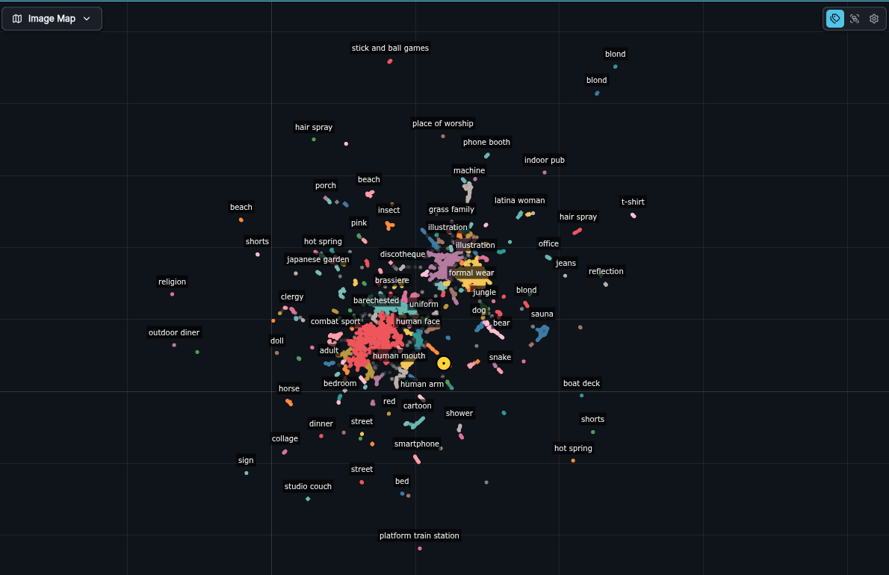
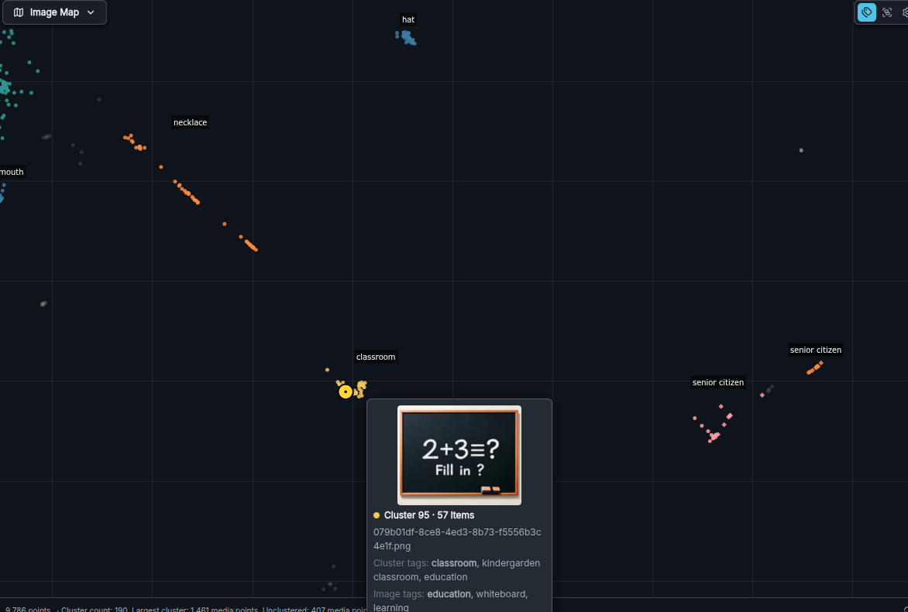

## Image Map

The optional Image Map feature dynamically creates a scatterplot of
your generated and uploaded images and videos. Once its model is
installed, Image Map automatically indexes every image or video in
your gallery.

Images and videos that are similar to each other are grouped together
in colored clusters and labeled using an autotagging system. When the
Image Map is activated you also get the benefit of semantic search in
the image gallery. This lets you search your galleries by image
content (i.e. find "sunset on the beach" even for images that weren't
prompted with those exact words). You can also perform image similarity
searches against your own, or third party images.

### Activating the Image Map

To use the Image Map you will need to install the image encoder model
`DFN2B-CLIP-ViT-L-14-39B` from the starter models section of the Model
Manager. No restart is needed: indexing starts shortly while the Image
Map or the gallery is open, or when you run a semantic search. The
model is found by its name (`image_index_model` in `invokeai.yaml`), so
deleting or renaming it stops indexing and the Image Map offers to
install it again. Installing a different model under that name
switches indexing to it on its own. If you have a large image
collection, initial indexing may take a while -- expect a gallery of
20,000 images to take about 15 minutes to index. After this, the index
is updated incrementally in the background.

### Embedding storage

On first startup after this update, InvokeAI converts saved image and video
embeddings in one database transaction. It reuses saved vectors and does
not run the embedding model again. InvokeAI creates a database backup
before conversion. Large indexes can add one-time startup time. Restore
that pre-upgrade backup before running an older application version.

New embeddings use float16 on disk and decode to float32 for search and
projections. This halves raw embedding BLOB storage. SQLite may retain
freed pages, so the database file may not shrink by half. Search and
projection calculations still use float32 in memory. Float16 quantization
can slightly change similarity scores, so items with nearly equal scores
can change order.

### Inactivating the Image Map

If you wish to turn off Image Map indexing and hide its panel
entirely, add the line `image_index_enabled: false` to
`invokeai.yaml`.

### Image Map Navigation

You can explore the map by using the mouse, scrollwheel or touchscreen
gestures to pan and zoom. Hovering over a spot will display a thumbnail
of the image it corresponds to, along with information on which
cluster the image belongs to, the tags assigned to the cluster, and
the tags assigned to the image itself.

When you click on a spot, one of two things can happen depending on
the Image Map mode you are in. In one mode clicking on a spot loads
its image into the preview, and navigates to where the image lives in
the gallery. In the other mode, clicking on a spot will load its
entire cluster into the gallery, and load the clicked image into the
preview. You can change the mode by selecting the "click" icon in the
upper right of the image map panel: 

If you select an image in the gallery, a yellow target will appear on
the Image Map to show its location, and the target will move around as
you navigate the gallery.

### Activating/inactivating tags

You can show and hide the tags by clicking on the "label" icon in the
upper right-hand of the panel.

### Floating the Image Map Window

When you open the Image Map in the right rail, a floating window icon
will appear at the far right of its title bar. Click on this to pop
the window out. You can then move it around the screen and resize the
floating window by dragging any of its edges or corners.

### Semantic search

If Image Map indexing is active, then an AI search mode is added to
the gallery. Press the sparkle button at the right end of the gallery's
search box and describe what you are looking for; any text already in
the box is used straight away. This will display the images and video
stills whose content is most closely related to your description. See
[Searching by content](/users-guide/gallery/introduction/#searching-by-content)
for details.

You can also search by image similarity. Drag and drop an image (from
the gallery, preview, or another browser tab) onto the search box. All
similar images will be shown in the gallery.

To exit search mode, click the "X" to the right of the search box.
