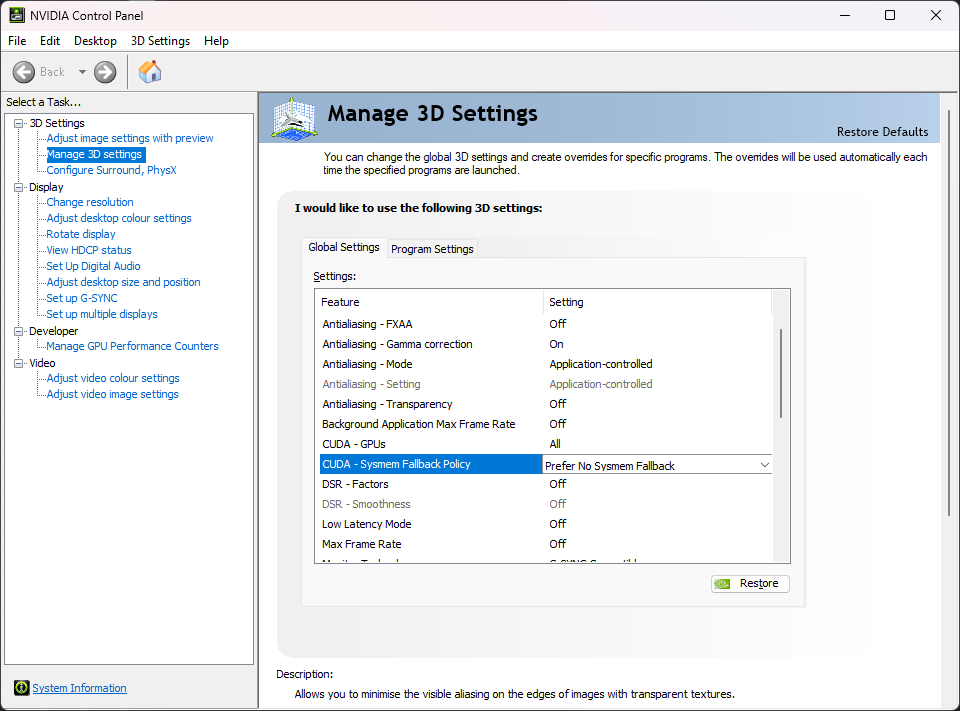

اعتباراً من الإصدار v5.6.0، يحتوي Invoke على وضع الذاكرة المنخفضة (Low-VRAM). يعمل على الأنظمة المزودة بوحدات معالجة رسوميات مخصصة (وحدات Nvidia على ويندوز/لينكس ووحدات AMD على لينكس).

يتيح لك هذا التوليد حتى إذا كانت بطاقة الرسوميات لديك لا تحتوي على ذاكرة VRAM كافية لاستيعاب النماذج بالكامل. يجب أن يكون большинство المستخدمين قادرين على تشغيل حتى أقوى النماذج - مثل نموذج FLUX dev غير المضغوط بحجم ~24GB.

## تفعيل وضع الذاكرة المنخفضة

وضع الذاكرة المنخفضة **مُفعّل افتراضياً** عبر الإعداد `enable_partial_loading: true` في ملف `invokeai.yaml`. لا حاجة لاتخاذ أي إجراء لتفعيله.

**يجب على مستخدمي ويندوز أيضاً [تعطيل احتياطي ذاكرة النظام Nvidia](#تعطيل-احتياطي-ذاكرة-النظام-nvidia-لنظام-ويندوز-فقط)**.

من الممكن ضبط الإعدادات بدقة للحصول على أفضل أداء أو إذا كنت لا تزال تواجه أخطاء نفاد الذاكرة (OOMs).

إذا كنت تريد تعطيل التحميل الجزئي (مثلاً على الأنظمة التي لديها وفرة في VRAM حيث يكون التحميل الكامل أسرع)، أضف هذا السطر إلى ملف `invokeai.yaml` وأعد تشغيل Invoke:

```yaml
enable_partial_loading: false
```

:::tip[كيفية العثور على `invokeai.yaml`]
  ملف التكوين `invokeai.yaml` موجود في دليل التثبيت الخاص بك. للوصول إليه، شغّل مشغل **Invoke Community Edition** وانقر على موقع التثبيت. سيفتح ذلك دليل التثبيت في نافذة مستكشف الملفات.

  سترى `invokeai.yaml` هناك ويمكنك تعديله باستخدام أي محرر نصوص. بعد إجراء التغييرات، أعد تشغيل Invoke.

  إذا لم ترَ `invokeai.yaml`، شغّل Invoke مرة واحدة. سيقوم بإنشاء الملف عند بدء التشغيل الأول.
:::

## التفاصيل والضبط الدقيق

يتضمن وضع الذاكرة المنخفضة 4 ميزات، يمكن تهيئة كل منها أو ضبطها بدقة:

- تحميل النموذج الجزئي (`enable_partial_loading`)
- إعداد موزع CUDA لـ PyTorch (`pytorch_cuda_alloc_conf`)
- أحجام ذاكرة التخزين المؤقت الديناميكية للذاكرة RAM و VRAM (`max_cache_ram_gb`, `max_cache_vram_gb`)
- ذاكرة العمل (`device_working_mem_gb`)
- الاحتفاظ بنسخة من الأوزان في RAM (`keep_ram_copy_of_weights`)

تابع القراءة لمعرفة المزيد عن هذه الميزات وكيفية ضبطها لنظامك وحالات الاستخدام الخاصة بك.

### تحميل النموذج الجزئي

يعمل التحميل الجزئي للنموذج في Invoke عن طريق دفق "طبقات" النموذج بين RAM و VRAM حسب الحاجة.

عندما تحتاج عملية ما إلى طبقات غير موجودة في VRAM، ولكن لا توجد مساحة كافية لتحميلها، يتم تفريغ الطبقات غير النشطة إلى RAM لإفساح المجال.

#### تفعيل تحميل النموذج الجزئي

التحميل الجزئي للنموذج مُفعّل افتراضياً. الإعداد المقابل في `invokeai.yaml` هو:

```yaml
enable_partial_loading: true
```

اضبطه على `false` لتعطيل التحميل الجزئي.

### إعداد موزع CUDA لـ PyTorch

يمكن تهيئة سلوك موزع CUDA الخاص بـ PyTorch باستخدام إعداد `pytorch_cuda_alloc_conf`. يمكن أن يساعد ضبط تكوين الموزع في تقليل ذروة VRAM المحجوزة. يعتمد التكوين الأمثل على عوامل كثيرة (مثل نوع الجهاز، VRAM، إصدار برنامج تشغيل CUDA، إلخ)، لكن التبديل من الموزع الأصلي لـ PyTorch إلى استخدام الموزع المدمج في CUDA يعمل بشكل جيد على العديد من الأنظمة. لتجربة هذا، أضف السطر التالي إلى ملف `invokeai.yaml`:

```yaml
pytorch_cuda_alloc_conf: "backend:cudaMallocAsync"
```

شرح أكثر اكتمالاً لخيارات التكوين المتاحة موجود [هنا](https://pytorch.org/docs/stable/notes/cuda.html#optimizing-memory-usage-with-pytorch-cuda-alloc-conf).

### أحجام ذاكرة التخزين المؤقت الديناميكية RAM و VRAM

تحميل النماذج من القرص بطيء ويمكن أن يكون عنق زجاجة رئيسي للأداء. يستخدم Invoke ذاكري تخزين مؤقت للنماذج - RAM و VRAM - لتقليل التحميل من القرص إلى الحد الأدنى.

افتراضياً، يدير Invoke أحجام ذاكرة التخزين المؤقت هذه ديناميكياً للحصول على أفضل أداء.

#### ضبط أحجام ذاكرة التخزين المؤقت بدقة

قبل الإصدار v5.6.0، كانت أحجام ذاكرة التخزين المؤقت ثابتة، وللحصول على أفضل أداء، احتاج العديد من المستخدمين إلى ضبط إعدادات `ram` و `vram` يدوياً في `invokeai.yaml`.

اعتباراً من v5.6.0، أصبحت أحجام ذاكرة التخزين المؤقت ديناميكية. لم يعد إعدادا `ram` و `vram` مستخدمين، وتمت إضافة إعدادات جديدة لتهيئة ذاكرة التخزين المؤقت.

**معظم المستخدمين لن يحتاجوا إلى ضبط أحجام ذاكرة التخزين المؤقت بدقة.**

لكن، إذا كانت بطاقة الرسوميات لديك تحتوي على VRAM كافية لاستيعاب النماذج بالكامل، قد تحصل على تحسن في الأداء عن طريق تعيين أحجام ذاكرة التخزين المؤقت يدوياً في `invokeai.yaml`:

```yaml
# الحجم الافتراضي الأقصى لذاكرة تخزين RAM يتم تسجيله عند بدء تشغيل InvokeAI. يتم تحديده بناءً على ذاكرة RAM / VRAM لنظامك.
# يمكنك تجاوز القيمة الافتراضية عن طريق تعيين `max_cache_ram_gb`.
# زيادة `max_cache_ram_gb` ستزيد من كمية RAM المستخدمة لتخزين النماذج غير النشطة مؤقتاً، مما يؤدي إلى إعادة تحميل أسرع للنماذج المخزنة.
# كمثال، إذا كان نظامك يحتوي على 32GB من RAM ولا توجد عمليات ثقيلة أخرى، قد يكون تعيين `max_cache_ram_gb` إلى 28GB قيمة جيدة لتحقيق تخزين مؤقت قوي للنماذج.
max_cache_ram_gb: 28

# الحجم الافتراضي الأقصى لذاكرة تخزين VRAM يتم ضبطه ديناميكياً بناءً على كمية VRAM المتاحة (مع مراعاة
# VRAM المستخدمة من قبل العمليات الأخرى).
# يمكنك تجاوز القيمة الافتراضية عن طريق تعيين `max_cache_vram_gb`.
# تنبيه: معظم المستخدمين لا يجب عليهم تعيين هذه القيمة يدوياً. انظر التحذير أدناه.
max_cache_vram_gb: 16
```

:::caution[القيمة القصوى الآمنة لـ `max_cache_vram_gb`]
  معظم المستخدمين لا يجب عليهم تهيئة `max_cache_vram_gb` يدوياً. قيمة التهيئة هذه لها أولوية على `device_working_mem_gb` وأي عمليات تحجز ذاكرة عمل إضافية صراحة (مثل فك تشفير VAE). وبالتالي، فإن تهيئتها يدوياً تزيد من احتمالية مواجهة أخطاء نفاد الذاكرة.

  بالنسبة للمستخدمين الذين يرغبون في تهيئة `max_cache_vram_gb`، يمكن تحديد القيمة القصوى الآمنة بطرح `device_working_mem_gb` من VRAM لبطاقة الرسوميات الخاصة بك. كما هو موضح أدناه، القيمة الافتراضية لـ `device_working_mem_gb` هي 3GB.

  على سبيل المثال، إذا كان لديك بطاقة رسوميات بسعة 12GB، فإن القيمة القصوى الآمنة لـ `max_cache_vram_gb` هي `12GB - 3GB = 9GB`.

  إذا قمت بزيادة `device_working_mem_gb` إلى 4GB، فإن القيمة القصوى الآمنة لـ `max_cache_vram_gb` تصبح `12GB - 4GB = 8GB`.

  معظم المستخدمين الذين يتجاوزون `max_cache_vram_gb` يفعلون ذلك لأنهم يرغبون في استخدام VRAM أقل بكثير، ويجب عليهم تعيين `max_cache_vram_gb` إلى قيمة أقل بكثير من "القيمة القصوى الآمنة".
:::

### ذاكرة العمل

لا يمكن لـ Invoke استخدام _كل_ VRAM المتاحة لديك لتخزين النماذج وتحميلها مؤقتاً. يتطلب بعضاً من VRAM لاستخدامها كذاكرة عمل للعمليات المختلفة.

يحتفظ Invoke بـ 3GB من VRAM كذاكرة عمل افتراضياً، وهو ما يكفي لمعظم حالات الاستخدام. ومع ذلك، من الممكن ضبط هذا الإعداد بدقة إذا كنت لا تزال تواجه أخطاء OOM.

#### ضبط ذاكرة العمل بدقة

يمكنك زيادة حجم ذاكرة العمل في `invokeai.yaml` لمنع أخطاء OOM:

```yaml
# القيمة الافتراضية هي 3GB - ارفعها إلى 4GB لمنع أخطاء OOM.
device_working_mem_gb: 4
```

:::tip[العمليات قد تطلب ذاكرة عمل إضافية]
  بالنسبة لبعض العمليات، يمكننا تحديد متطلبات VRAM مسبقاً وتخصيص ذاكرة عمل إضافية لمنع أخطاء OOM.

  فك تشفير VAE هو إحدى هذه العمليات. تقوم هذه العملية بتحويل مخرج عملية التوليد إلى صورة. لمخرجات الصور الكبيرة، قد يستخدم هذا أكثر من حجم ذاكرة العمل الافتراضي البالغ 3GB.

  أثناء خطوة فك التشفير هذه، يحسب Invoke مقدار VRAM المطلوب لفك التشفير ويطلب ذلك المقدار من مدير النموذج. إذا تجاوز المقدار حجم ذاكرة العمل، يقوم مدير النموذج بتفريغ طبقات النموذج المخزنة من VRAM حتى تتوفر مساحة كافية من VRAM لفك التشفير.

  بمجرد اكتمال فك التشفير، "يستعيد" مدير النموذج VRAM الإضافية التي تم تخصيصها كذاكرة عمل لعمليات تحميل النموذج المستقبلية.
:::

### الاحتفاظ بنسخة من الأوزان في RAM

لدى Invoke خيار الاحتفاظ بنسخة في RAM من جميع أوزان النموذج، حتى عندما تكون محملة على GPU. هذا التحسين _مُفعّل_ افتراضياً، ويتيح التبديل الأسرع بين النماذج وتصحيح LoRA. تعطيل هذه الميزة سيقلل من متوسط حمل RAM أثناء تشغيل Invoke (من غير المرجح أن تتغير ذروة RAM)، على حساب تباطؤ التبديل بين النماذج وتصحيح LoRA. إذا كانت ذاكرة RAM لديك محدودة، يمكنك تعطيل هذا التحسين:

```yaml
# اضبط على false لتقليل متوسط استخدام RAM على حساب تباطؤ التبديل بين النماذج وتصحيح LoRA.
keep_ram_copy_of_weights: false
```

### تعطيل احتياطي ذاكرة النظام Nvidia (لنظام ويندوز فقط)

على ويندوز، يمكن لوحدات معالجة الرسوميات Nvidia استخدام ذاكرة النظام عندما تمتلئ VRAM الخاصة بها عبر **احتياطي ذاكرة النظام (sysmem fallback)**. بينما يبدو هذا فكرة جيدة على السطح، إلا أنه في الممارسة العملية يسبب بطئاً هائلاً أثناء التوليد.

يُنصح بشدة بتعطيل هذه الميزة:

- افتح تطبيق **لوحة تحكم NVIDIA**.
- وسّع **إعدادات ثلاثية الأبعاد** في اللوحة اليسرى.
- انقر **إدارة الإعدادات ثلاثية الأبعاد** في اللوحة اليسرى.
- ابحث عن **CUDA - سياسة احتياطي ذاكرة النظام** في اللوحة اليمنى واضبطها على **تفضيل عدم استخدام احتياطي ذاكرة النظام**.



:::tip[Invoke يفعل نفس الشيء، ولكن بشكل أفضل]
  إذا كانت ميزة احتياطي ذاكرة النظام تبدو مألوفة، فذلك لأن استراتيجية تحميل النموذج الجزئي في Invoke مشابهة من الناحية المفاهيمية - استخدام VRAM عندما تتسع، وإلا الرجوع إلى RAM.

  لسوء الحظ، تطبيق Nvidia ليس محسَّناً لتطبيقات مثل Invoke ويسبب ضرراً أكثر من نفعه.
:::

## استكشاف الأخطاء وإصلاحها

### ملف ترحيل الصفحات في ويندوز

لدى Invoke متطلبات عالية للذاكرة الافتراضية (المعروفة أيضاً باسم 'الذاكرة الملتزمة'). يمكن أن يسبب هذا مشاكل على ويندوز إذا تم الوصول إلى حدود حجم ملف ترحيل الصفحات. (راجع هذه المشكلة للحصول على التفاصيل التقنية حول سبب حدوث ذلك: https://github.com/invoke-ai/InvokeAI/issues/7563).

إذا نفدت مساحة ملف ترحيل الصفحات، فقد يتعطل InvokeAI. غالباً، ستحدث هذه الأعطال مع أحد الأخطاء التالية:

- يخرج InvokeAI برمز خطأ ويندوز `3221225477`
- يتعطل InvokeAI بدون خطأ، لكن `eventvwr.msc` يكشف عن خطأ برمز `0xc0000005` (المكافئ السداسي العشري لـ `3221225477`)

إذا كنت تنفد من مساحة ملف ترحيل الصفحات، جرب الحلول التالية:

- تأكد من أن لديك مساحة كافية على القرص لنمو ملف ترحيل الصفحات. راقب استخدام القرص أثناء تشغيل Invoke. إذا اقترب من 100% قبل التعطل، فمن المرجح جداً أن هذا هو مصدر المشكلة. أخل بعض مساحة القرص لحل المشكلة.
- تأكد من أن ملف ترحيل الصفحات مضبوط على "حجم مُدار من قبل النظام" (هذا هو الإعداد الافتراضي) بدلاً من حجم مخصص. ضمن سياسة "حجم مُدار من قبل النظام"، سينمو ملف ترحيل الصفحات ديناميكياً حسب الحاجة.
