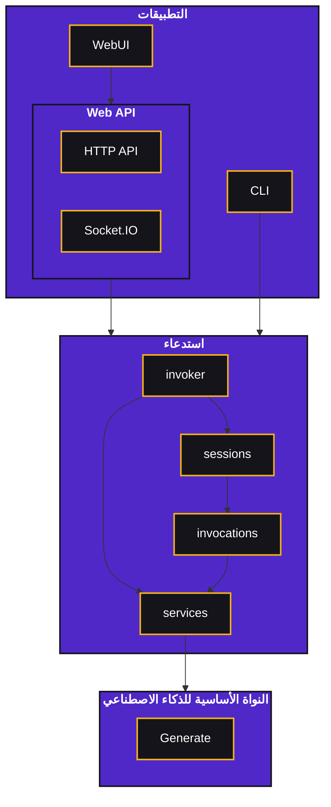

import Mermaid from '@components/Mermaid.astro'

<Mermaid>

</Mermaid>

## التطبيقات

التطبيقات مبنية فوق إطار عمل الاستدعاء. يجب عليها إنشاء `invoker` ثم التفاعل من خلاله. يجب أن تتجنب التفاعل المباشر مع الكود الأساسي لدعم مجموعة متنوعة من التكوينات.

### واجهة المستخدم الرسومية

واجهة المستخدم الرسومية مبنية فوق واجهة برمجة تطبيقات HTTP مبنية باستخدام [FastAPI](https://fastapi.tiangolo.com/) و [Socket.IO](https://socket.io/). يوجد كود الواجهة الأمامية في `/invokeai/frontend` وكود الواجهة الخلفية في `/invokeai/app/api_app.py` و `/invokeai/app/api/`. الكود منظم كذلك على النحو التالي:

| المكون | الوصف |
| --- | --- |
| api_app.py | يعد تطبيق API، ويضيف تعليقات توضيحية إضافية إلى مواصفات OpenAPI، ويشغل API |
| dependencies | ينشئ جميع خدمات الاستدعاء والمنادي، ويوفرها لـ API |
| events | نظام أحداث يمكن تكييفه في المستقبل لدعم التوسع الأفقي |
| sockets | واجهة Socket.IO - تتعامل مع الاستماع وإصدار أحداث الجلسة (يتم تعريف الأحداث في وحدة خدمة الأحداث) |
| routers | تعريفات API لمجالات مختلفة من وظائف API |

### واجهة سطر الأوامر

واجهة سطر الأوامر تُبنى تلقائيًا من بيانات تعريف الاستدعاء، وتدعم أيضًا توجيه الاستدعاء والربط التلقائي. الكود متاح في `/invokeai/frontend/cli`.

## الاستدعاء

يوفر إطار عمل الاستدعاء الواجهة لأنظمة الذكاء الاصطناعي الأساسية وهو مبني مع مراعاة المرونة وقابلية التوسع. هناك أربعة مفاهيم رئيسية: المنادي، الجلسات، الاستدعاءات، والخدمات.

### المنادي (Invoker)

المنادي (`/invokeai/app/services/invoker.py`) هو الواجهة الأساسية التي تتفاعل من خلالها التطبيقات مع الإطار. غرضه الأساسي هو إنشاء وإدارة واستدعاء الجلسات. يحتفظ أيضًا بمجموعتين من الخدمات:
- **خدمات الاستدعاء**، والتي تستخدمها الاستدعاءات للتفاعل مع الوظائف الأساسية.
- **خدمات المنادي**، والتي يستخدمها المنادي لإدارة الجلسات وإدارة قائمة انتظار الاستدعاء.

### الجلسات

الاستدعاءات والروابط بينها تشكل رسمًا بيانيًا، يتم الحفاظ عليه في جلسة. يمكن وضع الجلسات في قائمة انتظار للاستدعاء، والذي سينفذ الرسم البياني الخاص بها (إما الاستدعاء التالي الجاهز، أو جميع الاستدعاءات). تحتفظ الجلسات أيضًا بسجل تنفيذ للرسم البياني (بما في ذلك تخزين أي مخرجات). يمكن إضافة استدعاء إلى جلسة في أي وقت، وهناك إمكانية لإضافة رسم بياني كامل مرة واحدة، وكذلك ربط الاستدعاءات الجديدة تلقائيًا بالاستدعاءات السابقة. لا يمكن حذف الاستدعاءات أو تعديلها بمجرد إضافتها.

الرسم البياني للجلسة لا يدعم الحلقات التكرارية. يُترك هذا كمشكلة تطبيقية لمنع التعقيد الإضافي في الرسم البياني.

### الاستدعاءات

الاستدعاءات تمثل وحدات تنفيذ فردية، مع مدخلات ومخرجات. توجد جميع الاستدعاءات في `/invokeai/app/invocations`، ويتم اكتشافها جميعًا تلقائيًا وتوفيرها في التطبيقات. هذه هي الطريقة الأساسية لكشف الوظائف الجديدة في Invoke.AI، ويشرح [دليل التنفيذ](/development/architecture/invocations/) كيفية إضافة استدعاءات جديدة.

### الخدمات

توفر الخدمات للاستدعاءات إمكانية الوصول إلى وظائف النواة الأساسية للذكاء الاصطناعي والوظائف الضرورية الأخرى (مثل تخزين الصور). هذه متاحة في `/invokeai/app/services`. كقاعدة عامة، يجب أن توفر الخدمات الجديدة واجهة كفئة أساسية مجردة، وقد توفر تطبيقًا محليًا خفيفًا افتراضيًا في وحدتها. يجب أن يكون الهدف لجميع الخدمات هو تمكين استخدام تطبيقات مختلفة (مثل استخدام التخزين السحابي لتخزين الصور)، ولكن لا ينبغي تحميل أي تبعيات للوحدة ما لم يتم استخدام هذا التطبيق (أي لا تستورد أي شيء لن يتم استخدامه، خاصة إذا كان استيراده مكلفًا).

## النواة الأساسية للذكاء الاصطناعي

يتم تمثيل النواة الأساسية للذكاء الاصطناعي ببقية قاعدة الكود (أي الكود خارج `/invokeai/app/`).
