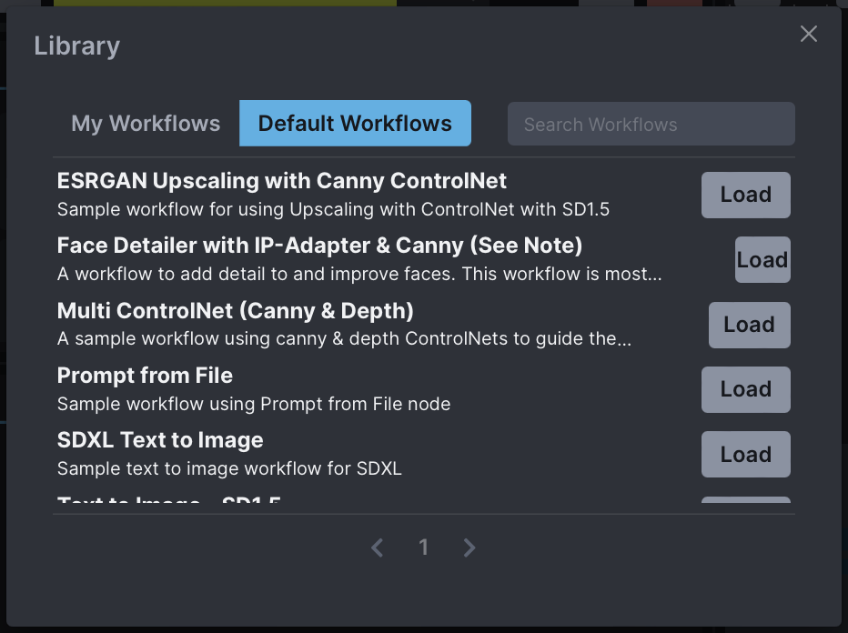
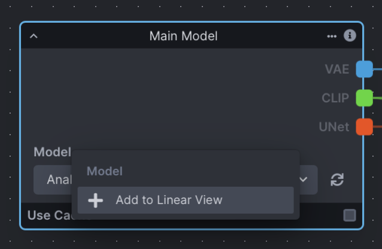
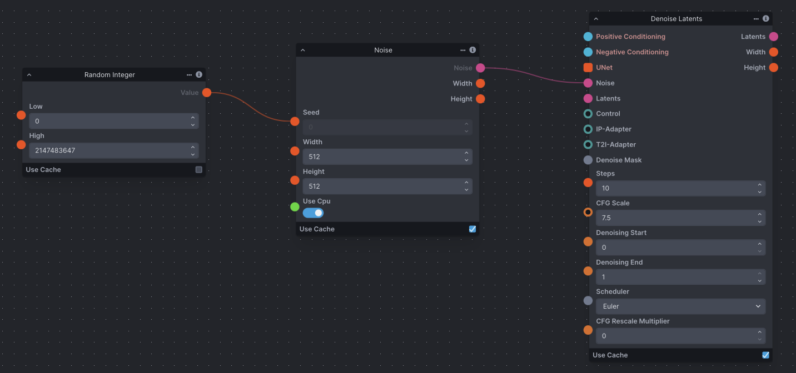
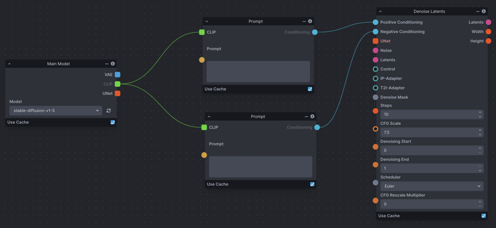
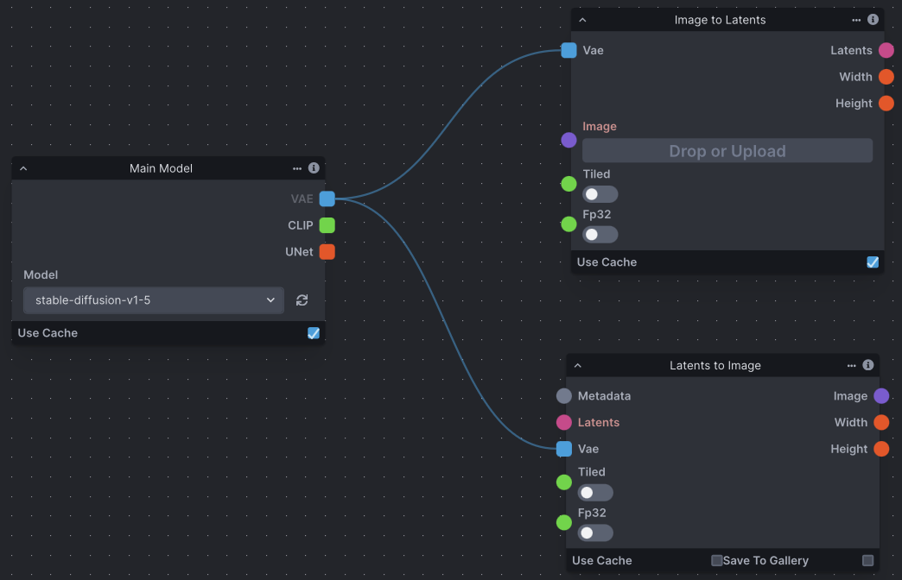
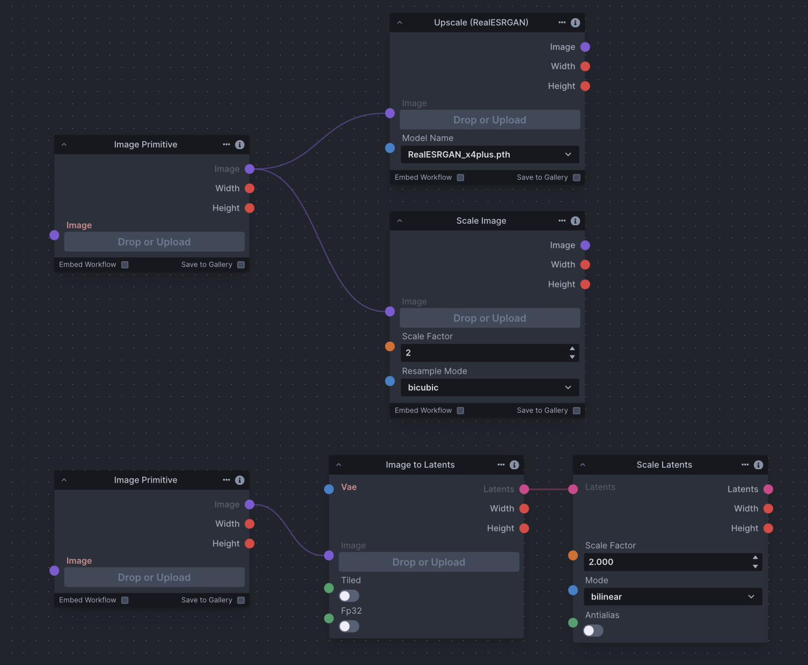
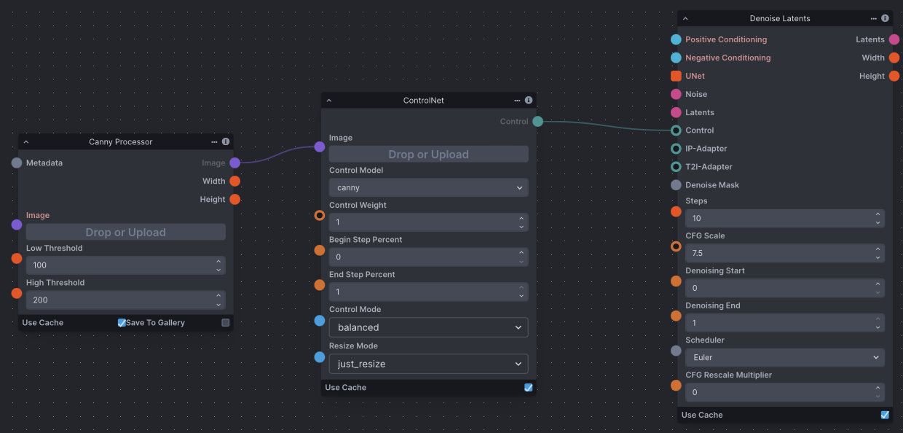
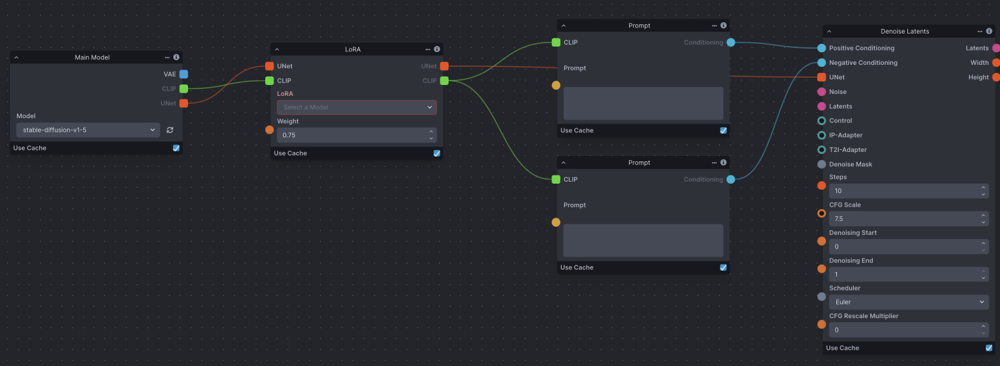
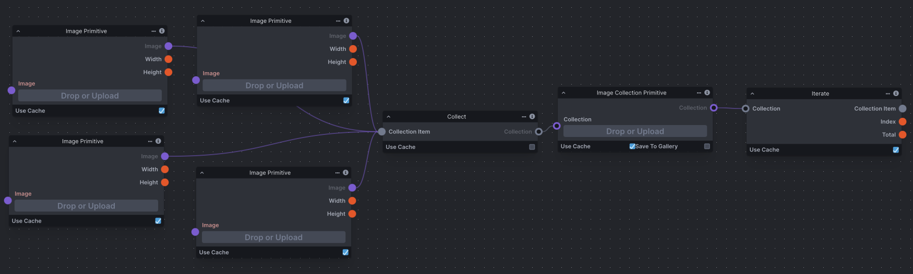
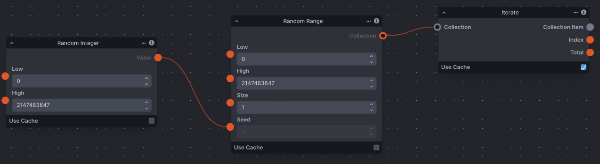

import { Card, CardGrid, Steps, Tabs, TabItem } from '@astrojs/starlight/components';

محرر سير العمل هو لوحة بيضاء فارغة تسمح باستخدام وظائف فردية وتحويلات الصور للتحكم في سير عمل توليد الصور. تستقبل العقد المدخلات على الجانب الأيسر، وتُخرج النتيجة على الجانب الأيمن.

يتكون الرسم البياني للعقد من عدة عقد متصلة معاً لإنشاء سير عمل. يتم توصيل مدخلات ومخرجات العقد عن طريق سحب الموصلات من عقدة إلى أخرى. المدخلات والمخرجات مرمزة بالألوان لسهولة الاستخدام.

:::tip[جديد في التوليد المنتشر؟]
إذا لم تكن معتاداً على التوليد المنتشر، ألق نظرة على [نظرة عامة على التوليد المنتشر](../../concepts/diffusion). فهم كيفية عمل التوليد المنتشر سيمكنك من استخدام محرر سير العمل بسهولة أكبر وبناء سير عمل تناسب احتياجاتك.
:::

## الميزات

<Card title="مكتبة سير العمل" icon="open-book">
  احفظ سير العمل في قاعدة بيانات Invoke، مما يتيح لك إنشاء وتعديل ومشاركة سير العمل حسب الحاجة. يتم توفير مجموعة منسقة من سير العمل الافتراضية للمساعدة في شرح استخدام العقد الهام.

  

  تحتوي المكتبة على عرضين:

  - **تصفح سير العمل** يعرض سير العمل الافتراضية المنسقة، قابلة للتصفية بمجموعة ثابتة من علامات الفئات.
  - **سير العمل الخاصة بك** يعرض سير العمل التي قمت بحفظها. مرشح العلامات هنا **ديناميكي** — فهو يعرض كل علامة فريدة موجودة في سير العمل الخاصة بك، مع عدد لكل علامة.

  أضف علامات مفصولة بفواصل إلى سير العمل (مثل `portrait, SDXL, upscaling`) عند حفظه. تظهر العلامات في أسفل كل بلاطة سير عمل في المكتبة وتصبح مرشحات قابلة للتحديد في الشريط الجانبي. انقر على علامة أو أكثر لتضييق القائمة؛ انقر على **سير العمل الخاصة بك** لمسح الفلتر وإظهار كل شيء مرة أخرى. يتم تحديث تعداد العلامات تلقائياً عند إنشاء أو تعديل أو حذف سير عمل.
</Card>
<Card title="عرض خطي" icon="list-format">
  أنشئ واجهة مستخدم مخصصة لسير العمل الخاص بك، مما يسهل التكرار على توليداتك. يتم حفظ عرض الواجهة الخطية مع سير العمل، مما يسمح لك بمشاركة سير العمل وتمكين الآخرين من استخدامها.

  <Steps>
  1. انقر بزر الماوس الأيمن على أي **تسمية مدخل** في عقدة.
  2. اختر **"إضافة إلى العرض الخطي"**.
  3. سيظهر المدخل الآن في لوحة العرض الخطي الخاصة بك!
  </Steps>

  
</Card>
<Card title="إعادة تسمية الحقول والعقد" icon="pencil">
  يمكن إعادة تسمية أي عقدة أو حقل إدخال في محرر سير العمل. إذا تمت إعادة تسمية حقل الإدخال الذي قمت بإعادة تسميته وأضيف إلى العرض الخطي، فسينعكس الاسم المتغير في كلا المكانين.
</Card>
<Card title="التخزين المؤقت للعقد" icon="rocket">
  تحتوي العقد على خيار **"استخدام التخزين المؤقت"** في تذييلها. يتيح ذلك تحسينات في الأداء من خلال إعادة استخدام القيم المخزنة مؤقتاً سابقاً أثناء معالجة سير العمل.
</Card>

### إدارة العقد

استخدم اختصارات لوحة المفاتيح السريعة هذه للتنقل وإدارة سير العمل الخاص بك بكفاءة:

<CardGrid>
  <Card title="نسخ العقدة" icon="document">
    <kbd>Ctrl</kbd> + <kbd>C</kbd> (أو <kbd>Cmd</kbd> + <kbd>C</kbd>)
  </Card>
  <Card title="لصق العقدة" icon="approve-check-circle">
    <kbd>Ctrl</kbd> + <kbd>V</kbd> (أو <kbd>Cmd</kbd> + <kbd>V</kbd>)
  </Card>
  <Card title="تحديد متعدد" icon="list-format">
    <kbd>Shift</kbd> + النقر والسحب
  </Card>
  <Card title="حذف العقدة" icon="close">
    <kbd>Backspace</kbd> / <kbd>Delete</kbd>
  </Card>
</CardGrid>

## العقد والمفاهيم الهامة

هناك العديد من مفاهيم تجميع العقد التي يمكن فحصها بتركيز ضيق. يمكن تجميع هذه التجميعات (وغيرها) معاً لتكوين إعدادات رسوم بيانية وظيفية، وهي مهمة لفهم كيفية عمل مجموعات العقد معاً كجزء من الكل.

:::note
لقطات الشاشة أدناه ليست أمثلة على رسوم بيانية كاملة للعقد، بل هي مقاطع توضح مفاهيم محددة.
:::

<Tabs>
  <TabItem label="الضوضاء والتكييف" icon="setting">
    ### إنشاء ضوضاء كامنة
    موتر الضوضاء الأولي ضروري لعملية التوليد المنتشر الكامن. نتيجة لذلك، تتطلب عقدة إزالة الضوضاء مدخلاً من عقدة الضوضاء.

    تتضمن عقدة **إنشاء ضوضاء كامنة** القياسية الآن محدد **نوع الضوضاء** للأشكال الكامنة الخاصة بالبنية المعمارية.
    اتركه على **SD** لسير عمل التوليد المنتشر المستقرة الكلاسيكية ذات 4 قنوات، أو قم بتبديله إلى البنية المعمارية التي
    تطابق أداة إزالة الضوضاء النهائية عند العمل مع نماذج مثل FLUX و FLUX.2 و SD3 و CogView4 و Z-Image أو Anima.

    

    ### تكييف موجه النص
    التكييف ضروري لعملية التوليد المنتشر الكامن، سواء كان فارغاً أم لا. نتيجة لذلك، تتطلب عقدة إزالة الضوضاء مدخلات تكييف إيجابية وسلبية. يعتمد التكييف على مشفر نص CLIP الذي توفره عقدة محمل النموذج.

    
  </TabItem>

  <TabItem label="معالجة الصور" icon="seti:image">
    ### الصورة إلى الكامنات و VAE
    تأخذ عقدة **ImageToLatents** صورة بكسل و VAE وتُخرج كامنات. عقدة **LatentsToImage** تفعل العكس، حيث تأخذ كامنات و VAE وتُخرج صورة بكسل.

    

    ### القياس
    استخدم عقد **ImageScale** و **ScaleLatents** و **Upscale** لتكبير الصور و/أو الصور الكامنة. التكبير هو عملية تكبير الصورة وإضافة المزيد من التفاصيل.

    تختلف الطريقة المختارة حسب السياق. ومع ذلك، كن على دراية بأن الكامنات هي بالفعل مزعجة ومضغوطة بدقتها الأصلية؛ قد يؤدي قياس الصورة إلى نتائج أكثر تفصيلاً.

    
  </TabItem>

  <TabItem label="التحكم المتقدم" icon="puzzle">
    ### ControlNet
    تُخرج عقدة **ControlNet** تحكماً، يمكن تقديمه كمدخل لعقدة Denoise Latents. اعتماداً على نوع ControlNet المطلوب، تتطلب عقد ControlNet عادةً عقدة معالج صور، مثل Canny Processor أو Depth Processor، والتي تعد صورة الإدخال لاستخدامها مع ControlNet.

    

    ### LoRA
    تتيح لك عقدة **Lora Loader** تحميل LoRA وتمريره كمخرج. يوفر LoRA ضبطاً دقيقاً لأوزان UNet ومشفر النص التي تعزز مفردات الصورة والنص للنموذج الأساسي.

    
  </TabItem>

  <TabItem label="التكرار والتجميع" icon="list-format">
    ### البذور المحددة والعشوائية
    من الشائع الرغبة في استخدام نفس البذرة (للاستمرارية) والبذور العشوائية (للتنوع). لتحديد بذرة، ما عليك سوى إدخالها في حقل **'Seed'** على عقدة الضوضاء. بالمقابل، تولد عقدة **RandomInt** عدداً صحيحاً عشوائياً بين 'Low' و 'High'، ويمكن استخدامها كمدخل لنقطة حافة 'Seed' على عقدة ضوضاء لجعل البذرة عشوائية.

    

    ### التكرار + صور متعددة كمدخل
    التكرار مفهوم شائع في أي معالجة، ويعني تكرار عملية مع مدخل معين. في العقد، يمكنك استخدام عقدة **Iterate** للتكرار من خلال المجموعات التي يتم جمعها عادة بواسطة عقدة **Collect**.

    لعقدة Iterate استخدامات محتملة عديدة، من معالجة مجموعة من الصور واحدة تلو الأخرى، إلى تغيير البذور عبر أجيال صور متعددة وأكثر. توضح لقطة الشاشة هذه كيفية جمع عدة صور واستخدامها في سير عمل توليد الصور.

    

    ### التوليد الدفعي / المتعدد للصور
    يتم التوليد الدفعي أو المتعدد للصور في محرر سير العمل باستخدام عقدة **RandomRange**. في هذه الحالة، يمثل حقل 'Size' عدد الصور المراد توليدها، مما يعني أن هذا المثال سيولد 4 صور.

    نظراً لأن RandomRange ينتج مجموعة من الأعداد الصحيحة، نحتاج إلى إضافة عقدة Iterate للتكرار من خلال المجموعة. يمكن بعد ذلك تغذية هذه الضوضاء إلى عقدة Denoise Latents لتتكرار خلال عملية إزالة الضوضاء مع البذور المختلفة المقدمة.

    
  </TabItem>
</Tabs>
