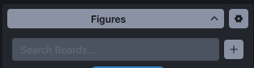
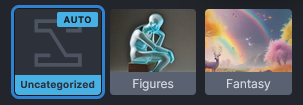

import { Card, CardGrid, Steps } from '@astrojs/starlight/components';

لوحة المعرض هي طريقة سريعة لمراجعة والبحث والاستفادة من الصور التي قمت بتوليدها وتحميلها. ينقسم المعرض إلى **لوحات**. لوحة *غير مصنفة* موجودة دائماً، لكن يمكنك إنشاء لوحاتك الخاصة لتنظيم أفضل.

---

## عرض اللوحة والإعدادات

في أعلى لوحة المعرض، ستجد أزرار الكشف عن اللوحة والإعدادات.

يظهر **زر الكشف** اسم اللوحة المحددة حالياً ويتيح لك تبديل رؤية الصور المصغرة للوحة.

يفتح **زر الإعدادات** قائمة بخيارات التخصيص:

- **حجم الصورة:** شريط تمرير يتيح لك التحكم في حجم معاينات الصور في المعرض.
- **التبديل التلقائي إلى الصور الجديدة:** عند التمكين، سيتم تحميل الصور المنشأة حديثاً تلقائياً في لوحة الصور الحالية (في علامة تبويب نص إلى صورة) أو لوحة النتائج (في علامة تبويب صورة إلى صورة). يحدث هذا بشكل غير مرئي حتى لو كنت في علامة تبويب مختلفة أثناء التوليد.
- **التعيين التلقائي للوحة عند النقر:** كلما تم توليد صورة أو حفظها، يتم وضعها في لوحة. اللوحة الوجهة مميزة بشارة `AUTO`.
  - *عند التمكين:* اللوحة المحددة في لحظة النقر على **Invoke** تصبح الوجهة. هذا يسمح لك بوضع توليدات متعددة في قائمة الانتظار إلى لوحات مختلفة دون انتظار اكتمالها.
  - *عند التعطيل:* تظهر قائمة منسدلة **لوحة الإضافة التلقائية**، مما يتيح لك تعيين لوحة محددة واحدة كوجهة دائمة لجميع الصور الجديدة.
- **إظهار شارة حجم الصورة دائماً:** يبدّل ما إذا كانت الدقة (مثال 512×512) معروضة على كل صورة مصغرة للمعاينة.

أسفل هذه الأزرار توجد منطقة إدخال نص **البحث في اللوحات**، مما يتيح لك العثور بسرعة على لوحات محددة بالاسم. بجانبها زر **إضافة لوحة (+)** لإنشاء لوحات جديدة.

:::tip
يمكنك إعادة تسمية أي لوحة ببساطة عن طريق النقر على اسمها تحت الصورة المصغرة وكتابة الاسم الجديد.
:::

---

## إدارة اللوحات

لكل لوحة قائمة سياق يمكن الوصول إليها عبر النقر بزر الماوس الأيمن (أو Ctrl+click).

- **الإضافة التلقائية إلى هذه اللوحة:** إذا كان *التعيين التلقائي للوحة عند النقر* معطلاً في الإعدادات، استخدم هذا الخيار لتعيين اللوحة المحددة بسرعة كوجهة افتراضية للصور الجديدة.
- **تنزيل اللوحة:** يحزم جميع الصور داخل اللوحة في ملف `.zip`. سيتم توفير رابط إشعار عندما يكون التنزيل جاهزاً.
- **حذف اللوحة:** يزيل اللوحة وجميع محتوياتها بشكل دائم.

:::danger
حذف لوحة سيؤدي إلى **حذف جميع الصور** الموجودة داخلها بشكل دائم. تابع بحذر!
:::

### محتويات اللوحة

كل لوحة منظمة في علامتي تبويب متميزتين:

1. **الصور:** الصور التي تم إنشاؤها مباشرة داخل InvokeAI.
2. **الأصول:** الصور الخارجية التي قمت بتحميلها لاستخدامها كـ [موجه صور](https://support.invoke.ai/support/solutions/articles/151000159340-using-the-image-prompt-adapter-ip-adapter-) أو داخل علامة تبويب صورة إلى صورة.

---

## اللوحات الافتراضية

اللوحات الافتراضية هي مجموعات لوحات للقراءة فقط يقوم Invoke بحسابها فورياً من البيانات الوصفية لصورتك بدلاً من تخزينها في قاعدة البيانات. النوع الأول المتاح يجمع الصور **حسب التاريخ**، منشئاً لوحة فرعية واحدة لكل يوم قمت بتوليد الصور فيه.

اللوحات الافتراضية **معطلة بشكل افتراضي**. لتمكينها:

1. افتح **إعدادات اللوحة** (أيقونة الترس في أعلى المعرض).
2. فعّل **اللوحات الافتراضية**.
3. يظهر قسم قابل للطي **حسب التاريخ** في قائمة اللوحات، مع لوحة فرعية لكل يوم يحتوي على صور. كل لوحة فرعية تظهر التاريخ وعدد الصور/الأصول وصورة مصغرة للغلاف.

اختيار لوحة فرعية حسب التاريخ يقوم بتصفية المعرض ليعرض فقط الصور من ذلك اليوم. حالة طي قسم حسب التاريخ تستمر عبر عمليات إعادة التحميل.

### الحدود

نظراً لأن اللوحات الافتراضية مشتقة وليست مخزنة:

- هي **للقراءة فقط**: لا سحب وإفلات، لا قائمة سياق، لا وجهة إضافة تلقائية.
- لا يمكنك إعادة تسميتها أو حذفها.
- توليد صورة جديدة يحدث التعدادات فوراً، لكن الصورة لا تزال محفوظة في لوحة الإضافة التلقائية العادية — اللوحات الافتراضية هي *عرض*، ليست وجهة.
- تعطيل تبديل **اللوحات الافتراضية** يخفي القسم ويعيد التحديد إلى *غير مصنفة* إذا كنت تشاهد لوحة فرعية افتراضية.

---

## التفاعل مع الصور

كل صورة تم إنشاؤها بواسطة InvokeAI تخزن بياناتها الوصفية للتوليد (الموجه، البذرة، النماذج، إلخ) مباشرة داخل الملف. يمكنك قراءة هذه البيانات عن طريق تحديد الصورة والنقر على **زر المعلومات**  في أي لوحة نتائج.

بالإضافة إلى ذلك، كل صورة لها قائمة سياق (نقر بزر الماوس الأيمن أو Ctrl+click) مع إجراءات سير عمل قوية:

*الخيارات المميزة بعلامة نجمية (\*) تتطلب أن تحتوي الصورة على بيانات وصفية للتوليد.*

<CardGrid>
  <Card title="إجراءات سريعة" icon="rocket">
    - **فتح في علامة تبويب جديدة:** يفتح الصورة في علامة تبويب متصفح منفصلة.
    - **تنزيل الصورة:** يحفظ الصورة على جهازك المحلي.
    - **تثبيت الصورة:** يثبت الصورة في أعلى المعرض. *(متاح أيضاً بالنقر على أيقونة النجمة عند التمرير).*
  </Card>
  <Card title="التوليد وسير العمل" icon="setting">
    - **تحميل سير العمل*:** يقوم بتحميل إعدادات سير العمل المحفوظة في علامة تبويب سير العمل ويفتحها.
    - **إعادة مزج الصورة*:** يقوم بتحميل جميع إعدادات التوليد (**باستثناء** البذرة) في لوحة التحكم.
    - **استخدام الموجه*:** يقوم بتحميل موجهات النص فقط.
    - **استخدام البذرة*:** يقوم بتحميل البذرة فقط.
    - **استخدام الكل*:** يقوم بتحميل جميع إعدادات التوليد في لوحة التحكم.
  </Card>
  <Card title="التوجيه" icon="right-arrow">
    - **إرسال إلى صورة إلى صورة:** ينقل الصورة إلى اللوحة اليسرى لعلامة تبويب صورة إلى صورة.
    - **إرسال إلى اللوحة الموحدة:** **يستبدل** محتويات اللوحة الموحدة الحالية بهذه الصورة.
  </Card>
  <Card title="التنظيم" icon="list-format">
    - **تغيير اللوحة:** يفتح موجهًا لنقل الصورة. *(يمكنك أيضاً سحب وإفلات الصور على الصور المصغرة للوحة).*
    - **حذف الصورة:** يحذف الصورة نهائياً من InvokeAI.
  </Card>
</CardGrid>

:::caution
  اختيار **حذف الصورة** سيزيل الصورة بالكامل من تثبيت InvokeAI الخاص بك. لا يمكن التراجع عن هذا الإجراء.
:::

---

## ملخص

يغطي هذا الشرح واجهة المعرض واللوحات. للإرشاد حول التوجيه وسير عمل التوليد، يرجى الرجوع إلى [دليل التوجيه](/concepts/prompting-guide/) و [توليد صور الذكاء الاصطناعي](/concepts/image-generation/).

## شكر وتقدير

تحية كبيرة لفريق العمل الأساسي الذي يعمل على جعل واجهة الويب حقيقة واقعة، بما في ذلك [psychedelicious](https://github.com/psychedelicious) و [Kyle0654](https://github.com/Kyle0654) و [blessedcoolant](https://github.com/blessedcoolant). كان [hipsterusername](https://github.com/hipsterusername) المشجع غير الرسمي للفريق وأضاف تلميحات الأدوات/الوثائق.
