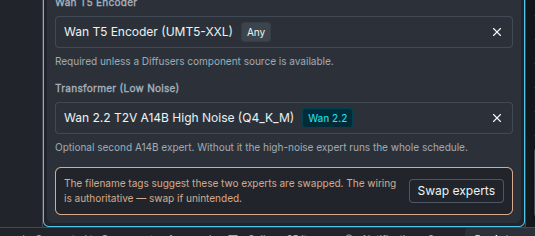

import { Card, CardGrid, Steps } from '@astrojs/starlight/components';

InvokeAI generates short MP4 clips from a text prompt, one or two images, an existing video — or combinations of those — using two local model families:

* **Wan 2.2** — the Alibaba Wan-AI family: three transformer variants covering text-to-video, image-to-video, first-to-last-frame interpolation, and video extension, with a 4-step **Lightning** fast path.
* **MiniMax H3** — a single "FL2VA" (first/last-frame-to-video-plus-audio) model that covers every conditioning mode *and* generates a synchronized stereo soundtrack, with a 6-step **Turbo** fast path.

The easiest way to use either is the **Video panel** described on this page — no node graph required. The [bundled video workflows](/features/video-workflows/) expose the same pipelines in the workflow editor for graph-level control.

:::caution[Experimental]
Video generation is a prototype feature. Panel behavior, workflows, and starter-model packaging may change between releases. The underlying models are also new — expect rough edges in coherence and artifacts at longer durations.
:::

---

## The Video panel

Open the **Video** entry in the editor's left rail (next to Generate and Upscale). The panel is a complete video pipeline: type a prompt, pick a model, press **Invoke**, and the finished MP4 appears in the gallery.

### Quick start

<Steps>

1. **Install a video model.** Open the **Model Manager** and install a starter bundle: **Wan 2.2 Text-to-Video**, **Wan 2.2 Image-to-Video**, or **MiniMax H3**. See [the models](#the-models) below for what each contains and what fits your hardware.

2. **Open the Video panel** and pick your model in the **Model** section. The panel reshapes itself around the selection — sections and fields appear, disappear, and re-range to match what the model can actually do.

3. **Type a prompt** describing the scene and, importantly, the *motion* you want across the clip.

4. **Optionally add conditioning media** — a first frame, a last frame, or an initial video to extend (see below).

5. **Press Invoke.** The MP4 lands in the gallery and plays in the viewer. On MiniMax H3 it arrives with a generated audio track.

</Steps>

### The panel adapts to the model

There is no mode switch. The panel infers what to generate from **which inputs you have filled in**, and each model family supports a different set of combinations:

| Inputs you set | What runs | Wan T2V‑A14B | Wan I2V‑A14B | Wan TI2V‑5B | MiniMax H3 |
|---|---|---|---|---|---|
| Prompt only | Text to video | ✓ | — | ✓ | ✓ |
| First Frame | Video starts on your image | — | ✓ | ✓ | ✓ |
| Last Frame only | Video ends on your image | — | — | — | ✓ |
| First + Last Frame | Interpolates between the two | — | ✓ | — | ✓ |
| Initial Video | Extends the clip | — | ✓ | ✓ | ✓ |
| Initial Video + Last Frame | Extends toward a destination image | — | ✓ | — | ✓ |

If you pick a model that can't run the current combination, the Invoke button tells you exactly why instead of failing mid-run.

### Prompt

The prompt toolbar carries the same helpers as the image Generate panel — templates, prompt expansion, image-to-prompt, and history. The **negative prompt** behaves per family:

* **Wan** — used only when CFG is greater than 1 (the field says so). With the Lightning fast path on (CFG 1), it is ignored by the graph.
* **MiniMax H3** — hidden entirely. H3 is guidance-distilled and has no CFG, so a negative prompt has nothing to act on.

### Start & End Images

Two drop targets: **First Frame** and **Last Frame**. Drag an image from the gallery (thumbnail or the preview's frame), or upload one.

* A **first frame** anchors the video's opening image (image-to-video).
* A **last frame** anchors where it ends. Combined with a first frame, the model interpolates between the two. On MiniMax H3 a last frame also works **alone** — the video builds toward your image.
* Setting a first frame **disables the Initial Video section**, and vice-versa: a clip can start from a still or continue a video, not both. The disabled section says which input to clear.

### Initial Video

Drop or upload an existing video to **extend** it. The section shows the clip with a live preview, plus:

* **Start Frame / End Frame sliders** to trim the kept range — small thumbnails show the exact frames at both bounds while you drag.
* The new segment continues from the trimmed clip's end frame and is joined on with a smooth cross-fade.
* Add a **Last Frame** image alongside the initial video to steer where the continuation lands (not available on TI2V‑5B).
* On Wan, the extension **inherits the source clip's frame rate** and the FPS field locks accordingly. MiniMax H3 always generates at its fixed 24 fps.

Run extend repeatedly — each output can be the next run's initial video — to grow a clip well past a single generation's length. See [making longer videos](#making-longer-videos).

### Dimensions

* **Aspect Ratio** presets (21:9 through 9:21) drive text-to-video output. As soon as conditioning media is set, **its aspect ratio takes over** and the preset locks — the readout names the source ("from the first frame").
* **Target Resolution** picks the size tier within that ratio:
  * Wan — **480p** and **720p** (native), **1080p** (extrapolated beyond the training distribution; expect softer results).
  * MiniMax H3 — **768 highres** (native: short edge 768) and **768 lowres** (fast preview: long edge 768).
  The panel derives exact pixel dimensions automatically, snapped to each model's grid — you never do the multiple-of-16/32 math yourself.
* **Frames** sets clip length:
  * Wan — any 4·n+1 count from 5 to 161; default **81** (5 seconds at the default 16 fps). The training distribution is 81; longer values degrade coherence.
  * MiniMax H3 — a snapped slider over the model's fixed grid (90 to 345 in steps of 17); default **124** (about 5 seconds at 24 fps).
* **FPS** — editable on Wan (default 16; locked while extending, see above); fixed at 24 on MiniMax H3.

### Model

Model select plus the sampling controls:

* **Steps** and **CFG** (Wan A14B additionally exposes **CFG (Low Noise)** for the second expert — see [the experts](#high-noise-and-low-noise-transformers-a14b-variants-only)).
* **Seed** with a randomize toggle.
* The **fast-path toggle** — **Lightning** on Wan A14B, **Turbo** on MiniMax H3. When the matching distillation LoRA is installed the toggle defaults **on**, setting the distilled step count (4 for Lightning, 6 for Turbo) and CFG 1. Turning it off restores the model's full-quality defaults (40 steps / CFG 5 on Wan, 50 steps on H3). The toggle works by adding or removing the LoRA in the Concepts list — what you see there is exactly what runs.

### Concepts

Add your own style/subject LoRAs, just like the image panel. Compatibility is enforced per family — an A14B LoRA can't run on TI2V‑5B (the tensor shapes differ), and the panel says so rather than silently dropping it.

### Model Components

What appears here depends on the model:

* **Wan single-file (GGUF/checkpoint) mains** need their supporting pieces: either a **Component Source** (any Diffusers Wan install, which supplies the text encoder and VAE) or a standalone **VAE** and **Wan T5 Encoder**. A14B mains also get a **Transformer (Low Noise)** slot for the second expert — without it, the high-noise expert runs the whole schedule.
* **Wan Diffusers mains** bundle everything; the section stays collapsed.
* **MiniMax H3** mains are the Diffusers components install; the two optional slots override the **transformer** and **text encoder** with single-file builds — this is how the starter bundle's int8 repacks are wired in.

If a Wan A14B pairing looks mis-wired — for example a low-noise-tagged file in the main slot — the panel shows a **non-blocking advisory** beneath the slots with a one-click **Swap experts** action. The tags come from a filename heuristic and your explicit wiring always wins, so deliberate cross-wiring still runs (the backend logs the same warning at generation time).

### Recalling parameters

Video generations record their parameters as metadata. Select a video in the gallery and use **Recall parameters** (in the viewer's header or the context menu) to load its prompt, model, dimensions, frames, LoRAs, and conditioning back into the Video panel — the same round-trip the image panel offers. Media that no longer exists is cleared rather than silently substituted.

---

## The models

### Wan 2.2

Wan 2.2 ships three transformer variants, plus a shared text encoder and two VAEs. All share the same diffusion-style sampling but differ in size, conditioning, and intended task.

| Variant | Task | Params | VAE | Conditioning |
|---|---|---|---|---|
| **T2V-A14B** | Text → Video | 14B × 2 experts | A14B VAE (16-ch, 8× spatial) | Text only |
| **I2V-A14B** | Image+Text → Video | 14B × 2 experts | A14B VAE (16-ch, 8× spatial) | Text + reference image (36-channel concat) |
| **TI2V-5B** | Text → Video OR Image+Text → Video | 5B (single) | Wan 2.2-VAE (48-ch, 16× spatial) | Text, optionally with reference image (first-frame mask blend) |

* **T2V-A14B** generates videos from a text prompt alone. Best motion coherence and prompt-following of the three.
* **I2V-A14B** locks the first frame to a reference image you supply, and also handles first-to-last interpolation and extension. Best subject-preservation.
* **TI2V-5B** is the small single-expert variant. It does both text-to-video and image-to-video at substantially lower VRAM, with somewhat less stable long-range coherence.

#### High-noise and low-noise transformers (A14B variants only)

The A14B models are a **mixture-of-experts (MoE)** pair — *two* 14B transformers per variant. The denoise loop swaps between them at a model-defined boundary timestep:

* **High-noise expert** runs early, when the latents are still mostly noise: composition, layout, broad motion.
* **Low-noise expert** runs late, when the latents are close to clean: detail and texture.

InvokeAI handles the swap automatically. In the Video panel, a single-file A14B main takes its partner through the **Transformer (Low Noise)** component slot; a Diffusers A14B main carries both experts internally. **TI2V-5B is single-expert** — no swap, no low-noise CFG, no second slot.

#### Lightning (the Wan fast path)

The stock A14B variants need ~40–50 denoise steps. The **Lightning distillation LoRAs** collapse that to **4 steps** at CFG 1 with minimal quality loss — about a 10× speedup. There's a pair per variant (one per expert); the panel's Lightning toggle wires both automatically.

:::tip
**TI2V-5B has no Lightning LoRA.** Its smaller size makes each step cheap; run it at 40–50 steps for a similar wall-clock to A14B + Lightning.
:::

#### Installing Wan models

Two **starter bundles**:

* **Wan 2.2 Text-to-Video** (~36 GB) — UMT5-XXL text encoder, both VAEs, TI2V-5B Q4_K_M, T2V-A14B Q4_K_M (high + low), T2V Lightning (high + low).
* **Wan 2.2 Image-to-Video** (~32 GB) — UMT5-XXL, A14B VAE, I2V-A14B Q4_K_M (high + low), I2V Lightning (high + low).

The bundles are independent; installing both totals ~56 GB (shared components are deduplicated). Higher-quality Q8_0 quantizations and full Diffusers builds are available a-la-carte in the starter models list.

:::tip
**On a 12 GB VRAM card**: install just the Text-to-Video bundle and use TI2V-5B — it covers both text-to-video and image-to-video and fits comfortably. The A14B variants will technically run via aggressive offloading but are slow and prone to OOM.
:::

### MiniMax H3

MiniMax H3 is a single **FL2VA** model — *first/last-frame to video with audio*. One checkpoint covers every conditioning mode the panel offers (text-to-video, first frame, last frame, both, and extend), and every generation includes a **jointly generated stereo soundtrack**, muxed into the MP4 as AAC.

What makes it different from Wan in practice:

* **Guidance-distilled** — there is no CFG and no negative prompt. Prompt adherence is baked in; the panel hides both controls.
* **Fixed 24 fps** and a fixed frame grid: 90–345 frames in steps of 17 (about 3.8 to 14.4 seconds), default 124.
* **768-class canvas** — "768 highres" pins the short edge to 768 (native quality); "768 lowres" pins the *long* edge to 768 for fast previews. Aspect ratios from 1:4 to 4:1 are supported, wider than the preset list.
* **Turbo fast path** — step-distillation LoRAs render in ~6–8 steps instead of ~50. The panel's Turbo toggle defaults on when one is installed (6 steps).
* **Conditioning text encoder** is a truncated **Qwen3-VL-32B** — a vision-language model, which is why H3 follows detailed scene descriptions well.

#### Installing MiniMax H3

The **MiniMax H3** starter bundle (~62 GB) installs the working set:

* **MiniMax H3 Components** (~11 GB) — the Diffusers-format main: tokenizer, processor, and the video + audio VAEs. **This is the model you select in the Video panel.**
* **MiniMax H3 FL2VA Transformer (int8, pruned)** (~21 GB) and **MiniMax H3 Text Encoder (int8)** (~27 GB) — single-file builds that slot into the panel's **Model Components** overrides (the bundled templates and the panel wire them the same way).
* **MiniMax H3 Turbo LoRA** and **MiniMax H3 LightX2V Turbo LoRA** — two independent step-distillation LoRAs (both Apache 2.0); the Turbo toggle picks one automatically.

H3 is the heaviest local video option — With 16 GB VRAM, `enable_partial_loading` enabled and 32 GB of system RAM it can create a full 345 frame video (about 14s) at 768x768 resolution, but for larger or longer videos a high-VRAM GPU (24 GB+) is strongly recommended.

:::caution[License restrictions]
MiniMax H3 is distributed under the **MiniMax H3 Community License**, which restricts use by territory (currently excluding the US, EU, UK, and South Korea) — and the restriction **extends to model outputs**. Review the terms at [huggingface.co/MiniMaxAI/MiniMax-H3](https://huggingface.co/MiniMaxAI/MiniMax-H3) before installing. The Turbo LoRAs themselves are Apache 2.0.
:::

---

## Making longer videos

Both families are trained on short clips — Wan on 81 frames (~5 s), H3 on up to 345 (~14 s). Asking for more frames in one generation pushes the temporal positional encoding out of distribution and coherence degrades. The way to go longer is to **extend**: generate a clip, then continue it, repeatedly.

### From the Video panel

<Steps>

1. **Generate your opening clip** (any mode).

2. **Drag it from the gallery into the Initial Video field.** Trim off any weak tail with the End Frame slider — the last frames of a generation are occasionally its worst.

3. Optionally set a **Last Frame** image to steer where the continuation lands.

4. **Invoke.** The panel renders the continuation and joins it to your source with a cross-fade, delivering one combined MP4.

5. **Repeat** with the new output as the next initial video.

</Steps>

### Quality drift across iterations

Each iteration's source is itself a generation output, so artifacts compound — by the 4th or 5th extension you may see softening or color drift. Mitigations:

1. **Trim the bridge point a few frames back from the end** — boundary frames are the most artifact-prone.
2. **Refresh a bridge frame with a low-strength img2img pass** (SDXL or FLUX at ~0.2 strength) before using it as a first frame for the next segment.
3. **Don't chain more than 4–5 segments** without refreshing in between.

Also, be aware that the extended video only has access to information present in the bridge frame (i.e. the last frame of the previous video). So if a character in the first video has their face obscured in the bridge frame, the character's face may be completely different in the extended part of the video.

### In the workflow editor

The **Extend Video** workflows expose the same machinery as graphs, including the `Concatenate Videos` node's transition modes (`cut`, `crossfade`, `fade_through_black`) and `Frame from Video` for manual frame-bridging chains. See the [Video Workflows guide](/features/video-workflows/).

---

## Troubleshooting

### OOM errors

Video denoise is memory-intensive — attention scales roughly as `(T_lat × H/16 × W/16)²`, so resolution and frame count both quadratically affect peak VRAM.

For Wan, add `wan_memory_optimization: true` to `invokeai.yaml` and restart to target about 2 GiB of resident transformer weights when `enable_partial_loading` is enabled, lower denoise activation memory, and stream untiled VAE decode directly to MP4. This can make generation substantially slower and requires enough system RAM for offloaded weights.

* **Drop resolution before frame count.** 1280×720 → 832×480 is a ~2.4× memory drop; on H3, switch Target Resolution to **768 lowres**.
* **TI2V-5B before A14B.** TI2V-5B Q4_K_M peaks around ~6–8 GB at 832×480, versus ~12–14 GB for A14B Q4_K_M.
* **OOM at the *reference image encoder* step** is usually allocator fragmentation from a previous run. Restart the server and try again; if it recurs reproducibly, file an issue.

### Late-frame artifacts (text, color blobs)

If a video looks great for most of its duration but the last ~20% develops text, watermarks, or floating colored shapes, that's the model's training-data prior leaking through as temporal coherence weakens. It's most common on TI2V-5B.

* On Wan (with CFG > 1), add to the negative prompt: `text, watermark, logo, subtitles, chinese characters, kanji, ticker, banner`
* Describe the *action* you want through the clip, not just the static scene
* Stay at the default frame count; longer pushes temporal RoPE out of distribution

### The Invoke button is disabled

The panel validates before enqueueing, and the button's tooltip lists every reason: an unsupported input combination for the selected model, a missing required component (Wan single-file mains need a VAE and encoder or a component source), a LoRA targeting the wrong Wan family, or conditioning media whose aspect ratio H3 can't reach (outside 1:4–4:1). Fix what it names and the button re-arms.

### TI2V-5B VAE state-dict load error

If decode fails with `size mismatch for ... AutoencoderKLWan`, the **wrong VAE** is wired for the transformer: TI2V-5B needs the 48-channel Wan 2.2 VAE, the A14B variants the 16-channel Wan 2.1 VAE. In the panel, pick the matching VAE in Model Components (the selector already filters to compatible channel counts when the model reports them).

### Preview images don't appear

1. **A video is already loaded in the viewer** — the progress preview overlays it. If missing entirely, hard-refresh the browser (`Ctrl+Shift+R` / `Cmd+Shift+R`).
2. **`Show progress in viewer` is disabled** — check the gallery settings (gear icon).

### Pipeline runs but the final MP4 is glitchy

Almost always a **VAE mismatch** (16-ch vs 48-ch on Wan) or a scheduler override. Use the auto-selected scheduler and the family-matched VAE.

---

## Acknowledgements

Wan 2.2 model family by the Alibaba Wan-AI team; Lightning distillation LoRAs by [lightx2v](https://huggingface.co/lightx2v/Wan2.2-Lightning); GGUF quantizations by [QuantStack](https://huggingface.co/QuantStack). MiniMax H3 by [MiniMax AI](https://huggingface.co/MiniMaxAI/MiniMax-H3); int8 single-file repacks by [Comfy-Org](https://huggingface.co/Comfy-Org/MiniMax-H3); Turbo distillation LoRAs by [larryvrh](https://huggingface.co/larryvrh/MiniMax-H3-Turbo-Lora) and [LightX2V](https://huggingface.co/lightx2v/Minimax-h3-Turbo).
