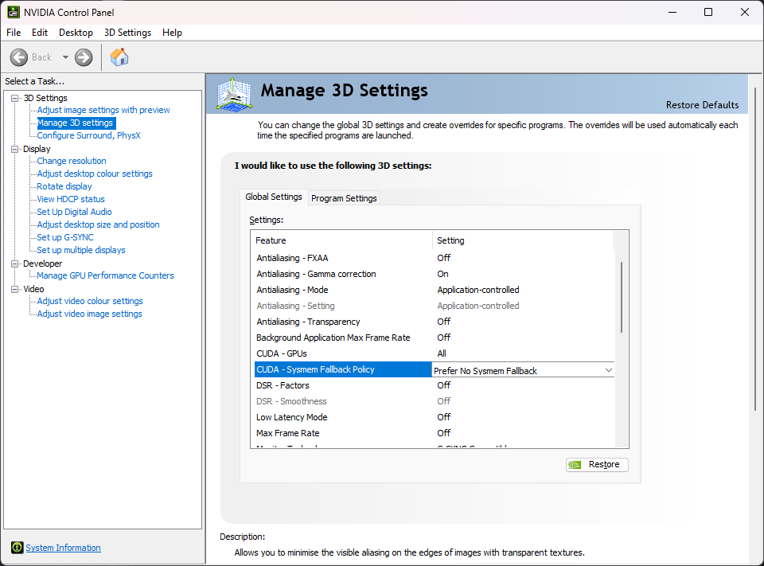

As of v5.6.0, Invoke has a low-VRAM mode. It works on systems with dedicated GPUs (Nvidia GPUs on Windows/Linux and AMD GPUs on Linux).

This allows you to generate even if your GPU doesn't have enough VRAM to hold full models. Most users should be able to run even the beefiest models - like the ~24GB unquantised FLUX dev model.

## Enabling Low-VRAM mode

Low-VRAM mode is **enabled by default** via the `enable_partial_loading: true` setting in `invokeai.yaml`. No action is required to turn it on.

**Windows users should also [disable the Nvidia sysmem fallback](#disabling-nvidia-sysmem-fallback-windows-only)**.

It is possible to fine-tune the settings for best performance or if you still get out-of-memory errors (OOMs).

If you want to disable partial loading (e.g. on systems with plenty of VRAM where full loading is faster), add this line to your `invokeai.yaml` and restart Invoke:

```yaml
enable_partial_loading: false
```

:::tip[How to find `invokeai.yaml`]
  The `invokeai.yaml` configuration file lives in your install directory. To access it, run the **Invoke Community Edition** launcher and click the install location. This will open your install directory in a file explorer window.

  You'll see `invokeai.yaml` there and can edit it with any text editor. After making changes, restart Invoke.

  If you don't see `invokeai.yaml`, launch Invoke once. It will create the file on its first startup.
:::

## Details and fine-tuning

Low-VRAM mode and related workload-specific optimizations include:

- Partial model loading (`enable_partial_loading`)
- PyTorch CUDA allocator config (`pytorch_cuda_alloc_conf`)
- Dynamic RAM and VRAM cache sizes (`max_cache_ram_gb`, `max_cache_vram_gb`)
- Working memory (`device_working_mem_gb`)
- Keeping a RAM weight copy (`keep_ram_copy_of_weights`)
- Tiled VAE decode and encode (`auto_tiled_decode`, `force_tiled_decode`)
- Wan video memory optimization (`wan_memory_optimization`)
- PiD decode activation chunking (`pid_memory_optimization`)

Read on to learn about these features and understand how to fine-tune them for your system and use-cases.

### Wan video memory optimization

Wan video generation has an additional opt-in memory optimization:

```yaml
wan_memory_optimization: true
```

This reserves VRAM so partial-load Wan transformer weights target about 2 GiB resident and stream remaining layers from RAM when partial model loading is enabled (the default). The explicit residency trim may be a no-op when cache admission already reaches that target. If `enable_partial_loading: false`, the activation, timestep, and VAE optimizations still apply, but transformer weights remain fully resident and the 2 GiB residency target is unavailable. It also chunks pointwise transformer activations, compacts TI2V per-token timestep conditioning, and streams untiled VAE decode chunks directly to MP4. It reduces peak VRAM during both denoise and decode, but generation can be substantially slower and requires enough system RAM for offloaded weights. Spatially tiled VAE decode continues to use its existing full-tile path.

The optimized BF16 transformer path can produce small numerical differences because chunked matrix operations accumulate in a different order. Same-seed output is not guaranteed to be bit-identical; set `wan_memory_optimization: false` for the baseline path.

Developers with a CUDA or ROCm device can validate Wan VAE memory estimates with `python scripts/calibrate_wan_vae_working_memory.py --vae <directory-or-safetensors-file>`. The script reports allocated and reserved memory deltas; its implied scaling constant uses reserved memory, which is what the shipped estimator covers, because reserved memory is what the decode takes from the GPU. Pass `--no-streaming` to measure the default full decode. The shipped constant sits above what the script reports for most sizes, because it has to cover the highest measurement, an 832x480 decode inside a running server; `estimate covers` in the output says whether the estimate holds. Use `--tiling` to measure the spatially tiled full-decode fallback; it overrides streaming mode. Use `--tile-size <pixels>` to override the VAE's default tile size.

Direct MP4 streaming keeps the VAE cache lock while chunks are decoded and written. Wan's causal decoder state and weights must remain live for the sequence; releasing the lock would require a separate bounded decode and encode queue.

### Partial model loading

Invoke's partial model loading works by streaming model "layers" between RAM and VRAM as they are needed.

When an operation needs layers that are not in VRAM, but there isn't enough room to load them, inactive layers are offloaded to RAM to make room.

#### Enabling partial model loading

Partial model loading is enabled by default. The corresponding setting in `invokeai.yaml` is:

```yaml
enable_partial_loading: true
```

Set it to `false` to disable partial loading.

### PyTorch CUDA allocator config

The PyTorch CUDA allocator's behavior can be configured using the `pytorch_cuda_alloc_conf` config. Tuning the allocator configuration can help to reduce the peak reserved VRAM. The optimal configuration is dependent on many factors (e.g. device type, VRAM, CUDA driver version, etc.), but switching from PyTorch's native allocator to using CUDA's built-in allocator works well on many systems. To try this, add the following line to your `invokeai.yaml` file:

```yaml
pytorch_cuda_alloc_conf: "backend:cudaMallocAsync"
```

When the setting is left unset, PyTorch's defaults apply, with one exception: with a ROCm build of PyTorch on Windows, Invoke uses `expandable_segments:True`. There, Windows does not fail an allocation it cannot fit into contiguous VRAM. It moves the allocation into much slower system memory instead, and fragmented VRAM makes that happen even when enough VRAM is free. Setting `pytorch_cuda_alloc_conf` yourself, or any of the `PYTORCH_ALLOC_CONF` / `PYTORCH_CUDA_ALLOC_CONF` / `PYTORCH_HIP_ALLOC_CONF` environment variables, replaces this default.

A more complete explanation of the available configuration options is [here](https://pytorch.org/docs/stable/notes/cuda.html#optimizing-memory-usage-with-pytorch-cuda-alloc-conf).

### Dynamic RAM and VRAM cache sizes

Loading models from disk is slow and can be a major bottleneck for performance. Invoke uses two model caches - RAM and VRAM - to reduce loading from disk to a minimum.

By default, Invoke manages these caches' sizes dynamically for best performance.

#### Fine-tuning cache sizes

Prior to v5.6.0, the cache sizes were static, and for best performance, many users needed to manually fine-tune the `ram` and `vram` settings in `invokeai.yaml`.

As of v5.6.0, the caches are dynamically sized. The `ram` and `vram` settings are no longer used, and new settings are added to configure the cache.

**Most users will not need to fine-tune the cache sizes.**

But, if your GPU has enough VRAM to hold models fully, you might get a perf boost by manually setting the cache sizes in `invokeai.yaml`:

```yaml
# The default max cache RAM size is logged on InvokeAI startup. It is determined based on your system RAM / VRAM.
# You can override the default value by setting `max_cache_ram_gb`.
# Increasing `max_cache_ram_gb` will increase the amount of RAM used to cache inactive models, resulting in faster model
# reloads for the cached models.
# As an example, if your system has 32GB of RAM and no other heavy processes, setting the `max_cache_ram_gb` to 28GB
# might be a good value to achieve aggressive model caching.
max_cache_ram_gb: 28

# The default max cache VRAM size is adjusted dynamically based on the amount of available VRAM (taking into
# consideration the VRAM used by other processes; with a ROCm build on Windows, the video-memory budget Windows grants
# Invoke, beyond which it would move allocations into system memory).
# You can override the default value by setting `max_cache_vram_gb`.
# CAUTION: Most users should not manually set this value. See warning below.
max_cache_vram_gb: 16
```

:::caution[Max safe value for `max_cache_vram_gb`]
  Most users should not manually configure the `max_cache_vram_gb`. This configuration value caps model-cache residency; `device_working_mem_gb` and operation-specific reservations (e.g. VAE decode) are still subtracted from that cap for every model-cache operation, not only when Wan memory optimization is enabled. A cap below the active working-memory reservation can force aggressive model offloading.

  For users who wish to configure `max_cache_vram_gb`, the max safe value can be determined by subtracting `device_working_mem_gb` from your GPU's VRAM. As described below, the default for `device_working_mem_gb` is 3GB.

  For example, if you have a 12GB GPU, the max safe value for `max_cache_vram_gb` is `12GB - 3GB = 9GB`.

  If you had increased `device_working_mem_gb` to 4GB, then the max safe value for `max_cache_vram_gb` is `12GB - 4GB = 8GB`.

  Most users who override `max_cache_vram_gb` are doing so because they wish to use significantly less VRAM, and should be setting `max_cache_vram_gb` to a value significantly less than the 'max safe value'.
:::

### Working memory

Invoke cannot use _all_ of your VRAM for model caching and loading. It requires some VRAM to use as working memory for various operations.

Invoke reserves 3GB VRAM as working memory by default, which is enough for most use-cases. However, it is possible to fine-tune this setting if you still get OOMs.

#### Fine-tuning working memory

You can increase the working memory size in `invokeai.yaml` to prevent OOMs:

```yaml
# The default is 3GB - bump it up to 4GB to prevent OOMs.
device_working_mem_gb: 4
```

:::tip[Operations may request more working memory]
  For some operations, we can determine VRAM requirements in advance and allocate additional working memory to prevent OOMs.

  VAE decoding is one such operation. This operation converts the generation process's output into an image. For large image outputs, this might use more than the default working memory size of 3GB.

  During this decoding step, Invoke calculates how much VRAM will be required to decode and requests that much VRAM from the model manager. If the amount exceeds the working memory size, the model manager will offload cached model layers from VRAM until there's enough VRAM to decode.

  Once decoding completes, the model manager "reclaims" the extra VRAM allocated as working memory for future model loading operations.
:::

### Keeping a RAM weight copy

Invoke has the option of keeping a RAM copy of all model weights, even when they are loaded onto the GPU. This optimization is _on_ by default, and enables faster model switching and LoRA patching. Disabling this feature will reduce the average RAM load while running Invoke (peak RAM likely won't change), at the cost of slower model switching and LoRA patching. If you have limited RAM, you can disable this optimization:

```yaml
# Set to false to reduce the average RAM usage at the cost of slower model switching and LoRA patching.
keep_ram_copy_of_weights: false
```

### Switching between model architectures

When a generation uses main models of another architecture than the previous one on the same GPU (say, FLUX.1 after SDXL), Invoke first moves every model the new generation does not use from VRAM to RAM. Models both generations use, such as a shared VAE or text encoder, stay in VRAM. Moving models back from RAM costs a few seconds per switch, more with `keep_ram_copy_of_weights: false`, so if you alternate between architectures that would fit in VRAM together, you can turn this off:

```yaml
# Keep other architectures' models in VRAM until a load needs the room.
offload_on_architecture_switch: false
```

### Clearing VRAM after every generation

If a generation runs fine the first time but runs out of memory when you repeat it, or slows down sharply because Windows moves part of it into shared GPU memory, you can have Invoke move the models it holds in VRAM to RAM after every queue item (every image of a batch) and hand the freed memory back to the GPU driver. The models stay cached in RAM, so each queue item then costs a few seconds for reloading them, not a full load from disk, and with `keep_ram_copy_of_weights: false` also the time to copy them back to RAM. On a machine with several GPUs, handing the memory back briefly holds up a generation running on another GPU. On CPU, Apple Silicon and integrated GPUs, whose VRAM is system memory, the setting changes nothing:

```yaml
clear_vram_after_session: true
```

### Tiled VAE decode and encode

Without tiling, the memory a VAE needs grows with the square of the image size. For FLUX.1, an untiled 3072² encode peaks at about 18.8 GiB on an RTX 4090, and a tiled one at 0.8 GiB, while tiled memory stays roughly flat as the image grows. Tiling costs some speed on smaller images.

Invoke tiles large decodes by itself: when an untiled decode would claim most of the memory the GPU keeps resident, it decodes in tiles instead, for the FLUX.1, Z-Image, Qwen-Image, Krea-2, Anima and Wan decodes. Because a tiled decode is not pixel-identical to an untiled one, this only kicks in for images too large for the card: for Z-Image on a 16GB GPU, for example, from about 1850x1850 on Nvidia and from about 1500x1500 on AMD, whose convolution library needs more memory. On a ROCm build under Windows the comparison uses the video-memory budget Windows grants Invoke, which is lower than the card's total and lower again while another program uses the GPU. Anima tiles a little earlier, because its untiled decode pushes the Anima model itself out of VRAM on 8GB cards. Wan videos are tiled from 832x480 on 8GB cards and from 720p on 16GB cards, where their untiled decodes need about as much memory as the card holds, or more.

To always decode untiled unless you ask for tiling, turn this off. A decode too large for the card then runs out of memory: the FLUX.1 and Z-Image decodes retry in tiles, the others fail, and on Windows the driver may move the decode into system memory and run it very slowly instead. Anima is not affected by this setting: there, tiling a large decode is what keeps the Anima model in VRAM, and turning it off would only make those decodes slower.

```yaml
auto_tiled_decode: false
```

- **Always tile:** set `force_tiled_decode: true` in `invokeai.yaml`. It covers the VAE decode and encode for SD1.5/SDXL, FLUX.1, Z-Image and Qwen-Image, the Anima encode, and the Krea-2 style reference. Other model families (for example SD3, FLUX.2, Wan and LTX-2) ignore it.
- **Per node:** the SD, FLUX.1, Z-Image and Qwen-Image **Latents to Image** and **Image to Latents** nodes, and **Image to Latents - Anima**, have **Tiled** and **Tile Size** fields for workflows. The [Upscale panel](/users-guide/image-generation/upscale/) turns tiling on by itself.
- **Automatic retry:** if a FLUX.1, Z-Image or Anima decode, or a FLUX.1 encode, runs out of memory, InvokeAI retries it once with tiling and logs that it did.

A tiled decode is not pixel-identical to a single-pass one. The VAE looks at the whole image at once, so the difference is spread over the image rather than limited to the tile seams; it is small, but the same seed will not reproduce an untiled result exactly.

### PiD decode optimization

PiD decodes directly into high-resolution pixels, so its activation and sampler memory can exceed the working memory needed by a normal VAE decode. Partial model loading reduces memory used by PiD's weights, but does not reduce these full-resolution intermediates.

To reduce PiD's peak VRAM use, enable its experimental memory optimization in `invokeai.yaml` and restart InvokeAI:

```yaml
pid_memory_optimization: true
```

This setting processes parts of the PiD pixel pathway in chunks and uses float32 instead of float64 sampler intermediates. It applies to every supported PiD decoder. Measured on an RTX 4090, peak activation memory for a 2048px decode drops from ~3.7 GB to ~1.5 GB (1024px: ~0.9 GB to ~0.5 GB).

`device_working_mem_gb` sets a floor for the reservation. To realize the full PiD savings at 1024px-2048px, lower that setting as needed for your GPU.

It is disabled by default because it is **not output-preserving**. The combined optimized path is not guaranteed to be bit-exact: chunking can change GPU kernel and reduction choices, while the float32 sampler differs from the default float64 path. The few-step sampler amplifies the difference into a slightly different image. The delta is small — around 43 dB PSNR, visually indistinguishable in side-by-side comparisons — but it is real, so the same seed and workflow will not reproduce an unoptimized decode exactly. Decoding speed is roughly unchanged: chunking costs about 4%, which the cheaper sampler math largely offsets.

When the setting is active, each decode logs the resolution, the patch-token count and whether chunking actually engaged — worth checking, since the option is server-wide and never recorded in image metadata. See [PiD Super-Resolution Decode](/users-guide/image-generation/advanced-topics/pid-decode/) for supported models and usage.

### Disabling Nvidia sysmem fallback (Windows only)

On Windows, Nvidia GPUs are able to use system RAM when their VRAM fills up via **sysmem fallback**. While it sounds like a good idea on the surface, in practice it causes massive slowdowns during generation.

It is strongly suggested to disable this feature:

- Open the **NVIDIA Control Panel** app.
- Expand **3D Settings** on the left panel.
- Click **Manage 3D Settings** in the left panel.
- Find **CUDA - Sysmem Fallback Policy** in the right panel and set it to **Prefer No Sysmem Fallback**.



:::tip[Invoke does the same thing, but better]
  If the sysmem fallback feature sounds familiar, that's because Invoke's partial model loading strategy is conceptually very similar - use VRAM when there's room, else fall back to RAM.

  Unfortunately, the Nvidia implementation is not optimized for applications like Invoke and does more harm than good.
:::

### AMD GPUs on Windows (ROCm)

Invoke does not officially support ROCm on Windows (see the [System Requirements](/start-here/system-requirements/)). If you run a ROCm build of PyTorch there anyway, Windows behaves as if the Nvidia sysmem fallback were always on: an allocation that does not fit is moved into much slower system memory instead of failing, and it stays there. Task Manager shows it as shared GPU memory. Invoke works around this where it can:

- The model cache plans against the video-memory budget Windows grants Invoke, not against the card's total VRAM.
- The PyTorch allocator defaults to `expandable_segments:True` (see [PyTorch CUDA allocator config](#pytorch-cuda-allocator-config)), so fragmented VRAM does not force allocations out.
- Decodes too large for the card are tiled before they start (see [Tiled VAE decode and encode](#tiled-vae-decode-and-encode)); waiting for an out-of-memory error does not work there, because none comes.
- When part of Invoke's GPU memory stays in system memory across two generations, the log says so. Other programs using the same GPU, like games or browsers, can push Invoke's memory out as well; close them. If it keeps happening, lower the image size, set `max_cache_vram_gb` lower or `device_working_mem_gb` higher, and restart Invoke to get the memory back into VRAM.

## Troubleshooting

### Windows page file

Invoke has high virtual memory (a.k.a. 'committed memory') requirements. This can cause issues on Windows if the page file size limits are hit. (See this issue for the technical details on why this happens: https://github.com/invoke-ai/InvokeAI/issues/7563).

If you run out of page file space, InvokeAI may crash. Often, these crashes will happen with one of the following errors:

- InvokeAI exits with Windows error code `3221225477`
- InvokeAI crashes without an error, but `eventvwr.msc` reveals an error with code `0xc0000005` (the hex equivalent of `3221225477`)

If you are running out of page file space, try the following solutions:

- Make sure that you have sufficient disk space for the page file to grow. Watch your disk usage as Invoke runs. If it climbs near 100% leading up to the crash, then this is very likely the source of the issue. Clear out some disk space to resolve the issue.
- Make sure that your page file is set to "System managed size" (this is the default) rather than a custom size. Under the "System managed size" policy, the page file will grow dynamically as needed.
