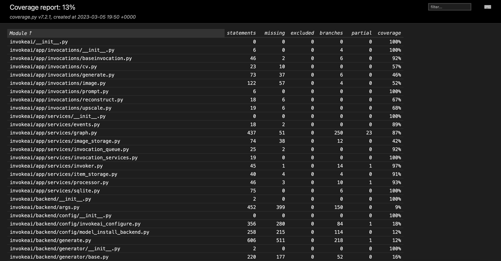
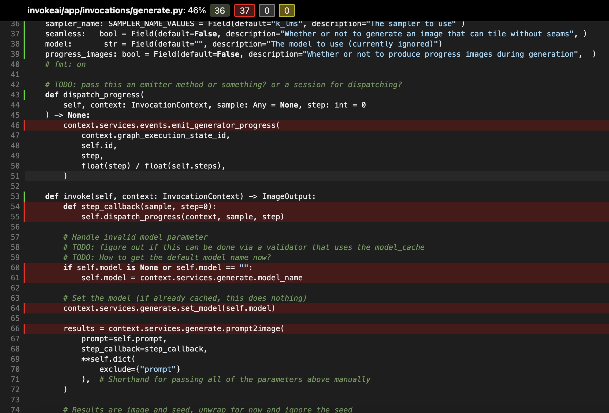

import { Tabs, TabItem } from '@astrojs/starlight/components';

## Frontend Tests

The default frontend is `webv2`, with unit and Chromium suites. Run commands from the repository root:

<Tabs>
  <TabItem label="Make">
    ```bash
    # Run the default frontend unit suite once.
    make frontend-test
    ```
  </TabItem>
  <TabItem label="pnpm">
    ```bash
    pnpm -C invokeai/frontend/webv2 test
    pnpm -C invokeai/frontend/webv2 test:browser
    # Complete milestone gates, including performance, project files, and accessibility.
    pnpm -C invokeai/frontend/webv2 check:release
    ```
  </TabItem>
</Tabs>

Install Chromium with `pnpm -C invokeai/frontend/webv2 exec playwright install chromium` if needed. Read `webv2/AGENTS.md` for test ownership and browser verification rules.

The legacy frontend remains in `invokeai/frontend/webv1`. Run its separate suite with `pnpm -C invokeai/frontend/webv1 test:no-watch` and its checks with `pnpm -C invokeai/frontend/webv1 lint`.

## Backend Tests

We use `pytest` to run the backend python tests. (See [pyproject.toml](https://github.com/invoke-ai/InvokeAI/blob/main/pyproject.toml) for the default `pytest` options.)

### Fast vs. Slow
All tests are categorized as either 'fast' (no test annotation) or 'slow' (annotated with the `@pytest.mark.slow` decorator).

'Fast' tests are run to validate every PR, and are fast enough that they can be run routinely during development.

'Slow' tests are currently only run manually on an ad-hoc basis. In the future, they may be automated to run nightly. Most developers are only expected to run the 'slow' tests that directly relate to the feature(s) that they are working on.

As a rule of thumb, tests should be marked as 'slow' if there is a chance that they take >1s (e.g. on a CPU-only machine with slow internet connection). Common examples of slow tests are tests that depend on downloading a model, or running model inference.

### Running Tests

Below are some common test commands:

```bash
# Run the fast tests from the repository root using the Makefile shortcut.
make test

# Run the fast tests. (This implicitly uses the configured default option: `-m "not slow"`.)
pytest tests/

# Equivalent command to run the fast tests.
pytest tests/ -m "not slow"

# Run the slow tests.
pytest tests/ -m "slow"

# Run the slow tests from a specific file.
pytest tests/path/to/slow_test.py -m "slow"

# Run all tests (fast and slow).
pytest tests -m ""
```

### Test Organization

Most backend tests live in the [`tests/`](https://github.com/invoke-ai/InvokeAI/tree/main/tests) directory. When adding a new backend test, prefer keeping it near the corresponding module area so related code and tests stay easy to find together.

### Tests that depend on models

There are a few things to keep in mind when adding tests that depend on models.

1. If a required model is not already present, it should automatically be downloaded as part of the test setup.
2. If a model is already downloaded, it should not be re-downloaded unnecessarily.
3. Take reasonable care to keep the total number of models required for the tests low. Whenever possible, re-use models that are already required for other tests. If you are adding a new model, consider including a comment to explain why it is required/unique.

There are several utilities to help with model setup for tests. Here is a sample test that depends on a model:

```python
import pytest
import torch

from invokeai.backend.model_management.models.base import BaseModelType, ModelType
from invokeai.backend.util.test_utils import install_and_load_model

@pytest.mark.slow
def test_model(model_installer, torch_device):
    model_info = install_and_load_model(
        model_installer=model_installer,
        model_path_id_or_url="HF/dummy_model_id",
        model_name="dummy_model",
        base_model=BaseModelType.StableDiffusion1,
        model_type=ModelType.Dummy,
    )

    dummy_input = build_dummy_input(torch_device)

    with torch.no_grad(), model_info as model:
        model.to(torch_device, dtype=torch.float32)
        output = model(dummy_input)

    # Validate output...
```

### Test Coverage

To review test coverage, append `--cov` and the report formats you want to your pytest command:

```bash
pytest tests/ --cov --cov-report=term --cov-report=html --cov-report=xml
```

Test outcomes and coverage will be reported in the terminal. In addition, a more detailed report is created in both XML and HTML format in the `./coverage` folder. The HTML output is particularly helpful in identifying untested statements where coverage should be improved. The HTML report can be viewed by opening `./coverage/html/index.html`.

:::note HTML coverage report output example
  

  
:::
