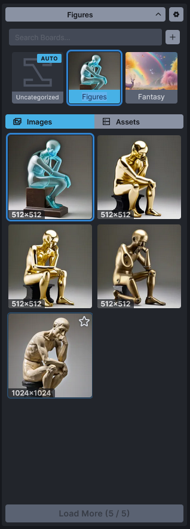
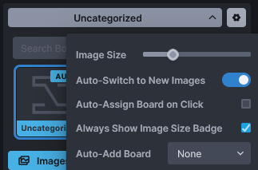
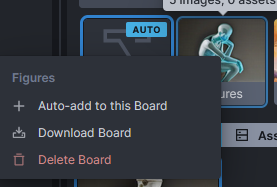
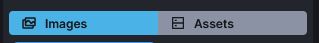
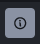
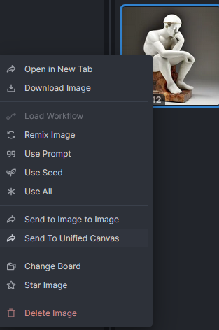

import { Card, CardGrid, Steps } from '@astrojs/starlight/components';

The Gallery Panel is a fast way to review, find, and make use of images and videos you've generated and loaded. The Gallery is divided into **Boards**. The *Uncategorized* board is always present, but you can create your own for better organization. Boards are polymorphic — images and videos coexist on the same board and appear together in the gallery, sorted by creation time.

---

## Board Display and Settings

At the very top of the Gallery Panel, you will find the board disclosure and settings buttons.

The **disclosure button** shows the name of the currently selected board and allows you to toggle the visibility of the board thumbnails.

The **settings button** opens a list of customization options:

- **Image Size:** A slider that lets you control the size of the image previews in the gallery.
- **Auto-Switch to New Images:** When enabled, newly generated images will automatically load into the current image panel (on the Text to Image tab) or the result panel (on the Image to Image tab). This happens invisibly even if you are on a different tab during generation.
- **Auto-Assign Board on Click:** Whenever an image is generated or saved, it is placed into a board. The destination board is marked with an `AUTO` badge.
  - *When enabled:* The board selected at the moment you click **Invoke** becomes the destination. This allows you to queue multiple generations into different boards without waiting for them to finish.
  - *When disabled:* An **Auto-Add Board** dropdown appears, allowing you to set one specific board as the permanent destination for all new images.
- **Always Show Image Size Badge:** Toggles whether the resolution (e.g., 512x512) is displayed on each image preview thumbnail.

Below these buttons is the **Search Boards** text entry area, allowing you to quickly find specific boards by name. Next to it is the **Add Board (+)** button for creating new boards.

:::tip
You can rename any board by simply clicking on its name under the thumbnail and typing the new name.
:::

---

## Board Management

Each board has a context menu accessible via right-click (or Ctrl+click).

- **Auto-add to this Board:** If *Auto-Assign Board on Click* is disabled in settings, use this option to quickly set the selected board as the default destination for new images.
- **Download Board:** Packages all images within the board into a `.zip` file. A notification link will be provided when the download is ready.
- **Delete Board:** Permanently removes the board and all of its contents — both images **and** videos.

:::danger
Deleting a board will **permanently delete all images and videos** contained within it. Proceed with caution!
:::

### Board Contents

Every board is organized into two distinct tabs:

1. **Images:** Images generated directly within InvokeAI.
2. **Assets:** External images you have uploaded to use as an [Image Prompt](https://support.invoke.ai/support/solutions/articles/151000159340-using-the-image-prompt-adapter-ip-adapter-) or within the Image to Image tab.

---

## Virtual Boards

Virtual boards are read-only board groupings that Invoke computes on-the-fly from your image metadata rather than storing in the database. The first available type groups images **By Date**, creating one sub-board per day on which you generated images.

Virtual boards are **off by default**. To enable them:

1. Open the **board settings** (gear icon at the top of the Gallery).
2. Toggle **Virtual Boards** on.
3. A collapsible **By Date** section appears in the board list, with a sub-board for each day that has images. Each sub-board shows the date, image / asset counts, and a cover thumbnail.

Selecting a date sub-board filters the gallery to just the images from that day. The collapse state of the By Date section persists across reloads.

### Limits

Because virtual boards are derived, not stored:

- They are **read-only**: no drag-and-drop, no context menu, no auto-add destination.
- You cannot rename or delete them.
- Generating a new image updates the counts immediately, but the image is still saved to your regular auto-add board — virtual boards are a *view*, not a destination.
- Disabling the **Virtual Boards** toggle hides the section and resets the selection to *Uncategorized* if you were viewing a virtual sub-board.

---

## Image Interaction

Every image generated by InvokeAI stores its generation metadata (prompt, seed, models, etc.) directly inside the file. You can read this data by selecting the image and clicking the **Info button**  in any result panel.

Additionally, each image has a context menu (right-click or Ctrl+click) with powerful workflow actions:

*Options marked with an asterisk (\*) require the image to have generation metadata.*

<CardGrid>
  <Card title="Quick Actions" icon="rocket">
    - **Open in New Tab:** Opens the image in a separate browser tab.
    - **Download Image:** Saves the image to your local device.
    - **Star Image:** Pins the image to the top of the gallery. *(Also available by clicking the star icon on hover).*
  </Card>
  <Card title="Generation & Workflows" icon="setting">
    - **Load Workflow*:** Loads the saved workflow settings into the Workflow tab and opens it.
    - **Remix Image*:** Loads all generation settings (**excluding** the Seed) into the control panel.
    - **Use Prompt*:** Loads only the text prompts.
    - **Use Seed*:** Loads only the Seed.
    - **Use All*:** Loads all generation settings into the control panel.
  </Card>
  <Card title="Routing" icon="right-arrow">
    - **Send to Image to Image:** Moves the image to the left-hand panel of the Image to Image tab.
    - **Send to Unified Canvas:** **Replaces** the current Unified Canvas contents with this image.
  </Card>
  <Card title="Organization" icon="list-format">
    - **Change Board:** Opens a prompt to move the image. *(You can also drag and drop images onto board thumbnails).*
    - **Delete Image:** Permanently deletes the image from InvokeAI.
  </Card>
</CardGrid>

:::caution
  Selecting **Delete Image** will remove the image entirely from your InvokeAI installation. This action cannot be undone.
:::

---

## Videos in the Gallery

Videos generated by InvokeAI (currently from the Wan 2.2 model family) appear alongside images in the same gallery view. Each video item displays a first-frame still as its thumbnail with a play badge in the corner; selecting it opens the video in the viewer where you can play it back inline.

### Uploading Videos

You can upload existing videos to a board via the standard drop-or-upload affordance. The upload pipeline accepts **MP4 files only**. Other containers (`.mov`, `.webm`, `.mkv`) are not transcoded on upload and are rejected at the API boundary — re-encode them to MP4 (for example with `ffmpeg -i input.mov -c:v libx264 output.mp4`) before uploading.

### Video Context Menu

Each video has a context menu with the same organization actions as images, plus video-appropriate variants:

- **Open in New Tab / Download:** Opens or saves the raw MP4 file.
- **Star Video:** Pins the video to the top of the gallery.
- **Change Board:** Moves the video to a different board. *(Drag-and-drop onto board thumbnails also works.)*
- **Delete Video:** Permanently deletes the video and its thumbnail.

Videos count toward board contents: a board with two images and three videos shows five items in the polymorphic gallery list and reports both totals in its stats.

---

## Summary

This walkthrough covers the Gallery interface and Boards. For guidance on prompting and generation workflows, please refer to the [Prompting Guide](/concepts/prompting-guide/) and [AI Image Generation](/concepts/image-generation/).

## Acknowledgements

A huge shout-out to the core team working to make the Web GUI a reality, including [psychedelicious](https://github.com/psychedelicious), [Kyle0654](https://github.com/Kyle0654), and [blessedcoolant](https://github.com/blessedcoolant). [hipsterusername](https://github.com/hipsterusername) was the team's unofficial cheerleader and added tooltips/docs.
