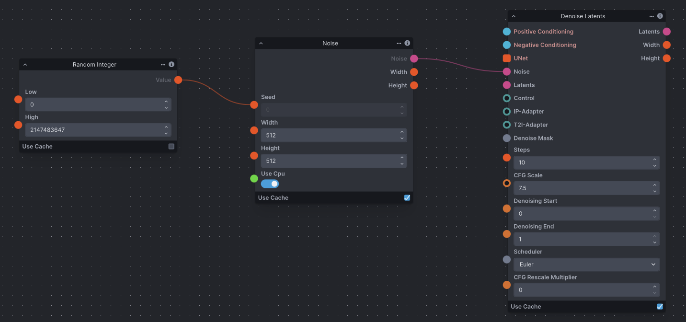
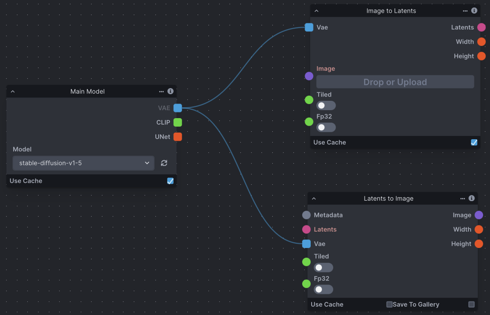

import { Card, CardGrid, Steps, Tabs, TabItem } from '@astrojs/starlight/components';

The workflow editor is a blank canvas allowing for the use of individual functions and image transformations to control the image generation workflow. Nodes take in inputs on the left side of the node, and return an output on the right side of the node.

A node graph is composed of multiple nodes that are connected together to create a workflow. Nodes' inputs and outputs are connected by dragging connectors from node to node. Inputs and outputs are color-coded for ease of use.

:::tip[New to Diffusion?]
If you're not familiar with Diffusion, take a look at our [Diffusion Overview](/concepts/diffusion). Understanding how diffusion works will enable you to more easily use the Workflow Editor and build workflows to suit your needs.
:::

## Features

<Card title="Workflow Library" icon="open-book">
  Save workflows to the Invoke database, allowing you to easily create, modify, and share workflows as needed. A curated set of default workflows is provided to help explain important node usage.

  
</Card>
<Card title="Linear View" icon="list-format">
  Create a custom UI for your workflow, making it easier to iterate on your generations. The Linear UI View is saved alongside the workflow, allowing you to share workflows and enable others to use them.

  <Steps>
  1. Right-click on any **input label** on a node.
  2. Select **"Add to Linear View"**.
  3. The input will now appear in your Linear View panel!
  </Steps>

  
</Card>
<Card title="Renaming Fields and Nodes" icon="pencil">
  Any node or input field can be renamed in the workflow editor. If the input field you have renamed has been added to the Linear View, the changed name will be reflected in both places.
</Card>
<Card title="Node Caching" icon="rocket">
  Nodes have a **"Use Cache"** option in their footer. This allows for performance improvements by reusing previously cached values during workflow processing.
</Card>

### Managing Nodes

Use these quick keyboard shortcuts to navigate and manage your workflow efficiently:

<CardGrid>
  <Card title="Copy Node" icon="document">
    <kbd>Ctrl</kbd> + <kbd>C</kbd> (or <kbd>Cmd</kbd> + <kbd>C</kbd>)
  </Card>
  <Card title="Paste Node" icon="approve-check-circle">
    <kbd>Ctrl</kbd> + <kbd>V</kbd> (or <kbd>Cmd</kbd> + <kbd>V</kbd>)
  </Card>
  <Card title="Select Multiple" icon="list-format">
    <kbd>Shift</kbd> + Click & Drag
  </Card>
  <Card title="Delete Node" icon="close">
    <kbd>Backspace</kbd> / <kbd>Delete</kbd>
  </Card>
</CardGrid>

## Important Nodes & Concepts

There are several node grouping concepts that can be examined with a narrow focus. These (and other) groupings can be pieced together to make up functional graph setups, and are important to understanding how groups of nodes work together as part of a whole.

:::note
The screenshots below aren't examples of complete functioning node graphs, but rather snippets demonstrating specific concepts.
:::

<Tabs>
  <TabItem label="Noise & Conditioning" icon="setting">
    ### Create Latent Noise
    An initial noise tensor is necessary for the latent diffusion process. As a result, the Denoising node requires a noise node input.

    

    ### Text Prompt Conditioning
    Conditioning is necessary for the latent diffusion process, whether empty or not. As a result, the Denoising node requires positive and negative conditioning inputs. Conditioning is reliant on a CLIP text encoder provided by the Model Loader node.

    
  </TabItem>

  <TabItem label="Image Processing" icon="seti:image">
    ### Image to Latents & VAE
    The **ImageToLatents** node takes in a pixel image and a VAE and outputs latents. The **LatentsToImage** node does the opposite, taking in latents and a VAE and outputs a pixel image.

    

    ### Scaling
    Use the **ImageScale**, **ScaleLatents**, and **Upscale** nodes to upscale images and/or latent images. Upscaling is the process of enlarging an image and adding more detail.

    The chosen method differs across contexts. However, be aware that latents are already noisy and compressed at their original resolution; scaling an image could produce more detailed results.

    
  </TabItem>

  <TabItem label="Advanced Control" icon="puzzle">
    ### ControlNet
    The **ControlNet** node outputs a Control, which can be provided as input to a Denoise Latents node. Depending on the type of ControlNet desired, ControlNet nodes usually require an image processor node, such as a Canny Processor or Depth Processor, which prepares an input image for use with ControlNet.

    

    ### LoRA
    The **Lora Loader** node lets you load a LoRA and pass it as output. A LoRA provides fine-tunes to the UNet and text encoder weights that augment the base model’s image and text vocabularies.

    
  </TabItem>

  <TabItem label="Iteration & Batching" icon="list-format">
    ### Defined & Random Seeds
    It is common to want to use both the same seed (for continuity) and random seeds (for variety). To define a seed, simply enter it into the **'Seed'** field on a noise node. Conversely, the **RandomInt** node generates a random integer between 'Low' and 'High', and can be used as input to the 'Seed' edge point on a noise node to randomize your seed.

    

    ### Iteration + Multiple Images as Input
    Iteration is a common concept in any processing, and means to repeat a process with given input. In nodes, you're able to use the **Iterate** node to iterate through collections usually gathered by the **Collect** node.

    The Iterate node has many potential uses, from processing a collection of images one after another, to varying seeds across multiple image generations and more. This screenshot demonstrates how to collect several images and use them in an image generation workflow.

    

    ### Batch / Multiple Image Generation
    Batch or multiple image generation in the workflow editor is done using the **RandomRange** node. In this case, the 'Size' field represents the number of images to generate, meaning this example will generate 4 images.

    As RandomRange produces a collection of integers, we need to add the Iterate node to iterate through the collection. This noise can then be fed to the Denoise Latents node for it to iterate through the denoising process with the different seeds provided.

    
  </TabItem>
</Tabs>
