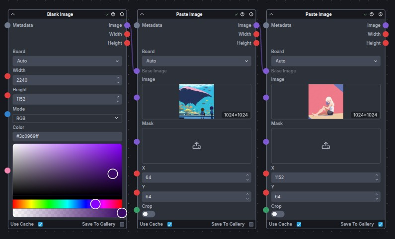
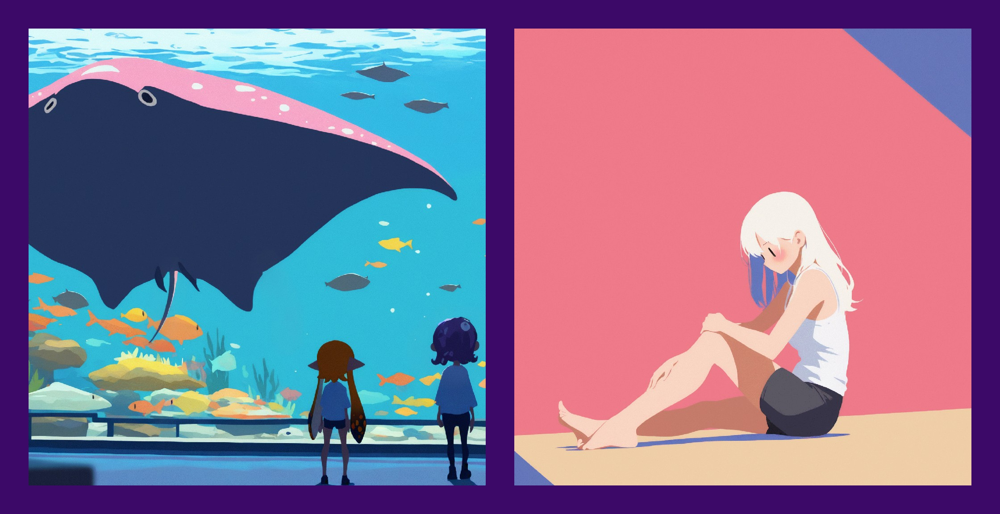
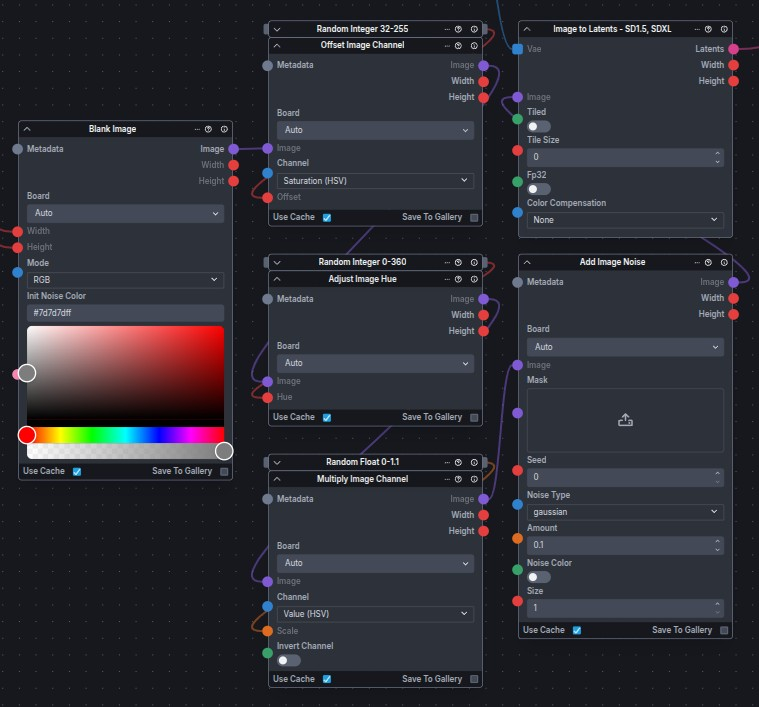

# Blank Image

Creates a new blank image with the specified dimensions, color, and mode, then forwards it downstream. Useful for creating a canvas for compositing, drawing, or testing.

## Inputs

- `width`: The width of the image in pixels (default `512`).
- `height`: The height of the image in pixels (default `512`).
- `mode`: The image mode (`RGB` or `RGBA`) determining channels and transparency.
- `color`: The background color to fill the image. Supports RGBA values.

---

## Example Usage

### Pasting images onto a solid background border

In this example, the `Blank Image` node creates a solid color background. Multiple images are then pasted onto this background to create a composite image with a border effect.  

### Generating random color noise for Text2Img workflows

In this example, a blank image is created with middle gray before being adjusted for saturation, hue, and brightness to create a random color input for a Text2Img workflow.