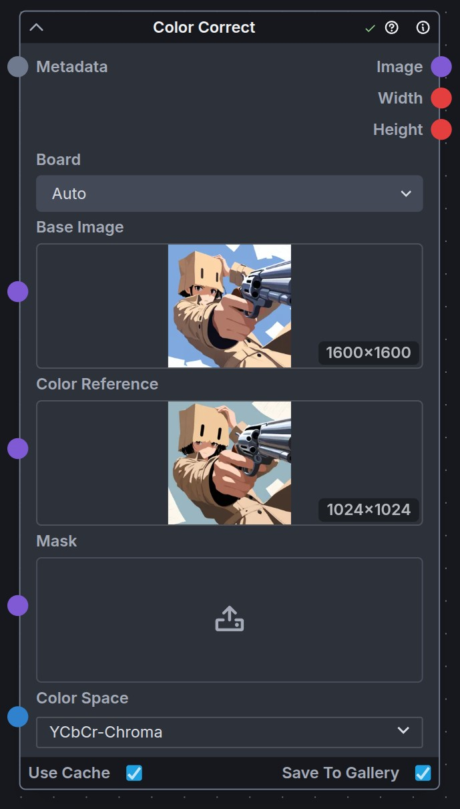
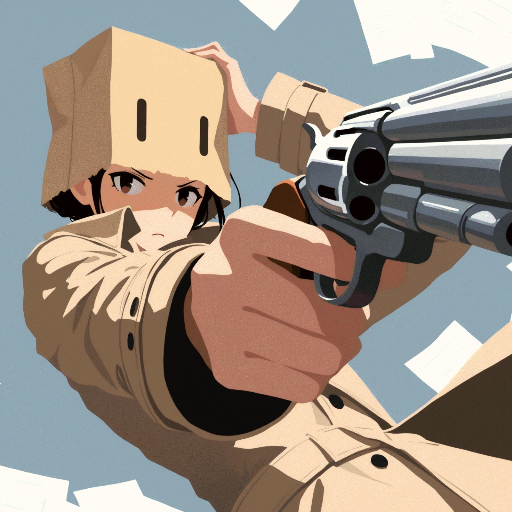

# Color Correct

Matches the color histogram of a base image to a reference image. You can limit correction to specific channels or colorspaces and optionally apply a mask to restrict where correction occurs.

## Inputs

- `base_image`: The image to color-correct.
- `color_reference`: Reference image whose colors should be matched.
- `mask` (optional): Mask limiting correction (white=use original, black=apply correction).
- `colorspace`: Colorspace to operate in (`RGB`, `YCbCr`, `YCbCr-Chroma`, `YCbCr-Luma`). Default `RGB`.

## Outputs

- `image`: The color-corrected image with original alpha preserved.

---

## Example Usage

### Fix color drift from high-res passes

Depending on upscaling, manipulations, controlnets, loras, or other inputs, the colors of a high-resolution output from a multi-stage generation might drift from the original low-res image. This node can be used to restore the original color balance by matching the high-res output back to the low-res input, restoring saturation or brightness depending on the colorspace used.

  

--- 

## Notes

- The node performs histogram matching per-channel using cumulative distribution functions. This can lead to colors (combinations of channels) that were not present in the reference image. This is especially true when operating in `RGB` colorspace. Using `YCbCr` or its variants can help preserve color relationships.